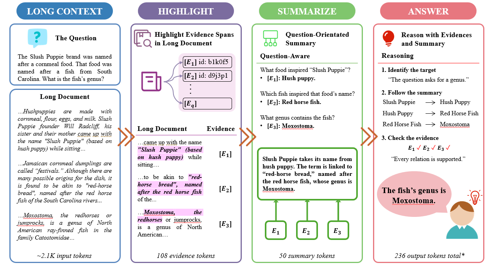
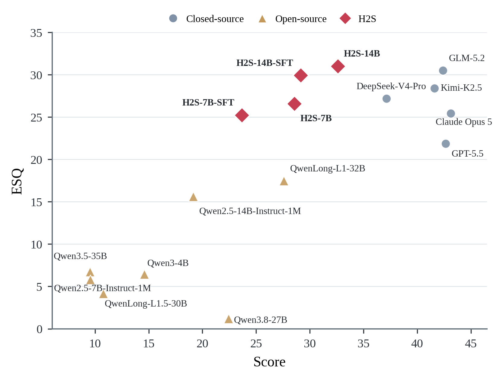
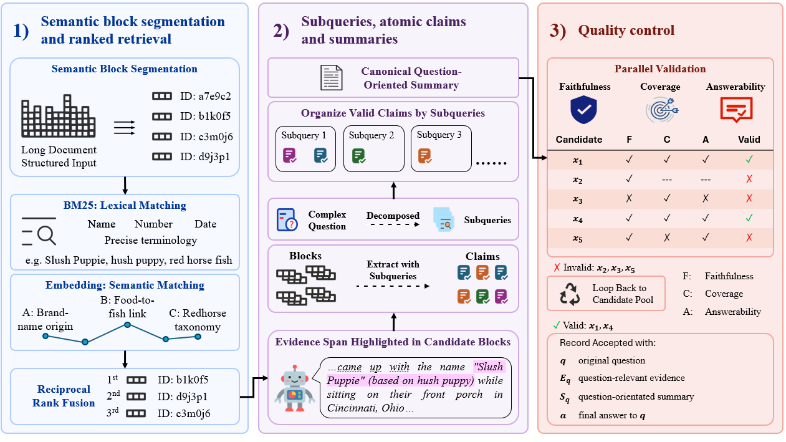

# Highlight-Then-Summarize: Learning to Compress Evidence for Long-Context Understanding

[](LICENSE)
[](pyproject.toml)
[](#-models-and-training)
[](#-h2s-bench)

This repository contains the official implementation and data schemas for
**Highlight-Then-Summarize (H2S)**, a compress-then-reason paradigm for
long-context understanding. H2S first identifies source-grounded evidence,
then integrates the selected information into a question-conditioned summary,
and finally produces the task answer.

## 📅 Project Log

| Date | Milestone |
|---|---|
| **Aug 2026** | Constructed H2S-Dataset and completed full-parameter SFT for the 7B and 14B models. |
| **Aug--Sep 2026** | Completed the 32K → 64K → 128K GRPO curriculum and evaluated H2S on seven long-context tasks. |
| **Sep 2026** | Added H2S-Bench, process-level ESQ analysis, component ablations, output-budget analysis, and attention case studies. |
| **Sep 2026** | Prepared the public code, configurations, data schemas, and reproducibility materials. |

---

## 📖 Abstract

Long-context understanding requires models to reason over lengthy documents,
multi-turn conversations, and other extended inputs. However, task-relevant
evidence is often sparse and scattered, while irrelevant and redundant content
interferes with reliable reasoning. We propose **Highlight-Then-Summarize
(H2S)**, a compress-then-reason paradigm that makes evidence selection and
evidence integration explicit before final-answer generation. H2S first
highlights source-addressable evidence and then organizes it into a compact,
question-conditioned summary. To train this behavior, we construct
**H2S-Dataset**, comprising 6,647 examples from 11 benchmark families, and
introduce **H2S-RL**, which provides process-level rewards for evidence and
summary quality in addition to final-answer correctness. On the seven-task
**H2S-Bench**, H2S-14B achieves an average score of 32.60 under a shared 128K
input and 4K output budget, outperforming Qwen3.8-27B by 10.17 points and
achieving the strongest overall result among the evaluated open-source models.

📄 **Paper:** link will be added after public release.

---

## ✨ H2S Overview



***The Highlight-Then-Summarize paradigm.** Given a question and a
block-structured long document, H2S generates source-addressable evidence,
integrates scattered evidence into a question-conditioned summary, and then
produces the final answer in one autoregressive trajectory.*

### 🔎 Highlight

H2S localizes question-relevant evidence with stable block identifiers and
supporting spans. This keeps the intermediate process traceable to the original
document.

### 📝 Summarize

H2S converts fragmented evidence into a compact question-conditioned summary.
The summary is not a generic document synopsis: it is organized around the
information required to answer the current question.

### 💡 Answer

The final answer is generated after evidence selection and integration have
been made explicit, reducing the need for long, unstructured reasoning over the
entire context.

The structured output contract is:

```text
<evidence>source-addressable evidence</evidence>
<summary>question-conditioned summary</summary>
<answer>task-specific final answer</answer>
```

---

## 📊 Main Results

All results below use a maximum input length of 128K and a maximum output
length of 4K. Avg is the unweighted macro-average over the seven H2S-Bench
tasks.

| Model | DocFinQA | Frames | LongCite | MRCR | AA-LCR | LongBenchV2 | HELMET-Summ | **Avg** |
|---|---:|---:|---:|---:|---:|---:|---:|---:|
| Qwen2.5-7B-Instruct-1M | 5.00 | 13.95 | 5.37 | 4.01 | 7.31 | 24.04 | 7.16 | 9.55 |
| H2S-7B-SFT | 20.45 | 31.29 | 8.65 | 58.12 | 13.96 | 27.88 | 5.42 | 23.68 |
| **H2S-7B** | 26.33 | 32.97 | **15.76** | 59.72 | 21.47 | 32.11 | 11.58 | **28.56** |
| Qwen2.5-14B-Instruct-1M | 15.70 | 23.47 | 8.32 | 25.05 | 13.56 | 35.82 | 12.03 | 19.14 |
| H2S-14B-SFT | 31.49 | **37.76** | 10.50 | 65.13 | 22.40 | 28.37 | 8.45 | 29.16 |
| **H2S-14B** | 30.83 | 37.72 | **13.88** | **66.13** | **26.86** | 35.42 | **17.38** | **32.60** |

H2S-RL improves the corresponding SFT checkpoints by **4.88 points** for 7B
and **3.44 points** for 14B. H2S-14B also exceeds the larger
QwenLong-L1-32B and Qwen3.8-27B baselines by 5.01 and 10.17 points,
respectively.

### Evidence--Summary Quality



***Final-answer score versus Evidence--Summary Quality (ESQ).** ESQ jointly
measures reference-evidence recovery and question-conditioned summary quality.
H2S training improves both task performance and the quality of the explicit
intermediate process.*

---

## 📦 H2S-Dataset

H2S-Dataset contains **6,647 examples from 11 benchmark families**, with 4,228
examples for supervised fine-tuning and 2,419 examples for reinforcement
learning. Each example augments the original question, context, and answer with
source-grounded evidence and a question-conditioned summary.

| Public artifact | Local source artifact | Cases | Purpose |
|---|---|---:|---|
| `H2S-SFT.jsonl` | `sft_v1.jsonl` | 4,228 | Structured Evidence--Summary--Answer supervision |
| `H2S-RL.jsonl` | `rl_v1.jsonl` | 2,419 | GRPO prompts, references, and reward metadata |
| `H2S-Bench.jsonl` | `test_v2.jsonl` | 2,575 | Seven-task long-context evaluation |

The full corpora are not committed to Git. Complete schema examples are
available at:

- [`data/H2S-SFT-example.jsonl`](data/H2S-SFT-example.jsonl)
- [`data/H2S-RL-example.jsonl`](data/H2S-RL-example.jsonl)
- [`data/H2S-Bench-ID-example.jsonl`](data/H2S-Bench-ID-example.jsonl)
- [`data/H2S-Bench-OOD-example.jsonl`](data/H2S-Bench-OOD-example.jsonl)
- [`data/examples/`](data/examples/) for multi-case samples

### Data Construction



***H2S data construction.** Documents are segmented into source-addressable
blocks; questions are decomposed into information needs; supported atomic
claims are linked to evidence spans and organized into question-conditioned
summaries; faithfulness, coverage, and answerability checks determine which
examples enter the final SFT and RL sets.*

---

## 🧪 H2S-Bench

H2S-Bench contains 2,575 examples across seven complementary long-context
tasks:

| Task | Primary capability |
|---|---|
| DocFinQA | Numerical retrieval and calculation |
| Frames | Multi-document reasoning |
| LongCite | Cited long-context answering |
| MRCR | Precise retrieval in long conversations |
| AA-LCR | Aggregation of distributed information |
| LongBenchV2 | General long-context understanding |
| HELMET-Summ | Long-document summarization |

Each model receives the same system prompt, question, and block-structured
document. Task performance is computed from the final answer only; evidence and
summary fields are evaluated separately in the ESQ analysis.

---

## 🧠 Models and Training

H2S uses the following initial checkpoints:

- `Qwen/Qwen2.5-7B-Instruct-1M`
- `Qwen/Qwen2.5-14B-Instruct-1M`

Training consists of full-parameter SFT followed by full-parameter GRPO under a
32K → 64K → 128K context-length curriculum. RL samples eight candidates per
prompt and uses a 2,048-token completion budget. Configuration templates are
provided in [`configs/sft/`](configs/sft/) and [`configs/rl/`](configs/rl/).

The public H2S reward is implemented in
[`rl/h2s_rewards.py`](rl/h2s_rewards.py). It combines final-answer quality with
evidence grounding, evidence-span coverage, summary quality, and structured
output validity. [`rl/h2s_reward_swift.py`](rl/h2s_reward_swift.py) exposes the
reward to ms-swift as `h2s_reward`.

---

## 🚀 Quick Start

### Installation

```bash
git clone https://github.com/X-Luffy/Highlight-Then-Summarize.git
cd Highlight-Then-Summarize
python3 -m pip install -e .
```

Install the model-training stack separately according to the target hardware
and ms-swift environment. The core reward and evaluation tests require only
Python.

### Inspect a Data Example

```python
import json

with open("data/H2S-RL-example.jsonl", encoding="utf-8") as handle:
    example = json.loads(handle.readline())

print(example["benchmark"])
print(example["question"])
print(example["reference_summary"])
```

### Evaluate Predictions

```bash
python3 eval/run_h2s_eval.py \
  --data /path/to/H2S-Bench.jsonl \
  --predictions /path/to/predictions.jsonl \
  --output outputs/report.json \
  --protocol tagged
```

Use `--protocol native` for unstructured base/API responses and
`--protocol tagged` for H2S-SFT/H2S outputs.

### Run Validation

```bash
python3 -m unittest rl.test_h2s_rewards eval.test_h2s_evaluator
python3 data_pipeline/test_pipeline_common.py
python3 -m py_compile $(find . -name '*.py' -not -path './.git/*')
```

---

## 🗂️ Repository Structure

```text
Highlight-Then-Summarize/
├── assets/          # Framework, data-pipeline, and analysis figures
├── configs/         # H2S-SFT and three-stage H2S-RL templates
├── data/            # Data documentation and complete schema examples
├── data_pipeline/   # Construction and materialization utilities
├── docs/            # Code map, release manifest, reproducibility notes
├── eval/            # H2S evaluator and command-line runner
├── rl/              # H2S reward and ms-swift adapter
├── sft/             # Prompts, SFT preparation, and validation helpers
├── CITATION.cff
└── README.md
```

---

## 📌 Release Scope

This repository does not include model checkpoints, optimizer states, full
datasets, full prediction files, private API clients, cluster launchers,
credentials, or runtime logs. The included examples document the actual data
contracts and are not substitutes for the complete artifacts. Please verify the
licenses of all upstream benchmarks before redistributing full source documents
or derived records.

## 📜 Citation

Citation metadata is available in [`CITATION.cff`](CITATION.cff). A BibTeX
entry will be added with the public paper release.

## 🙏 Acknowledgments

H2S builds on Qwen2.5 and ms-swift and uses publicly available long-context
benchmarks represented in H2S-Dataset and H2S-Bench. We thank the authors and
maintainers of these models, tools, and datasets.

## 📄 License

The code is released under the [MIT License](LICENSE). Dataset examples remain
subject to the licenses and terms of their upstream sources.
