<!-- Exported from Baidu Ku knowledge base. -->
<!-- Source: https://ku.baidu-int.com/knowledge/HFVrC7hq1Q/pKzJfZczuc/KRMcaCYx6j/w2TZb6MXg1qYOb -->
<!-- PublishTime: 1783529701000 -->

# 长文领域后训练RL探索调研

## 1. 背景与判断
**背景**：

当前业务目标是把模型可用上下文从 128k 扩到 256k 甚至更长。midt 阶段已经在做上下文扩展，因此 RL 阶段不应重复解决“能不能塞进 256k”的问题，而应解决“塞进去以后是否会用”的问题。

**难点**：

* 相关证据在超长上下文中找不到，或只依赖问题关键词做浅层匹配；
* 多处证据需要组合时，模型漏读、误连、幻觉补全；
* 上下文越长，最终答案奖励越稀疏，RL 很难知道哪一步 grounding 错了；
* 256k 输入下训练 rollout 成本高，直接全长度 RL 不经济；
* 长文生成时容易结构单调、重复、前后不一致，且长度控制和质量目标冲突。

**主线**：

> 在已具备 256k 上下文窗口的模型上，通过可验证奖励和过程奖励，强化长文证据定位、证据组合、答案可追溯、跨段一致性和长输出控制。


## 2. 近期相关工作
参考[长文训练策略调研0424](https://ku.baidu-int.com/knowledge/HFVrC7hq1Q/pKzJfZczuc/w3A5Id66Mm/2oa4zV-z5yIcgI?t=mention&mt=doc&dt=doc)

[长文能力提升调研（数据建设）](https://ku.baidu-int.com/knowledge/HFVrC7hq1Q/pKzJfZczuc/ySjqF_DPLt/Ez7wQepe2VHz5w?t=mention&mt=doc&dt=doc)

|索引|工作|详细内容|备注|
|-|-|-|-|
|1|[LongRLVR: Long-Context Reinforcement Learning Requires Verifiable Context Rewards](https://www.alphaxiv.org/abs/2603.02146?chatId=019f0317-4fe8-77c4-9096-3c0a32595e5c)<br/>**ICLR 2026**<br/>**Insight：长文 RL 不能只奖励最终答案，必须给 context/evidence reward，否则模型不知道自己该在长文中关注哪些证据。**|**摘要**：<br/>* 长文本推理依赖于**上下文定位 (Contextual Grounding)**，即从海量信息中准确提取相关片段。如果只奖励最终答案，模型很难学到哪些中间片段是必要的，这导致了“消失的定位梯度”问题。 <br/>* **LongRLVR**，通过增加密集且可验证的**上下文奖励**来增强原本稀疏的答案奖励。这种辅助信号直接激励模型选择正确的定位信息，从而提供稳健的学习梯度，解决底层的优化挑战。<br/>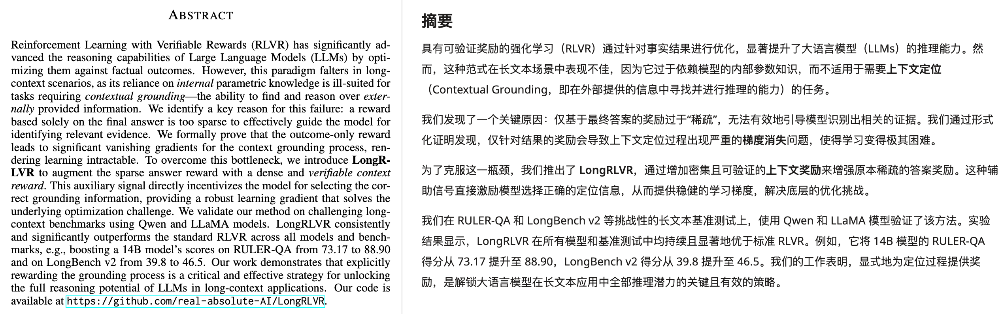<br/>**LongRLVR架构**<br/>准备工作：将长文档切块并按语义聚类， 利用超大模型（如 Qwen3-235B）针对这些聚类生成问题、答案及配套的证据 ID。<br/>A. 显式定位 (Explicit Grounding)<br/>模型在生成最终答案前，被要求先输出一组证据块标识符（Chunk IDs）。<br/>> "The model is tasked to retrieve useful chunks from the long context before generating the final answer." <br/>B. 调制 F-Score 上下文奖励 (Modulated Context Reward)<br/>不只是看答案对不对，还要根据模型找出的证据块计算奖励：<br/>F-Score： 衡量定位的准确率（Precision）和召回率（Recall），确保模型找全了证据。<br/>双重信号叠加：<br/>* 无条件奖励： 只要找对一部分证据就给奖，解决梯度消失。<br/>* 协同奖励： 当且仅当最终答案也正确时，大幅提升定位奖励的权重，确保定位是为了更好地回答问题。<br/>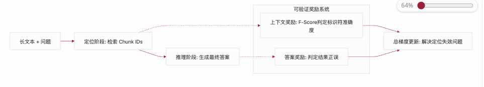<br/>**实验结论：**<br/>* **显著优于 SFT 和标准 RLVR**：LongRLVR 在所有测试的模型（LLaMA 和 Qwen 系列）以及所有长文本基准测试（RULER-QA, LongBench v2, LongReason）上均取得了**一致且大幅度**的领先。<br/>* **实现“以小博大”的参数效率**：通过 LongRLVR 训练的小尺寸模型展现出了极强的竞争力，甚至能超越参数量大得多的传统模型<br/>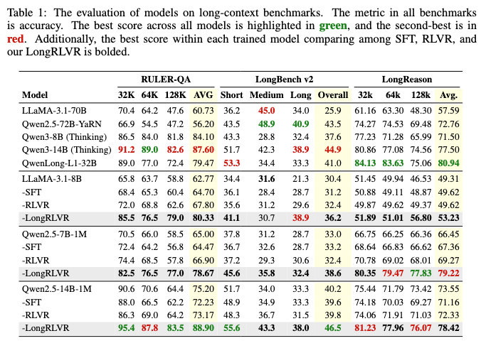|* **一句话总结**：LongRLVR认为长上下文 RL 不能只奖励最终答案，而要加入可验证的 evidence/context reward，让模型学会在长文里找到并使用正确证据。<br/>* **可参考的部分**：<br/>    * reward 设计里加入证据奖励：答案对不够，还要引用/定位到正确段落，如段落 id、条款 id、时间戳、span。<br/>    * 评测指标除了 answer accuracy，还要看 evidence recall、unsupported claim rate。<br/>|
|2|LoongRL: Reinforcement Learning for Advanced Reasoning over Long Contexts<br/>[https://arxiv.org/abs/2510.19363](https://arxiv.org/abs/2510.19363)<br/>**ICLR 2026 Oral**<br/>**Insight：数据构造可以强制诱导模型行为；KeyChain 通过“先定位再回答”的任务设计，让模型学会 plan-retrieve-reason-recheck。**<br/>|**摘要**：<br/>* LoongRL 用` KeyChain` 构造高难长上下文多跳任务，再做 RL，可以让模型学会规划-检索-推理-复核，并且短长度训练能泛化到 128K 长上下文。<br/>* `KeyChain`把短的多跳 QA 改造成长上下文任务：通过插入 UUID 链，把真正的问题藏在大量干扰文档中，模型必须一步步追踪链条，找到真实问题，再检索相关事实并推理出答案。<br/>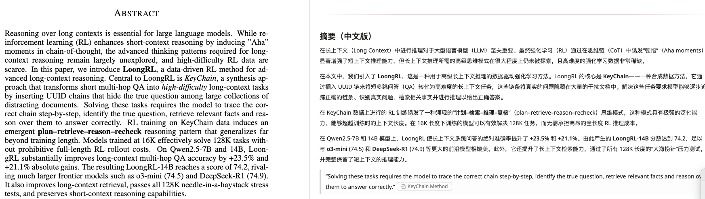<br/>**LoongRL架构：**<br/>* **核心**：原始数据是短上下文多跳 QA，比如 HotpotQA、MuSiQue、2WikiMultiHopQA，LoongRL 先把它扩成长上下文（context_long = 原始相关文档 + 大量干扰文档），然后 KeyChain 做一件关键的事：把真正的问题 Q 藏起来。它会在长上下文里插入一串 UUID key-value 链：<br/>    * `  UUID_A1 -> UUID_A2`<br/>    * `  UUID_A2 -> UUID_A3`<br/>    * `  UUID_A3 -> 原始问题 Q`<br/> 同时还会插入多条干扰链：<br/>    * `  UUID_B1 -> UUID_B2`<br/>    * `  UUID_B2 -> 干扰问题 Q_fake`<br/><br/>    * `  UUID_C1 -> UUID_C2`<br/>    * `  UUID_C2 -> 另一个干扰问题 Q_fake`<br/>最后给模型的新问题不是原始问题 Q，而是：** 请从 starting UUID_A1 开始，沿着上下文中的 key-value 链找到真正要回答的问题，然后回答它**。<br/>* **效果**：<br/>    1. 模型必须从起始 UUID 开始，在长文档中逐步追踪链条，找到真实问题后再进行推理——这强制诱发了**结构化思维**。**先追链**：从起始 UUID 找到真正的问题 Q；**再答题**：在长上下文里找相关证据，做多跳推理，回答 A。<br/>    2. 相比于普通长上下文 QA 的问题，模型可能直接靠浅层检索、关键词匹配，甚至靠参数知识猜答案。KeyChain 强迫模型形成一个流程：plan -> retrieve -> reason -> recheck<br/>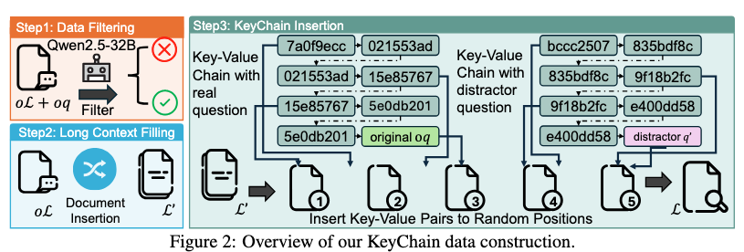<br/>**结果**：<br/>1. **性能比肩大尺寸模型**："LoongRL-7B achieves an average of 72.4 on LongBench v1, surpassing all R1-distilled models and QwenLong-L1-32B." <br/>2. **方法卓越性**：比起效果有限甚至降低效果的Distill蒸馏来讲，LoogRL效果更好且稳健。<br/>3. **短上下文能力保留良好**，但有取舍：LooongRL在MMLU，MATH等通用数据集上略有起伏。<br/><br/>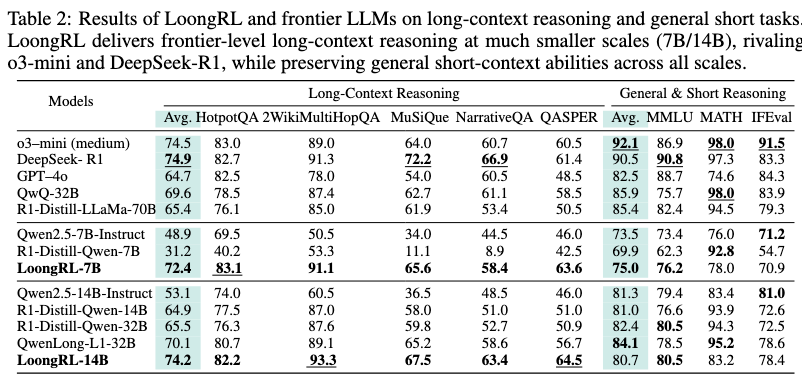<br/>|* **一句话总结：**`LoongRL` 用 16K 的训练成本 + KeyChain 数据，在 7B/14B 小模型上实现了媲美 o3-mini 和 DeepSeek-R1 的长上下文推理能力，同时几乎无损地保留了短上下文通用能力。<br/>* **关键启示**：<br/>    * 设计一种必须跨多个位置追踪信息链，才能还原真实问题并完成回答的长上下文任务。【Oral背书】<br/>    * 难度递增的多阶段训练：<br/>        1. Warm-up：仅非KeyChain数据，提升基础检索能力 <br/>            * step: 42<br/>            *  batch_size: 512 <br/>            * group size $G = 8$ <br/>            * epoch: 1<br/>        2. Stage I 引入KeyChain数据，诱发计划-检索-推理-复核模式 <br/>            * step: 168<br/>            *  batch_size: 512 <br/>            * group size $G = 8$ <br/>        1. tage II 难例挖掘 只保留全错的30-40%样本 聚焦难例避免过拟合<br/>            * step: 118<br/>            *  batch_size: 512 <br/>            * group size $G = 8$ |
|3|QwenLong-L1.5: Post-Training Recipe for Long-Context Reasoning and Memory Management<br/>[https://arxiv.org/abs/2512.12967](https://arxiv.org/abs/2512.12967)<br/>通义千问<br/>项目地址：[https://github.com/Tongyi-Zhiwen/Qwen-Doc](https://github.com/Tongyi-Zhiwen/Qwen-Doc)<br/>**Insight：长文 RL 不是简单把 GRPO 跑在更长输入上，而是需要高质量合成数据、长度 curriculum、任务均衡和稳定训练机制。**|**摘要：**<br/>* **QwenLong-L1.5**基于 Qwen3-30B-A3B-Thinking 构建，通过一套系统的训练后（Post-training）方案，使其在长文本任务上的表现达到了与 GPT-5 和 Gemini-2.5-Pro 相当的水平。<br/>* **核心目标**是解决现有模型在长文本处理中常见的两个痛点：一是大多数模型只擅长简单的“大海捞针”检索，而不擅长跨多处信息的**多跳推理**；二是物理上下文窗口（如 256K）无法应对数百万 token 的极端场景。<br/>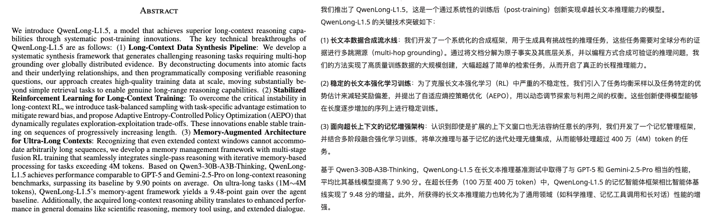<br/>**长文本数据合成pipeline**<br/>1. **建立长文语料池Document Corpus**，一共有五种大类，得到约 82,175 篇高质量文档，总量约 9.2B tokens，覆盖叙事文本、专业文档、表格、代码、对话的不同结果，是一个『大而杂』的长文原料库。<br/>    1. **代码仓库**--高质量开源代码<br/>    2. **学术资料**--STEM、医学、法律、社科、AI 论文、教材<br/>    3. **专业文档**--年报、财报、产品手册、医学教材、政府文件<br/>    4. **通用知识和文学**--小说、侦探故事、Wikipedia 长页<br/>    5. **对话数据**---少量 LLM 模拟的多轮长对话。<br/>2. **把长文拆分成结构化数据**，不对整篇长文生成问题，而是先挖出局部信息，论文中有三种QA合成方法。<br/>  - 实体；  - 属性；  - 关系；  - 时间；  - 数值；  - 表格字段；  - 因果关系；  - 观点关系；  - 跨文档共指关系<br/>> Long documents -> atomic facts / triplets / tables / relations -> compositional QA<br/>    1.  In-depth Multi-hop Reasoning QA -- 深度多跳推理<br/>        * 基于**知识图谱**的多跳推理构建，目的是打破简单的关键词检索，迫使模型连接分散在不同地方的信息，覆盖**多事实推理**，**时序推理**，**因果分析**和**假设情景**推断等任务。<br/>        * **具体做法**是首先从不同领域文档抽取三元组，然后在领域级别做聚合，把多个文档的图谱连起来，然后在图谱中利用随机游走或 BFS 算法采样出“长程路径”。为了增加难度，这些节点被刻意分布在不同的文档中。<br/>    2. Corpus-level Numerical Reasoning QA -- 跨文档数值推理<br/>        * 基于**SQL**的数值推理构造，针对财务报表，统计报告等文档，用SQL来确保答案的绝对精准，覆盖**统计**，**数值计算**，**差值计算**，**排序比较**和**时间范围计算**等任务。<br/>        * **具体做法**是解析含表格的长文档并聚合为跨文档结构化表，然后将自然语言转为SQL语句，在表格上执行SQL获取数值计算的真值。<br/>    3. General Long-Context Reasoning -- 长文推理任务<br/>        * 基于Multi-Agent【出题者proposer-解题者solver-校验者verifier】构建，目标是观点分析等泛化性任务，涵盖**观点分析**，**长上下文学习**，**对话记忆**，**因果分析**和**假设推理**的任务。<br/>        * **具体做法**是给一组文档，proposer先生成一个问题和参考答案，solver去回答这个问题，得到predicted答案，最后由verifier去判断两个答案是否一致，通过验证的QA会进入缓存，后续的Proposer会要求生成不重复且难度更好的任务。<br/>3. **扩长上下文**，插入大量的相关文档，增加检索难度和倒逼模型在长文中找到关键证据。<br/>4. **数据验证和过滤**<br/>    * **概要**：从约42.7k的合成样本中筛选出**14.1k的高质量RL**样本用于训练，最大的输入长度120k，平均输入长度为34k。<br/>    * **筛选标准**：1. 去除过难或者过简单的样本；2. 去重；3.去除在没有源文档也能回答的知识性问题；4.去除加入无关文档后pass@k为0的脆弱样本。<br/>    * **任务覆盖**：**多事实推理，数值计算，假设情景推断，长上下文学习，时序推理，因果分析，观点分析，对话捞针**<br/>    * QwenLong-L1 的 DocQA-RL-1.6K 数据集：[https://huggingface.co/datasets/Tongyi-Zhiwen/DocQA-RL-1.6K](https://huggingface.co/datasets/Tongyi-Zhiwen/DocQA-RL-1.6K)<br/>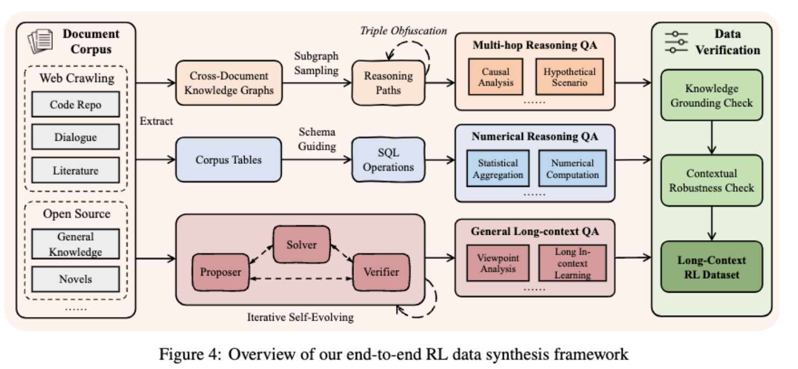<br/>**长文本RL训练**<br/>1. **难点：**<br/>    * **输入长度差异大**，20k、60k、120k 混在一起，训练 batch 分布很不稳；<br/>    * **任务类型差异大**，选择题、DocQA、多跳、NIAH、数值计算的 reward 分布不同；<br/>    * 长文错误回答里往往也包含很多**正确中间步骤**，直接给负 advantage 会误伤；<br/>    * 输入越长，模型**输出 reasoning 也越长**，如果 rollout 长度不跟着扩，训练信号会被截断；<br/>    * 如果一开始就放开**很长 rollout**，模型容易 response length 膨胀、entropy 飙升、训练崩。<br/>2. **多阶段训练**<br/>    1. **长度扩展**<br/>        *  第一，输入长度逐步增加，模型先在相对短的长文任务上学会 grounding、检索、推理，再进入更长上下文。<br/>        * 第二，输出长度也同步增加。<br/>> 论文观察到输入越长，模型需要的 reasoning 内容通常越长。如果只扩输入、不扩 rollout，模型可能还没推理完就被截断，reward 会很脏。<br/>  Stage 1: max input 20K, max output 12K  Stage 2: max input 60K, max output 20K  Stage 3: max input 120K, max output 50K  Stage 4: full-context RL<br/>    2. **任务均匀采样**：在一个batch中各类任务如多项选择，文档多跳推理，通用阅读理解，对话记忆和数值计算按照比例放入，避免训练中出现policy跳变，reward不稳，response失控。<br/>    3. **Task-Specific 优势估计**：在GRPO中避免任务之间的reward相互污染，QA 的 reward 归一化只跟 QA 比，NIAH 只跟 NIAH 比，数值计算只跟数值计算比。<br/>    4.  **AEPO**：Adaptive Entropy-Controlled Policy Optimization 动态控制负样本梯度：论文发现模型某些回答错了，所以得到负 advantage，但这些回答里的高熵 token 往往是模型探索中的不确定位置。如果直接强力惩罚，可能会把**有价值的探索压掉**，让梯度方差变大，造成 entropy 剧烈波动，甚至让训练 collapse。<br/>**模型太发散 -> 少惩罚负样本，先用正样本把方向拉回来 | 模型太保守 -> 放回负样本，让它继续区分好坏**<br/>设两个 entropy 阈值：  entropy_low  entropy_high  训练时：  如果 batch entropy > entropy_high:      屏蔽 negative advantage 样本      只用 positive advantage 样本更新      相当于在线 rejection sampling / 正样本 SFT  如果 batch entropy < entropy_low:      重新放回 negative advantage 样本      防止 entropy collapse，保留探索<br/>    5. **Memory RL 和 Full-Context RL 分开训， QwenLong-L1.5 **发现memory management 数据和 single-pass full-context 数据混在一起，会伤害 RL 训练效率和稳定性。<br/>        * full-context:  一次读完整上下文 -> 推理 -> 回答<br/>        * memory-agent：分 chunk 阅读 -> 更新 memory -> 制定下一步计划 -> 最终回答，目的是虑到即使有 256k 窗口，业务里还是会有 1M、4M 甚至更长的输入，所以设计了一个读 chunk、更新 memory、生成 plan、最后回答的 agent 流程。<br/>FuseChat 里的模型合并算法：Select, Calculate, Erasehttps://arxiv.org/abs/2408.07990 1. Select     找出不同 expert 参数更新里变化差异大的位置。     这些位置被认为更可能代表某个 expert 的独特能力。  2. Calculate     根据这些参数更新的强度，自动计算每个 expert 在不同参数矩阵上的合并权重。  3. Erase     如果多个 expert 在同一个参数位置的更新方向冲突，就擦掉少数方向，减少参数干扰。<br/>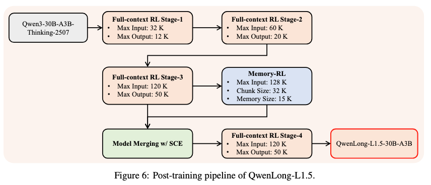<br/>**结果**：<br/>1. **长上下文 RL 的收益主要体现在真正长、信息密集的任务上**：QwenLong-L1.5最大收益在长上下文和信息聚合任务MRCR: +31.72 CorpusQA: +9.69 LongBench-V2: +6.16，在长文检索、消歧、多跳 grounding 和全局聚合有更好的提升。<br/>2. **Stage 1 就拿到大部分基础收益**：论文指出与其一开始堆 256k，不如先做一批高质量 32k/64k evidence QA、多跳 QA、抽取聚合，让模型先学会“找证据再回答”。<br/>  Base: 61.92  Naive GRPO: 67.24  Full-context RL Stage-1: 69.59  Stage-2: 70.46  Stage-3: 71.59  Final Stage-4: 71.82<br/>3. **Progressive length extension 对长、密集任务更重要：**分阶段训练是长文本激活的关键。<br/>`MRCR:`<br/>`  Stage-1: 76.35`<br/>`  Stage-2: 81.53`<br/>`  Stage-3: 82.69`<br/>`  Stage-4: 82.99`<br/>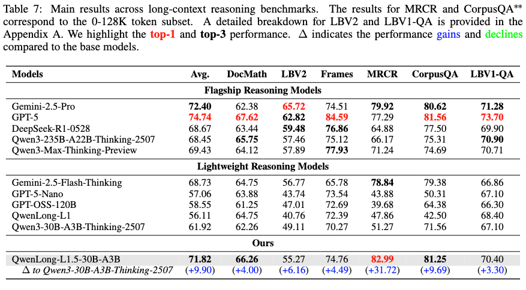|* **核心insight**：长上下文 RL 的收益来自“高质量合成数据 + progressive length curriculum + 多任务稳定训练”，而不是简单把 GRPO 跑在更长输入上；<br/>* 关键启示<br/>    1. RL 阶段重点不是继续扩窗口，而是让模型会用 256k，midt 解决物理长度，RL 要强化长文证据定位、信息聚合、多跳推理和拒答/冲突判断。<br/>    2. 数据要做成可验证长文任务
先从业务文档抽 atomic facts、表格、条款、时间线，再合成 evidence QA、抽取聚合、多跳问题，reward 同时看答案和证据。<br/>    3. 训练要分阶段推进
不要一上来全量 256k RL，可以从 32k/64k grounding 开始，再到 128k 多跳干扰，最后用 256k hard cases 校准长位置鲁棒性。|
|4|SPELL: SELF-PLAY REINFORCEMENT LEARNING FOR EVOLVING LONG-CONTEXT LANGUAGE MODELS<br/>**ICLR2026**<br/>[https://github.com/Tongyi-Zhiwen/Qwen-Doc](https://github.com/Tongyi-Zhiwen/Qwen-Doc)<br/>**Insight： 静态数据跟不上模型能力边界，self-play 可以动态生成“刚好有挑战”的长文任务，持续提供有效 RL 信号。**|**摘要**：<br/>* SPELL 的目标是解决长文 RL 缺少人工标注和可验证 reward 的问题，所以让同一个模型在 questioner、responder、verifier 三个角色之间自我博弈，自动造题、答题、验题，并用这些信号继续 RL。<br/>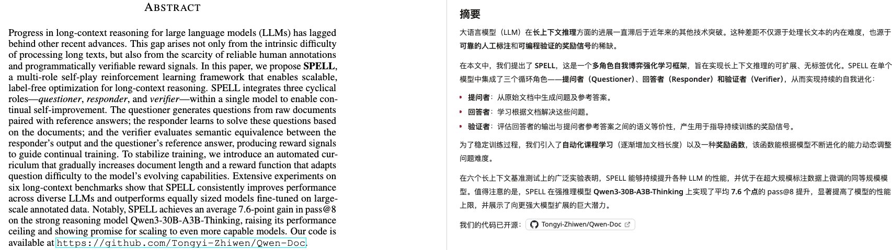<br/>SPELL：<br/>* **三角色闭环**：SPELL 用的是一个统一 policy model，但通过不同 prompt 让它扮演三个角色：questioner -> responder -> verifier -> policy update。<br/>* **具体流程**<br/>    1. Step 1: 当前 policy 用 questioner prompt 生成 q + a_ref<br/>    2. Step 2: 当前 policy 用 responder prompt 对同一个 q 采样 G 个回答<br/>    3. Step 3: 当前 policy 用 verifier prompt 对每个回答做多次判断<br/>    4. Step 4: 计算三类 reward<br/>    5.           - responder: max(CEM, verifier majority) 回答者奖励<br/>    6.           - questioner: Gaussian(success_rate) 出题者奖励<br/>    7.           - verifier: self-consistency / rule-consistency 验证者奖励<br/>    8. Step 5: 把三类 role 的 prompt-output-reward 都放进训练 batch<br/>    9. Step 6: 用 GRPO 更新同一个 policy<br/>    10. Step 7: 更新后的 policy 进入下一轮，继续扮演三个角色<br/>备注：questioner 只看一部分文档生成问题，但 responder 会看到完整文档集，剩余文档就自然变成 distractors。这样问题不只是 QA，还带有长文检索压力。训练不是只更新 responder，而是 questioner、responder、verifier 都更新同一个模型。也就是说，模型不仅学会答题，也学会出更好的题、做更可靠的判断。<br/>* **难度自适应：**SPELL 不希望 questioner 出太简单或太难的问题。 questioner 的 reward 在 responder 成功率接近 0.5 时最高。questioner 会被鼓励生成“当前模型有一半概率答对”的题，这类题最接近模型能力边界，训练信号最强。<br/>* **自动 curriculum**：第一轮时，questioner 只看随机采样的一小部分文档，生成一个 QA。如果这个 QA 是可解的，就会被加入 history memory：history memory = 最近可解的 QA + 对应源文档，后续 questioner 再造题时，会同时看到：新采样文档 + history memory 里的旧文档和旧 QA  1. 上下文范围变大  2. 避免重复和低难题。<br/><br/>**结果：**<br/>1. **Self-play 比静态 RLVR 更适合强模型**，SPELL 对弱模型和强模型都有效，但最有意思的是：强模型上，静态 RLVR 的收益会变小，而 SPELL 还能继续提升。论文里提到，Qwen3-30B-A3B-Thinking 上，SPELL 平均提升，而 RLVR 几乎没有收益。原因是**静态数据跟不上模型能力边界**，self-play questioner 会动态生成“当前模型刚好不会稳定做”的题。<br/>2. **questioner 和 verifier 都不能省**。Ablation 里：<br/>    * 冻结 questioner，平均掉 4.6 分--任务难度能跟着模型能力变强<br/>    * 去掉 history memory，平均掉 2.9 分--curriculum 更稳定<br/>    * 去掉 verifier，只靠规则 reward，平均掉 3.2 分，DocMath 掉 6.4 分--补规则 reward 的语义盲区<br/>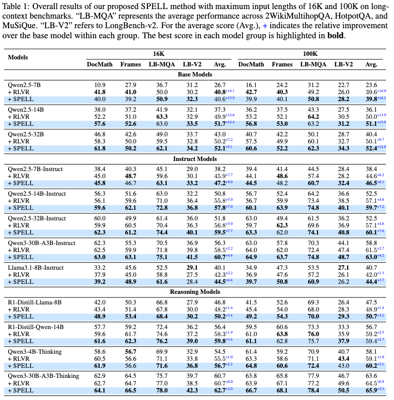|**关键启示**：<br/>    1. 业务长文数据可以做 self-play 扩增，可以让模型基于业务文档自动生成：问题 + 参考答案 + 证据位置，再让 responder 回答，verifier 判断，形成 RL 数据闭环。<br/>    2. 训练数据要动态卡在模型能力边界，不要只训全对题，也不要堆全错 hard cases。更适合 RL 的样本是：采样 4-8 次，有的答对、有的答错，这类样本 reward 方差最大，最能推动模型学习。|
|||||

## 2.方向探索
### 2.1 面向通用长文任务的层级摘要强化学习【v1 20260630】
**一句话总结**：我们不是只让模型在长文里找答案，而是让模型学会把长文压缩成可继续推理和生成的高质量中间状态，从 LoongRL 的"定位后回答"，推进到更通用的"压缩后推理/生成"，覆盖摘要、生成、对话和代码长上下文等基础长文任务。

#### 研究概览
|可视化|摘要|模块|内容|
|-|-|-|-|
||强化学习（RL）的核心目标是提升模型的回答质量。从 midt 阶段的知识补充，到 SFT 阶段的格式规范，再到 RL 阶段的质量优化，底层机制是通过多条 rollout 采样，从中筛选出最符合期望的回答。<br/>对于长文任务而言，**定位后推理**是关键能力。LoongRL 通过插入 UUID 链，强制模型在无关文档中定位到真正相关的上下文，使模型形成"先定位、再回答"的范式，这一点做得相当精准。然而，该方法在摘要、多轮对话、上下文学习、长文生成等基础长文任务上难以实现有效提升。<br/>本工作提出一种**层级压缩范式**：模型自发学会逐段阅读并生成 segment summary，最终将所有 summary 聚合压缩得到最终结果。该范式在多类任务上均有预期收益：<br/>* **摘要任务**：大模型对靠后文本注意力更集中，容易忽略前文内容；层级 summary 可将前文关键信息显式保留，从而改善摘要质量。<br/>* **上下文学习**：要求 summary 保留高质量细节，包括环境配置、函数名、超参数、路径等关键信息，叙述可以精简但细节不能缺失。<br/>* **长文生成**：本质上是在高质量 summary 基础上进行扩写，预期同样受益于该范式。<br/>**训练设计**参考 LoongRL 的两阶段策略：第一阶段学习压缩范式，第二阶段在难题上做能力提升。奖励设计采用稠密 reward：整体输出质量好给奖励，单段 summary 质量好也独立给奖励。<br/>**数据合成**包含两个互补方向：？？？<br/>1. **短到长**：以短文本为 GT，扩写为长文本作为输入，用于训练摘要压缩能力；<br/>2. **长到短**：~~以长文本压缩为短文本（作为 context），原始长文本作为生成目标，用于长文生成模块，同时保证压缩与扩写的对称性~~。<br/>此外，还将混入代码相关数据（对代码进行摘要与扩写，验证基础功能是否保留），以及小说类长文档数据（按章节拆分并逐层总结），以覆盖更广泛的长文任务类型。|**研究方向**|**面向通用长文任务的"层级压缩-推理/生成"RL 后训练**|
|||**核心范式**|长文输入 → 分段阅读 → segment summary / memory → 聚合 summaries → 最终回答 / 总结 / 生成 / 上下文学习|
|||**与 LoongRL 的区别**|* LoongRL 强调 定位 → 找到真正问题 → 回答；<br/>* 本方向强调 压缩 → 聚合 → 推理/生成|
|||**核心假设**|如果模型学会"**看一段、压缩一段、保留关键信息、最后聚合**"，不仅能提升摘要，也能提升长文生成、上下文学习和多轮对话|
|||**解决的问题**|* 长上下文模型存在 recency bias，前文信息容易被忽略；<br/>* 层级 summary 可以把前文关键信息压缩成后续可用的中间表示|
|||**覆盖任务**|长摘要、多轮对话记忆、长上下文学习、长文生成、代码长上下文理解、小说/报告类长文本归纳|

#### 数据合成
|数据合成方向|构造方式|训练目标|适用任务|
|-|-|-|-|
|**短到长：扩写数据**|**短文本/大纲/摘要 = GT summary，扩写成长文本作为 input**|**从长文本还原短文本**|**摘要、信息压缩**|
|**长到短再到长：压缩-复原**|**长文本 → 短文本，短文本作为 context，长文本作为 generation target**|**基于 summary 复原/扩写长文**|**长文生成、扩写、报告生成**|
|* 代码数据|代码仓库/文件 → 模块功能、函数接口、路径、依赖、超参数摘要|压缩代码信息，或基于摘要生成/解释代码|代码理解、代码生成、长上下文代码 QA|
|* 小说/长文档|章节 → 章节摘要 → 全局摘要|基于全局摘要做情节问答、人物关系、续写|小说理解、长文归纳、长篇生成|

#### 训练阶段
|训练阶段|目标|训练形式|重点能力|
|-|-|-|-|
|Stage 1：压缩范式学习<br/>待定：扩写范式给出更多reward，对压缩后的summary再进行扩写|让模型学会稳定生成高质量 segment summary|chunk_i → summary_i，再由多个 summary_i → global summary|保留关键事实、实体、时间、地点、数值、代码路径、函数名、超参数、依赖关系、用户状态等|
|Stage 2：基于 summary 做难任务|在压缩能力基础上完成复杂长文任务|长文 → summaries → final answer / generation / dialogue answer / ICL|基于压缩信息做推理、生成、问答、对话记忆和上下文学习|

#### Reward 维度
|Reward 维度|含义|
|-|-|
|final_quality|最终回答、摘要或生成结果整体质量|
|segment_summary_coverage|单段 summary 是否覆盖该 chunk 的关键信息|
|global_summary_coverage|聚合 summary 是否覆盖全局关键内容|
|key_detail_preservation|是否保留实体、时间、数值、函数、路径、参数、超参数等关键细节|
|consistency|segment summary、global summary 和最终答案之间是否一致|
|hallucination penalty|是否引入原文不存在的信息|
|redundancy penalty|是否重复、冗余、灌水|
|总体形式|`R = final_quality + segment_summary_coverage + global_summary_coverage + key_detail_preservation + consistency - hallucination - redundanc`|

#### 【20260702】
* 观察：
    * 现有工作把目光聚焦在『**定位后推理』，**数据合成，训练策略还有reward设计等都围绕这一核心来展开，如果继续在这方面去研究困难很大。
    * 我们发现在不是所有的任务都需要定位后推理这样一种范式的，摘要、多轮对话、上下文学习、长文生成等信息密度均匀分布的基础长文任务上，直觉上更适合『**压缩后推理**』的范式。
    * 业界普遍认为模型更关注最前段和最末端，符合人类的"首因效应"和"近因效应"的认知，也有论文背书，所以这种压缩后把关键高质量summary放到尾部会更利于长文任务的进行，直接上是makesense的。


> 《Lost in the Middle: How Language Models Use Long Contexts》："The 'Lost in the Middle' (LiM) effect describes how models favor information from the beginning (primacy  bias) and end (recency bias) over the middle of an input."    
* 工作：我们不是只让模型在长文里找答案，而是让模型学会把长文压缩成可继续推理和生成的高质量中间状态，从 LoongRL 的"定位后回答"，推进到更通用的"压缩后推理/生成"，覆盖摘要、生成、对话和代码长上下文等基础长文任务。
* 实验探针：
    * 数据集：QwenLong-L1 的 DocQA-RL-1.6K 数据集：[https://huggingface.co/datasets/Tongyi-Zhiwen/DocQA-RL-1.6K](https://huggingface.co/datasets/Tongyi-Zhiwen/DocQA-RL-1.6K)
    * 方法：按照token分桶均匀去选出200个case，用deepseek-v4-pro生成gold-summary，然后用deepseek-v4-flash来做三种不同上下文的预测回答。
    * **结论**：高质量 question-focused summary 对长文回答有帮助；prompt-only “先总结再回答”不稳定；后续研究重点应该是训练 summary 生成过程。
    * **风险**：现有summary生成有部分答案泄露的情况，需要优化。

* **主表**

|Method|Easy 0-32k|Medium 32-64k|Hard 64k+|Avg|path|summary_path|
|-|-|-|-|-|-|-|
|long context|0.597|0.431|0.304|0.455|output/summary_bottleneck_docqa_200_eval_20260701_223238/predictions_rescored.jsonl||
|~~long context + summary~~|~~0.653~~|~~0.569~~|~~0.429~~|~~0.560~~|~~output/summary_bottleneck_docqa_200_eval_20260701_223238/predictions_rescored.jsonl~~|~~output/summary_bottleneck_docqa_200_generated_20260701_205155/master_records.jsonl~~|
|long context + flash summary|0.559|0.444|0.231|0.441|output/qc_summary_eval_183_full_doc_flash/predictions.jsonl|output/qc_summaries_200_full_doc_merged/summaries_deepseek-v4-flash_merged.jsonl|
|long context + gpt-5.4 summary|**0.597**|**0.486**|**0.321**|**0.480**|output/qc_summary_eval_200_full_doc_gpt54/predictions.jsonl|output/qc_summaries_200_full_doc_gpt54_merged/summaries_gpt-5.4_merged.jsonl|
|long context (requiring summary)|0.472|0.333|0.268|0.365|output/summary_bottleneck_docqa_200_eval_20260701_223238/predictions_rescored.jsonl||


* **summary-only任务【gpt-5.4回答】**

|Summary Model|Easy 0-32k|Medium 32-64k|Hard 64k+|Avg|Total|Correct|
|-|-|-|-|-|-|-|
|`deepseek-v4-flash`|0.319|0.236|0.179|0.257|183|47|
|`gpt-5.4`|0.417|0.222|0.268|0.305|200|61|

    * **insight**：更强 teacher 生成的 summary 更能支持仅凭 summary 回答问题。


* **长度分桶：**16k Token Buckets

|任务类型|长度分桶 16k Token Buckets|||能力维度（任务类型）||数据来源|信息泄露case|
|-|-|-|-|-|-|-|-|
|* Doc-QA：171<br/>* 数值计算：80<br/>* MCQ：40|Bucket|Count|可视化|表格|可视化||数值计算|
||0k-16k|36|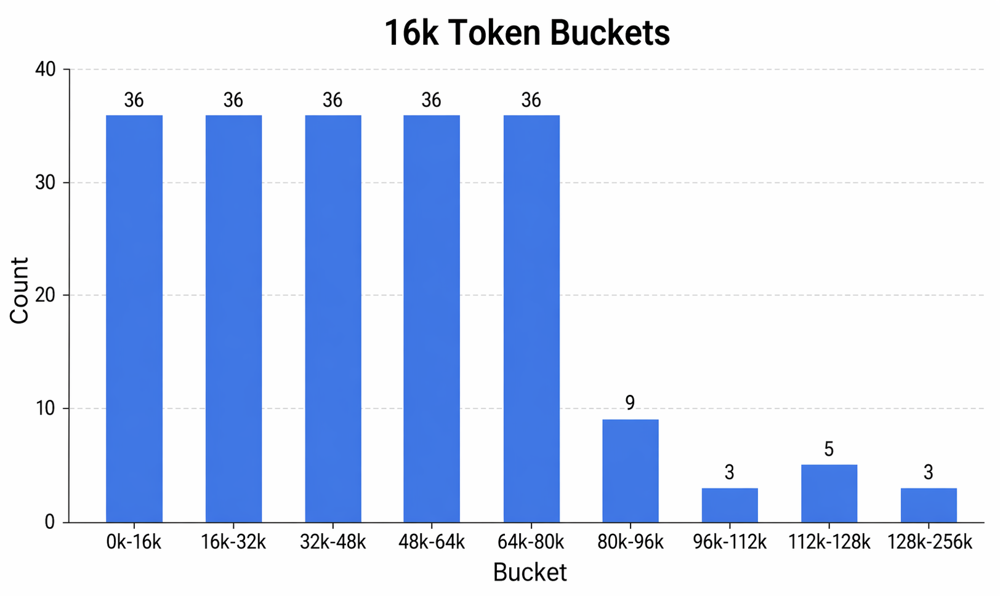|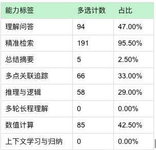|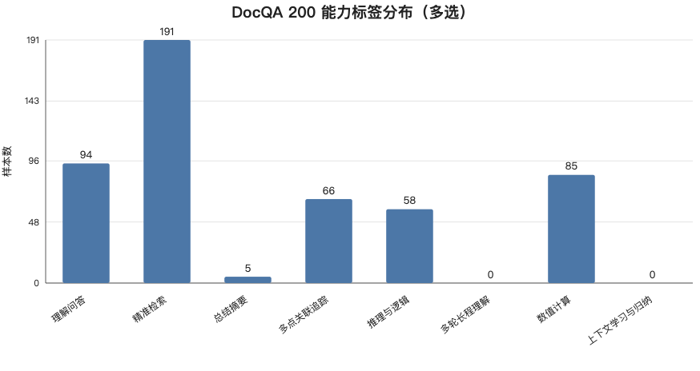||**输入文档**：`docqa_01655`, `doc-math`, `128k-256k`<br/>**问题**：计算 2021 上半年 adjusted ROATCE。<br/>**GT**:<br/>Therefore, the answer is 6.4492577269408615.<br/>**summary **中直接包含：<br/>The adjusted ROATCE ... equals 6.4492577269408615%.|
||16k-32k|36||||||
||32k-48k|36||||||
||48k-64k|36||||||
||64k-80k|36||||||
||80k-96k|9||||||
||96k-112k|3||||||
||112k-128k|5||||||
||128k-256k|3||||||

#### 【20260703】
**观点**：我们不是反对“定位后推理”，而是把它扩展成“定位 -> 压缩 -> 推理”，**定位后推理是必要前提，但不一定是充分条件****，summary 是对定位结果的去噪、组织和压缩**，让模型面对的是高密度推理状态，而不是一组松散原文片段。


|长度分档|样本数|多证据比例（>=3）|P50证据跨度(chars)|P90证据跨度(chars)|
|-|-|-|-|-|
|0-32k|72|51.4%|886|24,976|
|32-64k|72|65.3%|5444|106,043|
|64k+|56|60.7%|5461|113,405|

* **结论**：随着上下文变长，答案所需证据越来越分散，压缩可以帮助长尾困难样本的解决，在128k-256k token的扩展中有足够的实现的价值。
* **风险**：

    1. **压缩后回答的必要性证明：**目前业界的主流是定位后推理，我们的观点是在单点检索，多点高密度检索上效果没有下降，在多点低密度任务上有效果；
    2. **高质量summary如何构建的问题：**目前的初步想法是基于公开长文构造doc + question得到question-contition的summary【生成】，再用『只看 summary 能否答对』进行【过滤】，得到能训练模型先压缩关键证据再回答的长文数据。
    3. **训练策略**：先用SFT去warm-up，学会先总结再回答的格式，用 RL 优化 summary 质量和最终答案，其中 reward 看final answer 是否正确、summary 是否足够回答【后验】和事实性检测。


#### 数据构造
**背景**：

* 数据建设：benchmark verifier
* 训练：GRPO：单阶段，两阶段无长文，后面有长文，均匀混合；
* 长文：verifier，训了就有很好的水平，verifier合理+RL策略也是正常的。ID+OOD。
* VS系统，接收RL数据，有query，verifier list【rule，高质】，reward shaping，verifier的组合
* 1M长下文：底层架构+
* 数据合成：问题在，RL，makesense，从问题


**目标**：不强制模型每题都写固定格式 summary，而是要构造一种 RL 环境，让模型在探索中发现：当证据分散、冗余、需要聚合时，先压缩成中间状态更容易拿高 reward。


**什么数据是必要的：**

1.  Summary-Helpful 数据

    * 特点：没有 summary 可能答，但很容易错；summary 好了会显著降低难度。
    * 筛选：证据分散+后验的实验，是否加summary

```
  teacher 生成：

  {
    "question_conditioned_summary": "...",
    "key_facts": [...],
    "answer": "..."
  }

  然后过滤：

  summary + question -> 能答对
  summary facts -> 能被 doc 支持
```
2. Retrieval-Sufficient 数据

    * 特点：一个短 span 就能回答。
    * 目标：如果证据很短、很明确，不需要长篇总结，直接定位回答即可。

3. Summary-Necessary-Hard 数据【后期 RL 的关键数据】

    * 特点：直接回答 pass@k 很低，但 teacher summary 后 pass@k 明显提高。
    * 筛选：前期RL的rollout全错样本


**Reward如何设计**

  R = final_answer_reward——主奖励：答案对不对

    +** optional_summary_sufficiency_reward——条件奖励：生成了summary的情况下，能否答对**

    + faithfulness_reward——事实一致性奖励

    + key_detail_coverage_reward——关键信息奖励

    - hallucination_penalty——幻觉惩罚

    - unnecessary_summary_penalty——冗长惩罚


**阶段一：SFT数据**

核心思路是：先用强模型构造 question-conditioned summary，再把数据拆成“学会压缩”，“基于压缩回答”，“端到端压缩后回答”三种格式；

```
三类SFT格式：
 A. Summary-only
  input: doc + question
  target: question-conditioned summary

  B. Answer-from-summary
  input: summary + question
  target: answer

  C. End-to-end
  input: doc + question
  target: summary + answer
```
**阶段二：RL训练 stage-1**

核心思路：模型自己 rollout，然后 reward 同时看 final answer、summary sufficiency、faithfulness、key detail preservation 和 format。


#### 【20260707】
**summary生成**

* **准备阶段**

|**目标文件**|**结果文件**|**唯一健**|**脚本**|
|-|-|-|-|
|QwenLong-L1 的 DocQA-RL-1.6K 数据集：[https://huggingface.co/datasets/Tongyi-Zhiwen/DocQA-RL-1.6K](https://huggingface.co/datasets/Tongyi-Zhiwen/DocQA-RL-1.6K)<br/>总量：1.59k<br/>划分：train训练集<br/>**测试集：2.01k尚未使用**<br/>|summary文件<br/>`/home/disk6/xiazhaoyuan/workspace/paper/ernie/output/remaining_docqa_aligned_by_key_20260706_220027/master_records_keyaligned.jsonl`<br/>summary-only评估文件：<br/>`/home/disk6/xiazhaoyuan/workspace/paper/ernie/output/summaryonly_full_1533_qwen_math_judge_20260707/full_1533_case_level_details_enriched.jsonl`|**id + source + ability + question**<br/>eg.`docqa_long_toc_choices_0_20000_000000`+`long_toc_choices_0_20000`+`doc-mc`+"`甲公司（住所地为A市B区）与乙公司（住所地为C市D区）签订了一份位于E市F区的厂房租赁合同，约定争议由E市F区法院管辖。后因乙公司拖欠租金，甲公司向E市`| summary生成程序：`/home/disk6/xiazhaoyuan/workspace/paper/ernie/code/scripts/generate_question_conditioned_summaries.py`<br/>System prompt：  你是长文 question-conditioned summary 数据生成专家。你必须输出可解析 JSON，不要输出 Markdown。  User prompt 模板：  请根据 doc 和 question 生成 question-conditioned summary。  重要约束：  1. 你只能使用 doc 中的信息；  2. 输入中没有标准答案，你不能猜测或编造；  3. summary 的目标是保留回答 question 所需的关键证据、实体、数值、时间、条件、例外和推理中间量；  4. 如果 doc 中证据不足，summary 中要明确说明证据不足，而不是硬给答案；  5. summary 不要直接写“答案是...”，除非这是 doc 原文已经显式给出的事实；  6. summary 控制在 150-350 个中文字符或 100-220 个英文词内。  请输出 JSON：  {    "summary": "question-conditioned summary",    "key_facts": ["关键事实1", "关键事实2", "关键事实3"],    "evidence_quotes": ["原文短引用1", "原文短引用2"],    "risk_notes": ["可能的歧义或缺失信息"]  }  [Question]  {question}  [原始长文 doc]  {full_doc}<br/>summary-only评估（含划分）：<br/>`summary/home/disk6/xiazhaoyuan/workspace/paper/ernie/code/scripts/evaluate_summary_only_sufficiency.py`|

* 分析阶段

|长度分布<br/>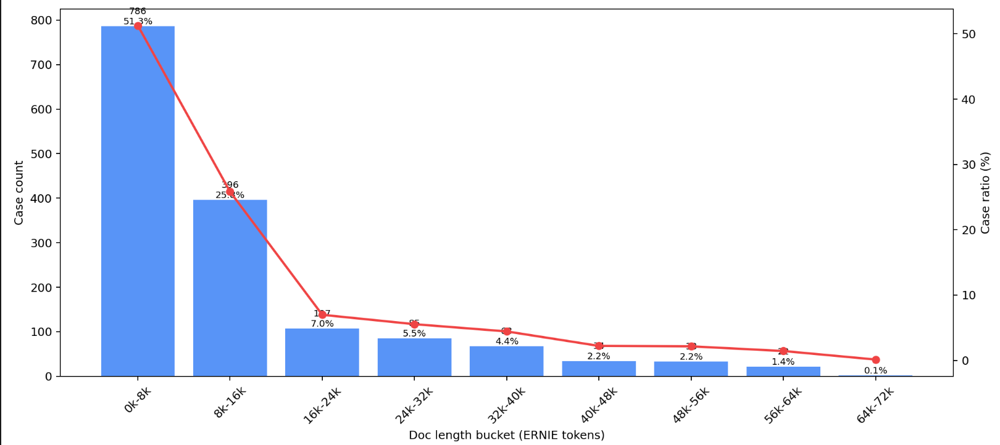|任务类型<br/>qa固定格式回答"there isXXX"，mc选择题，math数值计算<br/>|
|-|-|
||**Insight**：<br/>* DocQA的训练集1533个case长度都偏短，超过64k的只有3个case，0-16k占据75%的比例。<br/>* 任务上，均匀分布，评估过程中对于math使用了llm作为judge<br/>* 能力维度会更偏向于定位，summary的专项任务很少，只有3%，如果在docqa有很好表现，那么会有很大优势。<br/>|

* **金标：回答者统一为claude-opus-4-6**

|Summary-Gen-Model|0-20k Easy|20-40k Medium|40k+ Hard|Avg Acc|
|-|-|-|-|-|
|claude-opus-4-6|0.762|0.454|0.242|0.690|

    * **insight**：Claude生成的summary质量很高，可以拿来作为后续数据合成的语料。

* SFT/RL数据生成（包含Verifier构建）

|索引|阶段|目标|脚本|文件|统计|
|-|-|-|-|-|-|
|1|清洗数据|* 保留summary-only能回答正确的case，代表着它是一个高质量summary，可以拿来训练<br/>* 清洗部分summary中的答案尾端，我们不希望在summary中有答案<br/> 请清洗下面的 question-conditioned summary，只删除尾部明显直接泄露最终答案的总结句。  要求：  1. 保留回答问题所需的证据、实体、数值、时间、条件、例外和推理中间量；  2. 对数学题保留公式、中间计算和必要数值；只删除“答案是/therefore the answer is/因此最终答案为”这类最终答案包装句；  3. 不要新增原 summary 没有的信息；  4. 不要改写大部分 summary，不要压缩，不要润色，只做最小删除；  5. 输出 JSON，不要输出 Markdown。  JSON 格式：  {    "cleaned_summary": "...",    "removed_answer_leakage": true/false,    "removed_text": ["被删除的短句"]  }  [Ability]  {ability}  [Question]  {question}  [Original Summary]  {question_conditioned_summary} <br/>* 检验事实性，利用字段『**evidence_quotes"**』在原doc去检索|`/home/disk6/xiazhaoyuan/workspace/paper/ernie/code/scripts/build_sft_rl_from_enriched_cases.py`<br/>1. 用 id + source + ability + question 对齐唯一键<br/>2. 先过滤 correct == true<br/>3. 再做 evidence_quotes 原文支持检查<br/>4. 只有通过前面过滤的目标 case，才调用 Claude 清洗 summary|**输入文件**：<br/>case：<br/>`/home/disk6/xiazhaoyuan/workspace/paper/ernie/output/summaryonly_full_1533_qwen_math_judge_20260707/full_1533_case_level_details_enriched.jsonl`<br/>summary-only-eval：<br/>`/home/disk6/xiazhaoyuan/workspace/paper/ernie/output/summaryonly_full_1533_qwen_math_judge_20260707/full_1533_case_level_details_enriched.jsonl`<br/>**输出文件**：<br/>`/home/disk6/xiazhaoyuan/workspace/paper/ernie/output/clean_summary_cases_v2_no_evidence_filter_20260707/clean_cases.jsonl`|总量：1058个case<br/>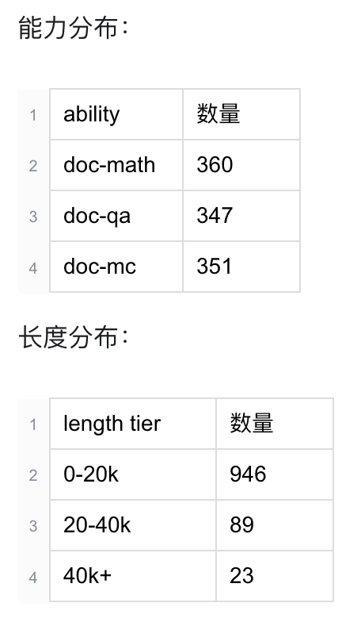|
|2||||||
|3||||||

* 实验结果

|Experiment|Easy 0-20k|Medium 20-40k|Hard 40k+|Avg|备注|
|-|-|-|-|-|-|
|* claude-opus-4-6 longdoc|0.989|0.899|0.783|0.925|评测代码：code/scripts/evaluate_longdoc_summary_baselines.py<br/>评测脚本：<br/>/home/disk6/xiazhaoyuan/workspace/paper/ernie/code/scripts/run_longdoc_summary_baselines_200.sh<br/>评测结果文件：<br/>/home/disk6/xiazhaoyuan/workspace/paper/ernie/output/longdoc_summary_baselines_200_seed41_20260708_010327|
|* claude-opus-4-6 claude_summary|1.000|0.966|0.957|**0.980**||
|claude-opus-4-6 longdoc+claude_summary|1.000|0.966|0.870|0.970|****|
|* qwen3.5-flash longdoc|0.773|0.753|0.652|0.750||
|* qwen3.5-flash claude_summary|0.977|0.944|0.870|0.950||
|qwen3.5-flash longdoc+claude_summary|0.977|0.966|0.957|0.970|****|
|qwen3.5-flash longdoc+qwen_summary_200|0.784|0.730|0.565|0.735|* 200词：/home/disk6/xiazhaoyuan/workspace/paper/ernie/output/qwen35_flash_qc_summaries_seed41_short/summaries_qwen3.5-flash_llmrepaired.jsonl<br/>* 500词：/home/disk6/xiazhaoyuan/workspace/paper/ernie/output/qwen35_flash_qc_summaries_seed41_500/summaries_qwen3.5-flash_llmrepaired.jsonl<br/>* 1000词：/home/disk6/xiazhaoyuan/workspace/paper/ernie/output/qwen35_flash_qc_summaries_seed41_1000/summaries_qwen3.5-flash_llmrepaired.jsonl|
|qwen3.5-flash longdoc+qwen_summary_500|0.841|0.798|0.696|0.805||
|qwen3.5-flash longdoc+qwen_summary_1000|0.852|0.899|0.826|0.870||

    * **summary对强模型也有作用**：Claude 自身也从 0.925 提升到 0.970，说明 summary 不只是弱模型补丁，对强长文模型也能减少 medium/hard的注意力发散。
    * **弱模型的注意力分散严重，需要总结去噪**：qwen3.5-flash 加 Claude summary 后从 0.750 提升到 0.970，hard 桶从 0.652 到 0.957。
    * **summary的长度是关键**：弱模型自己生成的短 summary 不稳定，但当 summary 扩展到 500/1000 级别后，longdoc+summary 能显著提升回答质量，尤其在 40k+ hard case 上

* case study

|Method|Ability|Base Acc|Summary Acc|Delta|修正|退化|备注|
|-|-|-|-|-|-|-|-|
|qwen_summary_1000|doc-math|0.494|0.765|**+0.272**|**29**|7|* docqa_docmath_0_20000_000028：average Interest expense，summary 误导成文档未提供平均值；<br/>* docqa_docmath_20000_40000_000378：CAGR，summary 认为缺 full-year 数据；<br/>* docqa_docmath_20000_40000_000390：warrant redemption，summary 口径误导；<br/>* docqa_musique_0_20000_001085、001454：多跳 QA 被summary 压缩掉关键跳。|
|qwen_summary_1000|doc-mc|0.974|1.000|+0.026|2|0||
|qwen_summary_1000|doc-qa|0.829|0.829|+0.000|4|4||

**insight**：flash summary 真正带来的提升主要来自“把分散数值和计算中间量压缩到可用上下文尾部”，但风险是弱模型 summary 会误判证据不足或抽错计算口径，所以 RL/SFT的重点应该不是简单鼓励更长 summary，而是奖励关键数值覆盖、公式口径正确和不误拒答
