<!-- Exported from Baidu Ku knowledge base. -->
<!-- Source: https://ku.baidu-int.com/knowledge/HFVrC7hq1Q/pKzJfZczuc/KRMcaCYx6j/w2TZb6MXg1qYOb -->
<!-- Published: 2026-08-17T20:29:14+08:00 -->

# 长文领域后训练RL探索调研

v3-20260817

### **结果展示**
**ID**

|Model|Overall|CNNSum|CUAD|DocFinQA|FinGLM|Frames|GovReport|LongBench-Pro|LongCite|MRCR|MSMARCO-Rerank|
|-|-|-|-|-|-|-|-|-|-|-|-|
|Qwen2.5-7B-Instruct-1M|32.9% (n=500)|18.1% (n=21)|18.6% (n=40)|34.2% (n=24)|11.0% (n=23)|24.3% (n=24)|19.4% (n=34)|42.4%|0.0% (n=10)|0.0% (n=25)|51.0% (n=25)|

**OOD**

|Model|Overall|AA-LCR|HELMET-Cite|HELMET-LongQA|HELMET-Rerank|HELMET-Summ|LongBenchV2|QwenLong-Test-DocMath|
|-|-|-|-|-|-|-|-|-|
|Qwen2.5-7B-Instruct-1M|20.3% (n=500)|0.0% (n=100)|9.6% (n=25)|33.9% (n=100)|59.4% (n=25)|14.3% (n=100)|22.0% (n=100)|27.9% (n=50)|


**评估设置**

|索引|定位|内容|
|-|-|-|
|1|评估设置|* 我们分别在同分布（ID）和分布外（OOD）测试集上评估模型的长文本理解能力。ID 与 OOD 测试集各包含 500 个样本，均覆盖七类能力：文档问答、精确检索、推理和摘要各 100 个样本，数值计算50 个样本，引用和排序各 25 个样本。ID 测试集主要由训练分布内的 benchmark 构成，OOD 测试集则采用未见或分布发生变化的 benchmark，用于衡量模型的跨任务泛化能力。<br/>* 所有模型均使用相同的原始 benchmark 输入，不额外渲染 block ID。最大上下文长度设为 135,168 tokens，最大生成长度为 4,096 tokens；超过上下文上限的输入采用左侧截断。解码温度设为0，top-p 为 1.0，重复惩罚为 1.0，从而保证不同模型之间的评估具有确定性和可复现性。|
|2|答案抽取|* 为公平比较原生 Instruction 模型和 SFT 模型，我们采用统一的 FinalAnswer 抽取逻辑。对于 SFT 模型，模型可能同时输出 evidence、summary 和 answer，评估时仅提取 <answer>...</answer> 中的内容，其他中间推理、证据和摘要均不参与计分。对于原生 Instruction 模型，如果输出中不存在 <answer> 标签，则将模型的直接回答作为最终答案。<br/>* 解析器同时支持 JSON 格式答案以及 [Answer]、[答案] 等标识符。在进行指标计算前，答案统一经过 Unicode NFKC 规范化、大小写归一化、空白归一化和标点清理。评估过程完全由确定性的程序完成，不依赖 LLM-as-a-Judge。|
|3|任务与指标||
|4|详细|### 问答指标  普通问答任务同时计算规范化 Exact Match 和 Token F1，并取两者中的较大值。对于包含多个参考答案的样本，取模型答案与所有参考答案之间的最高分。中文短答案按字符切分，英文答案按词切  分。  ### 集合指标  要求返回多个实体、条款或文档编号的任务使用 Set F1。预测答案与参考答案分别解析为无序集合，然后计算集合级 precision、recall 和 F1。参考答案允许包含多个别名，同一实体匹配任一合法  别名即可视为命中。  ### 排序指标  排序任务采用 NDCG。对于提供 graded relevance 或 qrel 的任务，计算指定截断位置上的 NDCG@K；否则根据参考排序构造位置相关性并计算 NDCG。Pairwise Accuracy 和候选召回率作为辅助诊断  指标，但不作为主结果。  ### 数值指标  数值任务从模型输出和参考答案中抽取数值，并允许百分数和普通小数之间的格式差异。容差定义为：  [  \max(10^{-4},, 0.001 \times |\text{reference}|)  ]  误差在容差范围内时得满分，超出容差时分数随归一化误差增大而递减。如果无法抽取数值，则回退到普通 QA 的 EM/F1 指标。  ### 摘要指标  摘要任务采用 ROUGE-L。对于中文摘要，统一使用字符级最长公共子序列；对于英文摘要，使用词级最长公共子序列。这样可以避免中文预测包含 Markdown 标题或换行时出现预测与参考答案分词粒  度不一致的问题。  ### 引用指标  LongCite 同时评价答案内容和引用正确性。答案内容取 Token F1 与 ROUGE-L 的较大值，引用部分计算引用 ID 的 precision、recall 和 F1，最终分数为内容分数与引用 F1 的调和平均。  HELMET-Cite 的交付 GT 不包含完整引用标签，因此当 GT 为实体列表时使用支持别名的 Set F1；当 GT 为文本答案时使用 QA EM/F1。  ## 结果汇总  每个样本得到一个位于 ([0,1]) 范围内的 benchmark-native 分数。每个 benchmark 的最终结果为其所有样本分数的宏平均，ID/OOD Overall 则为对应 500 个样本的平均分。  默认结果直接报告 ROUGE-L、NDCG、F1 或 Accuracy 等任务原生程序指标。不同指标家族的绝对值不宜直接横向比较，模型比较应主要在相同 benchmark 和相同指标下进行。  “只有单样本指标恰好等于 1 才记为正确”的 strict-exact ACC 以及 LLM-as-a-Judge 结果仅作为辅助诊断，不作为论文主结果。|


**v3-20260811**

**数据构建**

**RAW**

|**数据集**|**定位**|**任务类型**|**长度分布**|**case示例**|**总览**|
|-|-|-|-|-|-|
|**CNNSum**|中文小说的多尺度长文摘要；针对 16K 到 128K 不同长度的中文小说，生成覆盖主线、人物关系和冲突发展的摘要。<br/>[https://github.com/CxsGhost/CNNSum](https://github.com/CxsGhost/CNNSum) |summarization<br/>1638|{"8k-16k": 604, "16k-32k": 750, "32k-64k": 284}<br/>上下文 token min/P50/P95/max<br/>12567 / 28781 / 61718 / 63843|{  "data_id": "0552bcff-11a3-40a6-806d-e221316a190f",  "prompt": [    {      "role": "user",      "content": [        {          "type": "text",          "text": "你将阅读一段中文小说或故事的连续正文，并完成全局摘要任务。 请只依据给定正文作答，覆盖主要人物、关键冲突、情节推进和重要转折；不要加入主观评论，不要续写或编造原文没有的信息。 【任务】 请客观总结这段小说的剧情脉络，包括主要人物、重要事件和当前结果，不讨论主题寓意或创作背景。 【小说正文】 夏浔再苏醒时，已经在海岛上了。旁边坐着一个没了牙的老太太，正在喂他鱼汤，夏浔还没弄明白身在何处，就听一个爽朗的女人声音道：“他醒了？”随即门帘一掀，一个女人大步进了进来，一看见他便笑道：“哈哈，你的命还真大，不枉我一番辛苦！”这个女人看起来约有三旬上下，肤色是健康的小麦色，眼睛异常的明亮，好像海水般清澈，这使得她看起来又年轻了许多。她的嘴唇润泽丰满，透出一股野性的魅力，女子一旦有了媚态，三四分姿容，便可抵得过七八分颜色，何况她本来就不丑，健康性感的火辣身材，略显野性的气质相貌，赋予这个女海盗一种特别的味道。夏浔只听声音就认出了她，连忙挣扎起身道：“原来是三当家的，多谢三当家救命之恩。”苏颖又是爽朗地一笑，大声道：“你不用客气，不伤无辜，这是我爹生前立下的规矩。这几天，你就在我这儿住着，不要胡乱走动，等我查明你的身份，我会派人送你回去，如果你当真是朝廷的秘探，我苏小妹能救你，也就能结果了你！”这苏颖大大咧咧一副男儿做派，交待了这么几句话，便风风火火地离开了。夏浔只是闭气过久晕厥过去，一俟苏醒，也就没了大碍，在这岛上，他插翅也飞不了，因此既无人看管他，也不必绑着他，夏浔未敢远离，就在院落周围转了转，熟悉这里的环境。苏颖的住处是半倚山洞盖成的一处院落，三间正房，两间厢房，一个小院儿，距沙滩很近，出了小院前方不远，就是平坦的沙滩。这片沙滩是贝壳类沙滩，沙石比较粗砾，但是海水很清澈，不时会有些海藻一类的东西被冲上岸来。夏浔远远地察看一下岛上的动静，这片海域不适宜船只靠岸，码头应该在另一侧，他看到一些张着洁白大帆的船只正向岛后绕过去，看情形，双屿岛作为走私的中转站，生意还兴隆的很。夏浔心道：“他们要盘我的底，总得还须几日时光，我想活命，就得利用这段时间逃走。可是一叶小舟，怕是到不了海宁的，..."        }      ]    }  ]|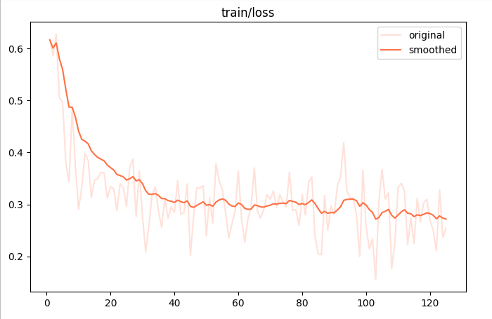|
|DocFinQA|完整 SEC 年报上的长文档金融数值推理；将 FinQA 问题放回完整 SEC filing，要求从超长财报中检索数值并按问题完成计算。<br/>[https://arxiv.org/abs/2401.06915](https://arxiv.org/abs/2401.06915)|financial_qa_or_numerical<br/>2328|{"64k-128k": 2081, ">128k": 125, "32k-64k": 122}<br/>上下文 token min/P50/P95/max<br/>40729 / 95915 / 129273 / 166917|- query 示例：  - what was the percentage change in net gains ( losses ) realized on fund dispositions between 2007 and 2008?  - how much were investment advisory revenues in 2007 , in millions of dollars?  - what percentage of total other purchase commitments is made up of other purchase commitments?```json{  "data_id": "DocFinQA_part1_0_copy0",  "prompt": [    {      "role": "user",      "content": [        {          "type": "text",          "text": "Based on the following financial document, please answer the question. 【Document】 Table of Contents # UNITED STATES # SECURITIES AND EXCHANGE COMMISSION (Mark One) # ANNUAL REPORT PURSUANT TO SECTION 13 OR 15(d) OF THE SECURITIES EXCHANGE ACT OF 1934 # For the fiscal year ended December 31, 2014 ¨ TRANSITION REPORT PURSUANT TO SECTION 13 OR 15(d) OF THE SECURITIES EXCHANGE ACT OF 1934 # CDW CORPORATION (Exact name of registrant as specified in its charter) Delaware 200 N. Milwaukee Avenue Vernon Hills, Illinois (Address of principal executive offices) (Zip Code) (Registrant's telephone number, including area code) (Former name, former address and former fiscal year, if changed since last report) Securities registered pursuant to Section 12(b) of the Act: Title of each class: Common stock, par value $0.01 per share Name of each exchange on which registered # NASDAQ Global Select Market..."        }      ]    }  ],||
|**FinGLM**|中文金融大模型与金融文档理解；围绕上市公司年报等金融材料进行问答、信息抽取和金融知识理解。<br/>[https://github.com/MetaGLM/FinGLM](https://github.com/MetaGLM/FinGLM)|financial_qa_or_numerical<br/>2789|{"64k-128k": 1064, ">128k": 1725}<br/>上下文 token min/P50/P95/max<br/>81503 / 133819 / 200489 / 247677|  "prompt": [    {      "role": "user",      "content": [        {          "type": "text",          "text": "请基于以下上市公司年度报告内容回答问题。 【年报元信息 / 本题绑定的结构化线索】 1. 公司全称：广州御银科技股份有限公司；公司简称：御银股份；股票代码：002177；报告年份：2021；年报文件：2023-06-09__广州御银科技股份有限公司__002177__御银股份__2021年__年度报告.pdf 说明：本题绑定的是单份年报。如果问题本身没有显式写出公司名或年份，请以这里的元信息确定作答对象。 【年报内容】 ===== 年报 1: 2021 2023-06-09__广州御银科技股份有限公司__002177__御银股份__2021年__年度报告.pdf ===== [第1页] 广州御银科技股份有限公司2021年年度报告全文 广州御银科技股份有限公司 2021年度报告 2022年04月 1 [第2页] 广州御银科技股份有限公司2021年年度报告全文 第一节重要提示、目录和释义 公司董事会、监事会及董事、监事、高级管理人员保证年度报告内容的真实、准确、完整，不存在虚假记载、误导性陈述或重大遗漏，并承担个别和连带的法律责任。 公司负责人谭骅、主管会计工作负责人陈国军及会计机构负责人(会计主管人员)陈国军声明：保证本年度报告中财务报告的真实、准确、完整。 所有董事均已出席了审议本报告的董事会会议。 经审计，公司2021年度扣除非经常性损益前后孰低的净利润为-63,189,327.46元，且营业收入85,885,255.91元。根据《深圳证券交易所股票上市规则（2022年修订）》第9.3.1条第一款第（一）项规定，最近一个会计年度经审计的净利润为负值且营业收入低于1亿元（上述净利润以扣除非经常性损益前后孰低者为准；营业收入应当扣除与主营业务无关的业务收入和不具备商业实质的收入），公司股票交易将被实施退市风险警示（股票简称变更为“*ST御银”）。敬请广大投资者关注公司公告，审慎理性决策，注意投资风险。本报告涉及未来计划等前瞻性陈述，只是对公司经营情况的预测，不构成公司对投资者的实质性承诺。投资者及相关人士均应当对此保持足够的风险意识，并且应当理解计划、预测与承诺之间..."        }      ]    }  ],||
|**CUAD**|法律合同条款理解与抽取；从商业合同中定位与交易审查相关的条款，回答某类法律条款是否存在及其原文 span。<br/>[https://github.com/TheAtticusProject/cuad](https://github.com/TheAtticusProject/cuad)|legal_clause_extraction<br/>1693|{"16k-32k": 406, "8k-16k": 492, "<8k": 516, "64k-128k": 33, "32k-64k": 246}<br/>上下文 token min/P50/P95/max<br/>726 / 12352 / 59086 / 91140|{  "data_id": "CUAD_QA_500answerable_sample0000_copy2",  "prompt": [    {      "role": "user",      "content": [        {          "type": "text",          "text": "You are reviewing a commercial contract for clause extraction. Use only the provided contract text. Do not rely on outside knowledge. Task: Identify the contract text, if any, that is related to the requested clause category. If the requested clause is present, quote the exact relevant span or spans from the contract. If the requested clause is not present, respond exactly: No relevant clause found in the provided contract. Contract metadata: - Document title: AFSALABANCORPINC_08_01_1996-EX-1.1-AGENCY AGREEMENT - Clause category: Governing Law - Gold-answer availability note: The gold annotation contains one or more answer spans for this clause category. Question: Highlight the parts (if any) of this contract related to \"Governing Law\" that should be reviewed by a lawyer. Details: Which state/country's law governs the interpretation of the contract? Contract text: Exhibit 1.1 1,265,00..."        }      ]    }  ],||
|**LongCite-45k**|带细粒度引用的长文档问答；回答长文档问题，并在每条陈述后给出对应的 chunk 或句子级引用。<br/>[https://github.com/THUDM/LongCite](https://github.com/THUDM/LongCite)|citation_grounded_qa<br/>676|{"8k-16k": 204, "64k-128k": 102, "16k-32k": 175, "32k-64k": 151, ">128k": 18, "<8k": 26}<br/>上下文 token min/P50/P95/max<br/>711 / 23661 / 103481 / 181240|"data_id": "longcite45k_sft_000384",  "prompt": [    {      "role": "user",      "content": [        {          "type": "text",          "text": "Please answer the user's question based on the following document. When a sentence S in your response uses information from some chunks in the document (i.e., <C{s1}>-<C_{e1}>, <C{s2}>-<C{e2}>, ...), please append these chunk numbers to S in the format \"<statement>{S}<cite>[{s1}-{e1}][{s2}-{e2}]...</cite></statement>\". You must answer in the same language as the user's question. [Document Start] <C0>竞争性磋商文件（货物） 采购人：南京市软件谷第二小学代理机构：江苏捷元建设项目管理有限公司二○二三年七月第一章 竞争性磋商采购邀请江苏捷元建设项目管理有限公司（以下简称“代理机构”）受南京市软件谷第二小学(单位名称，以下简称“采购人”）委托，就南京市软件谷第二小学2023年办公教学家具采购（项目名称）进行线下竞争性磋商采购，兹邀请符合资格条件的供应商提交响应文件。 <C1>一、项目基本情况1.项目编号：JSJY-Y-20230012.项目名称: 南京市软件谷第二小学2023年办公教学家具采购3.采购项目最高限总价：12.614万元4.采购需求：详见“第四章 采购需求”5.合同履行期限：详见“第四章 采购需求”6.本项目不接受联合体二、申请人的资格要求1.满足《中华人民共和国政府采购法》第二十二条规定：（1）具有独立承担民事责任的能力（法人或者其他组织提供营业执照或法人证书或组织机构代码证，自然人提供身份证）；<C2>（2）具有良好的商业信誉和健全的财务会计制度（提供参加本次政府采购活动前6个月内至少一个月份的会计报表（至少包括资产负债表、利润表、现金流量表）复印件或其上一年..."        }      ]    }||
|**MRCR **|长上下文隐式结构检索与多轮指令跟随；在大量对话示例和长上下文中定位目标对象，再执行精确的插入、替换或抽取操作。<br/>[https://github.com/google-deepmind/michelangelo](https://github.com/google-deepmind/michelangelo)|long_context_retrieval_and_edit<br/>stage1： 2939 <br/>stage2： 400|{"<8k": 261, "8k-16k": 338, "16k-32k": 399, "64k-128k": 522, "32k-64k": 1419}<br/>上下文 token min/P50/P95/max<br/>4410 / 37403 / 102881 / 121635|- query 示例：  - Prepend 1rRZEWDyfr to the 2nd (1 indexed) song about murder. Do not include any other text in your response.  - Prepend OtytznnXU6 to the 1st (1 indexed) diary entry about models. Do not include any other text in your response.  - Prepend xzDXdGMlzo to the 2nd (1 indexed) short news article about colors. Do not include any other text in your response.```json{  "data_id": "long_text_mrcr_200ddfd7-e629-4155-a3ef-0e2c842cfebb::gen_03",  "prompt": [    {      "role": "user",      "content": [        {          "type": "text",          "text": "Prepend 7OeQ9cdEZG to the 4th (1 indexed) poem about weights. Do not include any other text in your response."        }      ]    }||
|**MSMARCO passage rerank**|候选段落检索结果的相关性重排序；给定 query 和大批候选 passage，输出相关性更高的文档编号排序。<br/>[https://microsoft.github.io/msmarco/](https://microsoft.github.io/msmarco/) |reranking<br/>stage1：650<br/>stage2：220|{"64k-128k": 100, "16k-32k": 305, "32k-64k": 245}<br/>上下文 token min/P50/P95/max<br/>21589 / 54012 / 98147 / 114142|```json{  "data_id": "msmarco_rerank_0805_001638",  "prompt": [    {      "role": "user",      "content": [        {          "type": "text",          "text": "You are provided with a list of documents, each indicated by their ID. Rank each document based on their relevance to the question in descending order from most relelvant to least relevant texts. Include all documents in the rankings. Write your answer using the unique IDs, with the following format: Ranking: ID3 > ID1 > ID2 [ID: 1625013] Document: Huge parts of the North American moose population have a home-range of between 5-40km2. Looking at their colleagues high up north with less food supply, the home-range can be up to 25-times that big! Alaskan moose have around 260 km2 in average browsing range. [ID: 1340253] Document: Home / U.S. Citizen Services / Contact Information, Working Hours and Appointments. The American Citizen Services (ACS) Unit at the Embassy in Brasília and at the Consulates in Rio de Janeiro, São Paulo and Recife offer a full range of services to U.S. Citizens..."        }      ]    }||
|AA-LCR|跨多份真实文档的长上下文分析推理；从约 100K token 的多文档集合中综合企业、行业、政府、法律和学术材料，回答需要比较或计算的问题。<br/>[https://huggingface.co/datasets/ArtificialAnalysis/AA-LCR](https://huggingface.co/datasets/ArtificialAnalysis/AA-LCR)|multi_document_reasoning<br/>65|{"64k-128k": 60, ">128k": 5}<br/>上下文 token min/P50/P95/max<br/>94499 / 111919 / 129114 / 132142|role": "user",      "content": [        {          "type": "text",          "text": "You are an expert AI assistant. Your task is to answer a question based on a set of provided documents. Read the documents carefully and provide a concise and accurate answer. --Documents-- BEGIN DOCUMENT 1: Organisation for Economic Co-operation and Development **DAF/COMP(2023)14** **Unclassified** **English - Or. English** **27 November 2023** **DIRECTORATE FOR FINANCIAL AND ENTERPRISE AFFAIRS** **COMPETITION COMMITTEE** **Cancels & replaces the same document of 3 November 2023** **Out-of-Market Efficiencies in Competition Enforcement - Background Note** **- by the Secretariat -** 6 December 2023 This document was prepared by John Davies as the background note for item 12 of the 141[st] meeting of the Competition Committee on 5-6 December 2023. The opinions expressed and arguments employed herein do not necessarily reflect the official views of the Organisation or of the governments..."        }|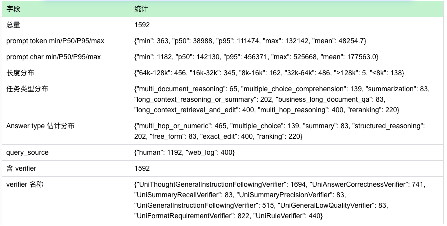|
|LongBench v2|真实世界长上下文综合理解与深层推理；覆盖单文档、多文档、长对话、结构化数据和代码等场景的长上下文选择题。<br/>[https://longbench2.github.io/](https://longbench2.github.io/) |multiple_choice_comprehension<br/>139|{"16k-32k": 59, "8k-16k": 12, "32k-64k": 38, "64k-128k": 30}<br/>上下文 token min/P50/P95/max<br/>10904 / 30921 / 109172 / 115583|  "data_id": "LongBenchv2-32k-7",  "prompt": [    {      "role": "user",      "content": [        {          "type": "text",          "text": "Please read the following text and answer the questions below. <text> 1/6 1/6 Press Release Dupixent approved in the EU as the first-ever targeted therapy for patients with COPD * First-in-world approval of Dupixent for adults with uncontrolled COPD with raised blood eosinophils based on two landmark phase 3 studies showing Dupixent significantly reduced exacerbations, improved lung function and also improved health-related quality of life * Dupixent is the first new treatment approach for COPD in more than a decade and a new option for approximately 220,000 adults in the EU * Approval represents the sixth approved indication for Dupixent in the EU and seventh approved indication globally Paris and Tarrytown, NY, July 3, 2024. The European Medicines Agency (EMA) has approved Dupixent (dupilumab) as an add-on maintenance treatment for adults with uncontrolled chronic obstructive pulmon..."        }      ]||
|FRAMES|多文档 RAG 的事实性、检索与多跳推理；跨 2 到 15 篇 Wikipedia 文章检索信息，处理时间、数值和多约束条件后回答问题。<br/>[https://huggingface.co/datasets/google/frames-benchmark](https://huggingface.co/datasets/google/frames-benchmark) |multi_hop_reasoning<br/>400|{"64k-128k": 18, "32k-64k": 97, "16k-32k": 142, "<8k": 77, "8k-16k": 66}<br/>上下文 token min/P50/P95/max<br/>363 / 20982 / 62121 / 112153|"content": [        {          "type": "text",          "text": "Please read the following text and answer the question below. <text> Monaco Monaco, officially the Principality of Monaco, is a sovereign city-state and microstate on the French Riviera a few kilometres west of the Italian region of Liguria, in Western Europe, on the Mediterranean Sea. It is a semi-enclave bordered by France to the north, east and west. The principality is home to 38,682 residents, of whom 9,486 are Monégasque nationals; it is recognised as one of the wealthiest and most expensive places in the world. The official language is French; Monégasque, English and Italian are spoken and understood by many residents. With an area of 2.08 km2 (0.80 sq mi), Monaco is the second-smallest sovereign state in the world, after Vatican City. Its population of 38,367 in 2023 makes it the most densely populated sovereign state. Monaco has the world's shortest coastline: 3.83 km (2.38 m..."        }      ]||
|LongBench-Pro|双语、真实长文档和任务感知的长上下文评测；在真实英文/中文长文档上覆盖问答、推理、排序、摘要等任务，并使用任务专属指标。<br/>[https://github.com/THUDM/LongBench](https://github.com/THUDM/LongBench) |long_context_reasoning_or_summary<br/>202|{"<8k": 11, "32k-64k": 42, "8k-16k": 54, "64k-128k": 47, "16k-32k": 48}<br/>上下文 token min/P50/P95/max<br/>7607 / 23938 / 69910 / 76102|"data_id": "long_text_reason_longbench-pro_t3_6423d377-9ea1-4f65-b916-c6f5a5f0c4ba",  "prompt": [    {      "role": "user",      "content": [        {          "type": "text",          "text": "# 藏匿于你眼中的山河 ## 01 “你们知不知道最近网上炒得正火的yeezy350系列，最贵的都上万!在我这拿货价钱至少能给你少三分之一!” “包正品，包售后，你们都看看这鞋的设计，这个配色简直绝了!” “看在是同学的份上我才给这个价的啊，仔细算起来我也才赚回本，绝对是血亏了!” 女孩的声音清脆响亮，一众爱鞋的男生都围过去看她举起的手机里放出的图片，其中有人还叫出声“这是和××联名的限定款，你居然也有货？” 礼夏挪开他凑在自己手机前的脑袋，自信满满道:“那当然了，也不看看我礼夏是谁？那可是江湖人称囤货大王的!” 此时有人心动了，纷纷开始问起礼夏购买方式和价格，礼夏笑眯眯的维持这稍稍有些混乱的秩序，边在本子上记好名字，边喊着“别挤别挤——都有货的啊!” 盛景刚来到传媒系教室门口，看到的就是这幅景象，被围在中间的女生大大咧咧坐在桌子上，把一群人高马大的男生指挥得整整齐齐。 “礼夏!”突兀的一声把所有人的目光都聚集了过去，盛景站在门口，插着裤兜，酷酷的站在那里。 有些女生一眼就认出来那是盛景，楚大有名的校草。是因为长相和优秀的实力而在学校里被人津津乐道的男神。 正忙着记客户名字的礼夏倒是吓了一跳，她不是没听说听说过盛景，也对他的种种事迹略有耳闻，只是没想到他会来找自己，并且当着这么多人的面叫出了自己的名字。 众人议论纷纷，有更胜者吹了几声响亮的口哨，礼夏被推搡着出了教室门，迎面就看见倚在教室门口的盛景。 他个子很高，礼夏只能微微仰起头去看他，他的脸逆着光，是比无意中见过的几次更加清晰的好看，礼夏的呼吸微滞。 有微风缓缓拂过男生的发梢，礼夏从未觉得有这么温柔和煦的夏天。 或许是礼夏的视线太过于直白，盛景摸了摸头有些不好意思的询问道 “听说你手里有新出的黑天使？” 礼夏愣了一下，结结巴巴的点头道:“是是啊，我这还剩了一双。” “那这最后一双我能不能先预定了。”盛景使出杀手锏般的微笑。 隔壁班的盛景亲自来找礼夏，甚至准确的叫出了她的名字，不止礼夏一个人在幻想接下来会发生的粉红色场景，可原因竟是礼夏的“鞋商”身份已经声名在外，就连盛景都慕名而来。 顷刻间，还在面红心跳的情绪通..."        }      ]||
|LongBench-Pro summarization|LongBench-Pro 的长文摘要子任务切片；要求从长文档中保留问题相关的事件、人物、关系或主线信息，生成受约束的摘要。<br/>[https://github.com/THUDM/LongBench](https://github.com/THUDM/LongBench) |summarization<br/>83|{"<8k": 5, "8k-16k": 19, "16k-32k": 19, "32k-64k": 26, "64k-128k": 14}<br/>上下文 token min/P50/P95/max<br/>7395 / 31078 / 71991 / 117365| - ...润端亏损继续收窄，EBITDA 转正至 0.14 亿元。结构上，3C、服饰、美妆成为拉动主力；用户侧会员贡献提升至 38%，复购持续改善。8 月将围绕“效率、质量、口碑”三条主线，通过 14 项行动落地，把自然流量占比提升至 48%、退货率降至 11.4%、经营利润转正至 0.03 亿元，支撑 GMV 24.60 亿元的阶段目标。 根据报告中“财务与关键比率”部分定义的“管理费用率”（管销研/营业收入）以及“收入与利润明细”中列出的费用数据，计算管理费用率，并判断计算的结果是否与“财务与关键比率”部分明确给出的管理费用率一致。先输出“[答案]”标识符，再以“[计算结果] [一致/不一致]”的格式输出答案（计算结果为百分数%，四舍五入保留两位小数），不要输出任何其他内容。 输出示例： [答案] 18.45% 一致  - ...定增长，不利于城市经济的可持续发展。 金融风险增加：房地产市场低迷使房地产开发企业、购房者、银行等各方都面临债务危机威胁。开发企业融资渠道紧张，资金链脆弱，容易出现资金断裂、债务违约；购房者因房价下跌，资产贬值，可能出现 “负资产”，导致还款违约；银行则面临不良贷款增加的风险，影响金融稳定。如 2024 年三四线城市开发商债券违约规模达 890 亿元，较上年增长 67%，区域银行房地产不良贷款率突破 15%，某农商行因开发贷坏账激增触发资本充足率预警，这些都严重影响了三四线城市的金融秩序和经济稳定 。 根据表格中的内容回答，1—7 月份全国住宅、办公楼、商业营业用房的开发投资绝对量之和是多少亿元？先输出“[答案]”标识符，再输出计算结果（整数，无需单位），不要输出任何其他内容。 输出示例： [答案] 38976  - ...淀粉、蛋白质，细微含量区别不足以影响营养成分。 “单纯对比早晚稻的营养没有实际意义。”陈大洲认为，现代人摄入营养的渠道很多，主要靠肉蛋奶，大米已经不算是主渠道了。 据国家统计局调查，2012年全国早稻播种面积5764.7千公顷，总产量为3329万吨，均比上年有所增加。其中，江西面积1389.5千公顷，总产量800.2万吨，湖南面积1424.7千公顷，总产量818.7万吨，两省的早稻播种面积和总产量接近全国一半。（记者 吴齐强 颜珂） 根据国家统计局公布的数据，在2021年至2025年期间，全国统计中的早稻单位面积产量相比上一年增长幅度最大的是哪一年的哪个城市（在城市维度比较）？先输出“[答案]”标识符，再以“[年份数字] [城市名称]”的格式输出答案，不要输出任何其他内容。 输出示例： [答案] 2024 湖南```json||


**数据构建**

|文件|总量|insight|能力维度|benchmark分布|长度分布|
|-|-|-|-|-|-|
|SFT|5300|1. 四类主能力合计占 77.4%，检索、推理各 22.3%，文档 QA 20.3%。<br/>2. 长输入为主，<32K 52.8%; >=64K 27.7%。<br/>3. MRCR 是最大来源，同时由 CUAD、Frames、摘要数据补足其他能力。|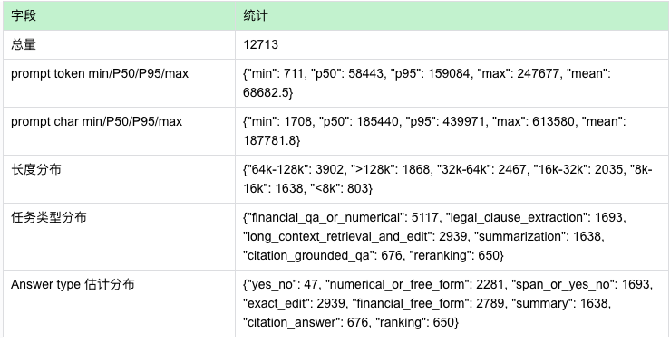||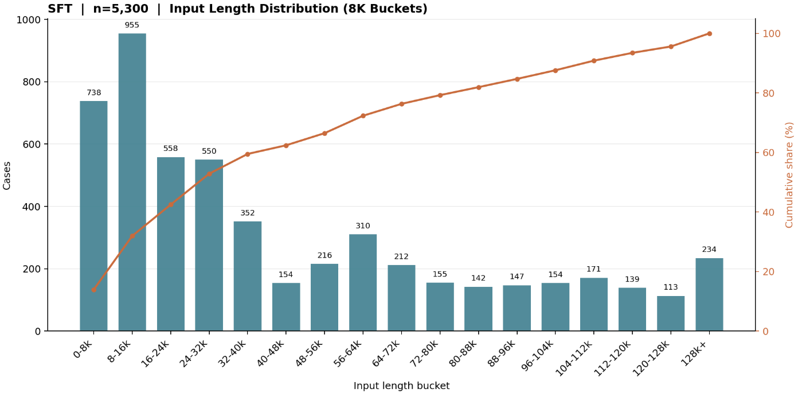|
|RL|3000|1. 与 SFT 高度同源，能力比例几乎一致，避免 RL 只集中在推理或检索。<br/>2. 长度分布与 SFT 同步，<32K 52.8%; >=64K 27.7%。<br/>3. benchmark 构成基本按 SFT 比例切分；verifier ready 1,098，pending 1,902。|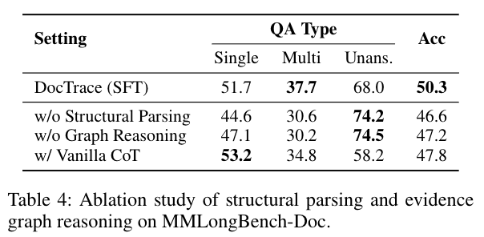||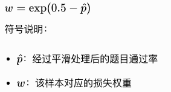|
|ID|500|1. 七类能力按 20/20/20/20/10/5/5 配置，适合做均衡能力回归。<br/>2. 500 条覆盖全长度范围，<32K 33.0%; >=64K 42.4%。<br/>3. 以训练同源 benchmark 为主，作为 ID 能力对照集。|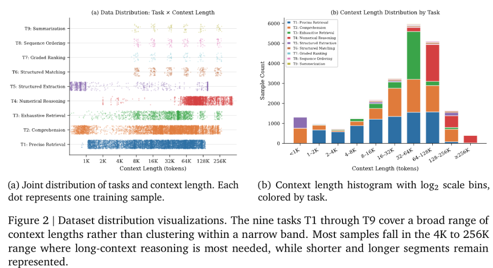|||
|OOD|500|1. 严格采用 20/20/20/20/10/5/5，避免单一任务主导泛化结论。<br/>2. 覆盖长文压力区间，<32K 21.0%; >=64K 61.8%。<br/>3. 由 AA-LCR、HELMET、LongBenchV2 和 QwenLong-Test-DocMath 构成。|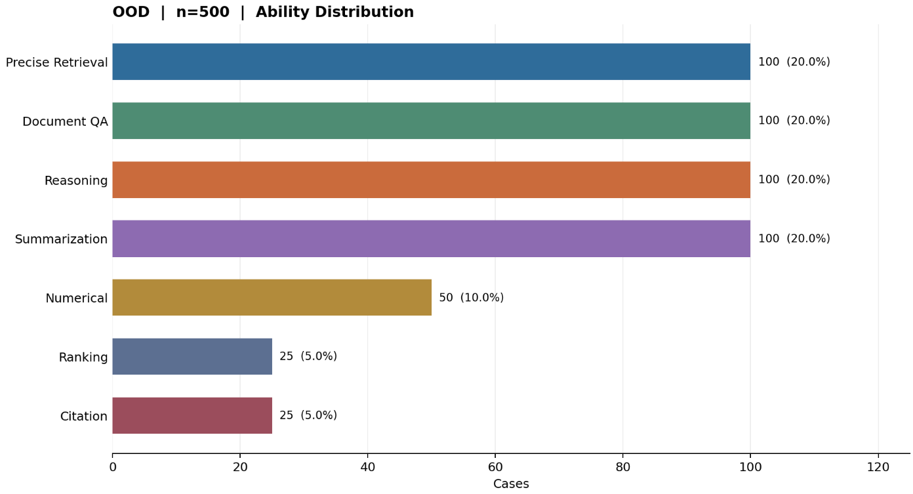||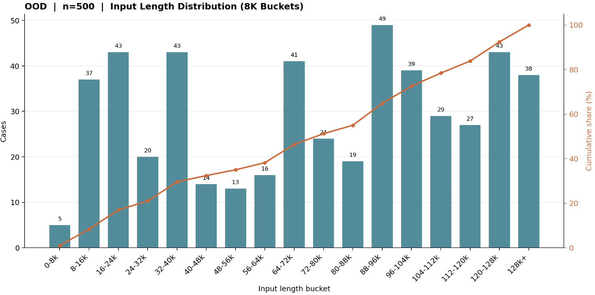|


**训练数据**

|**索引**|**操作**|**脚本**|**内容**|**备注**|
|-|-|-|-|-|
|**0**|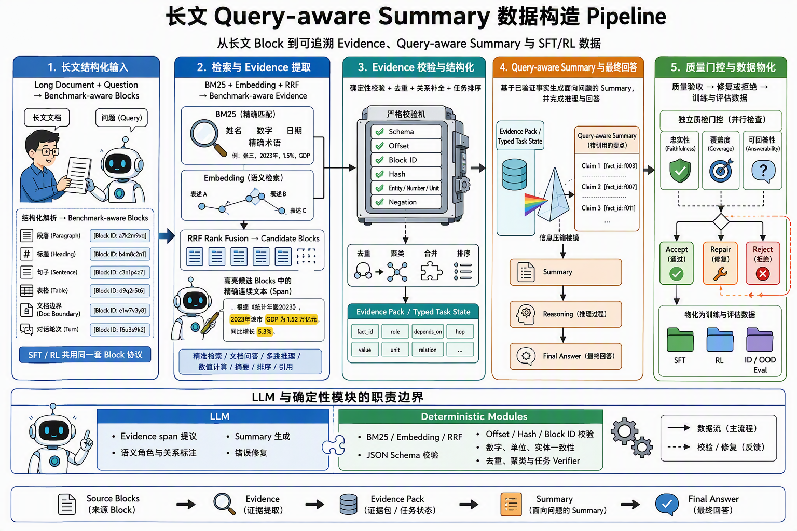|****|****|****|
|1|Block文档切分|**处理脚本**：<br/>`/home/users/xiazhaoyuan/workspace/paper/ernie/code/v3/data_struction/2_build_block_store.py`<br/>**输出文件**：<br/>`/home/users/xiazhaoyuan/workspace/paper/ernie/code/v3/data_struction/output/2_full_v3_balanced_20260813`<br/>**策略**<br/>* 普通长文：按段落、标题、句子和语义连续性组织；<br/>* 多文档任务：文档之间有明确边界，不能跨文档随意合并；<br/>* 多轮对话：需要保留 user/assistant 的轮次关系；<br/>* LongCite：原生 chunk 与答案引用坐标绑定，不能重新打乱；<br/>* 排序任务：候选 document ID 必须保持可定位；<br/>* 表格和数值任务：表头、行和计算条件需要保持局部完整。<br/>### 1. 普通 prose 类长文适用范围：`CNNSum`、`GovReport`、`CUAD`、`Frames`、大部分 `LongBench-Pro`、`QwenLong-DocMC`。- 以段落和句子作为语义原子；- 标题和章节边界尽量保留；- 相邻短段在 token 预算允许时合并；- 不跨越不相关的结构边界；- 默认目标约 256 token，硬上限 1,024 token。### 2. 表格和数值类任务适用范围：`DocFinQA`、`FinGLM`、`QwenLong-Test-DocMath`。- 表头、指标名称、单位、条件和数据行尽量保持在同一局部 block；- 优先按 line/table row 组织，再进行 token-aware 合并；- 避免只保留数值而丢失单位和计算条件；- 方便后续构建数值题的 evidence、summary 和 calculation state。### 3. 多文档任务适用范围：`MSMARCO-Rerank`、`AA-LCR`、`HELMET-Cite`、`HELMET-Rerank`、`QwenLong-MultiHopRAG`。- 保留原生 document 边界；- Block ID 在 document 内按顺序生成；- 不跨 document 合并；- 保留 document ID、候选 ID 和原有 document header；- 多跳任务保留 bridge chain 所需的 document 坐标。### 4. MRCR 多轮对话- 使用 conversation/pair 模式；- user + assistant 的问答对尽量作为一个语义单元；- 不对对话内容做普通 prose 式任意切分；- 保留角色标签和轮次顺序；- 最终 block 数量较少、单块 token 数相对较高，这是设计结果而不是异常。### 5. LongCite- 保留原生 chunk 边界；- 一个原生 chunk 对应一个 Block；- 不对 native chunk 进行二次拆分或合并；- 将文档中的原生 `Chunk[i]` / `<Ci>` 标记替换为 Block ID；- 同步替换 GT 中的引用坐标；- 超过通用 1,024 token 上限的 native unit 单独统计，不破坏引用一致性。### 6. GovReport 和 LongBench-Pro 的数据修复- GovReport 部分样本没有显式 question，统一使用默认任务：```textSummarize the following government report while preserving the key facts and conclusions.```- LongBench-Pro 中发现部分 raw 输出只有 reasoning content，没有最终 answer；- 这些样本被识别为上游 target 异常并进入 rejected 文件；- Block 构建没有伪造或自动补写答案。<br/>|总览<br/><br/>Block挑选<br/><br/>  Embedding 统计：  - 模型：text-embedding-v4，维度 1024  - Embedding 文本：2,032,529  - API 调用：207,740  - Token：415,641,604  - Cache QC：PASS，错误 0  - ID/OOD/RL/SFT Retrieval QC：全部 PASS||
|2|Block筛选|**脚本**：`/home/users/xiazhaoyuan/workspace/paper/ernie/code/v3/data_struction/4_retrieve_blocks_api.py`<br/>**输出文件**：`/home/users/xiazhaoyuan/workspace/paper/ernie/code/v3/data_struction/output/4_hybrid_retrieval_api_v4_20260813`<br/>* 4_retrieved_blocks.jsonl<br/>* 4_retrieval_cases.jsonl|||
|3|证据块的原子事实<br/>Claim|**操作逻辑**：<br/>Question  -> Query Diff 子查询  -> Fluent Claims  -> Claim 对应的原文证据 span  -> 严格匹配 / fuzzy95 后验校验  -> 可审计的 block_id、offset 和 source hash<br/>证据claim生成prompt<br/> System Prompt：  You are a benchmark-aware atomic evidence proposer.  You must output valid JSON and never invent or paraphrase source text.  Your exact span is only a proposal; a program will verify it.  User Prompt 的主体结构：  Extract atomic evidence from the selected blocks for the question below.  Benchmark: {benchmark}  Ability: {ability}  Question: {question}  Adapter specification:  {    "adapter": "...",    "task_description": "...",    "required_payload_fields": [...],    "recommended_payload_fields": [...],    "allowed_roles": [...],    "sort_policy": "...",    "max_evidence": 16  }  Selected source blocks:  [Block ID: block_xxx]  {source_text}  [Block ID: block_yyy]  {source_text}  Return JSON only in exactly this shape:  {    "evidence": [      {        "evidence_id": "e001",        "block_id": "...",        "exact_span": "...",        "start_offset": 0,        "end_offset": 10,        "role": "...",        "task_payload": {...}      }    ],    "abstention_reason": null  }    HELMET-Summ 使用的是：  {    "evidence_id": "e001",    "evidence_spans": [      {        "block_id": "...",        "exact_span": "...",        "start_offset": 0,        "end_offset": 10      }    ],    "role": "background",    "task_payload": {      "claim": "...",      "topic": "..."    }  }|||
|4|summary构建|**流程：**<br/>  Valid Claims<br/>    -> 跨 claim exact-span 去重<br/>    -> support overlap 去重<br/>    -> 相同 provenance 的 claim 保守合并<br/>    -> union subquery IDs 和 support<br/>    -> 按 subquery 顺序排序<br/>    -> 按 RRF rank / document offset 打破并列<br/>    -> Query-aware Cited Summary|||
|5|统计|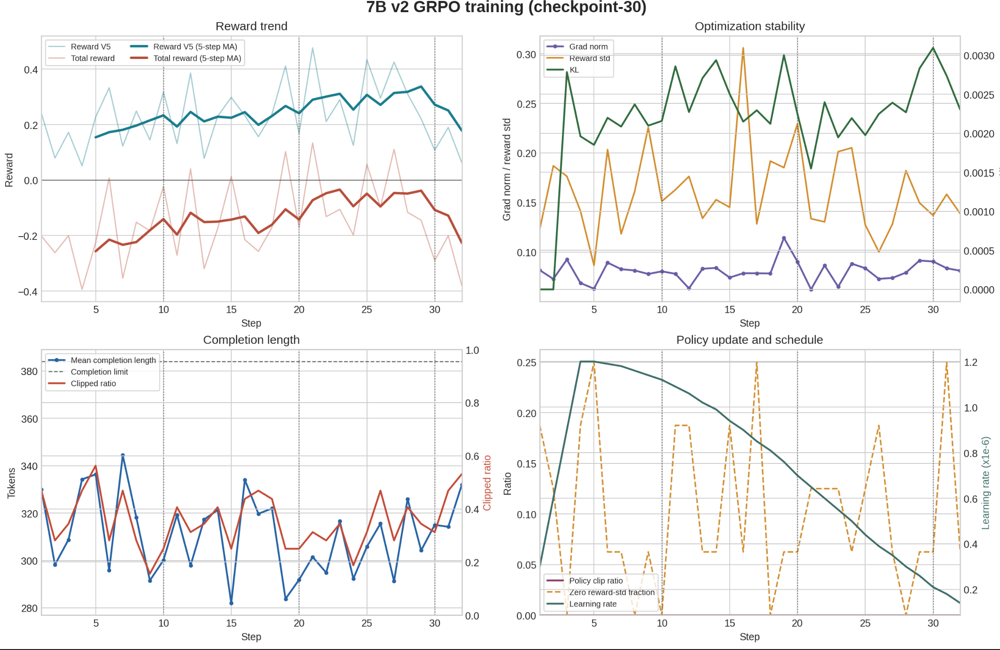<br/>**文件目录**：<br/>`/home/users/xiazhaoyuan/workspace/paper/ernie/code/v3/train/data`<br/>|[BLOCK_ID: <id>]<br/><block text><br/>[/BLOCK_ID: <id>]||
|6|SFT文件交付<br/>`/home/users/xiazhaoyuan/workspace/paper/ernie/code/v3/train/data/sft_paper_messages.jsonl`|<br/>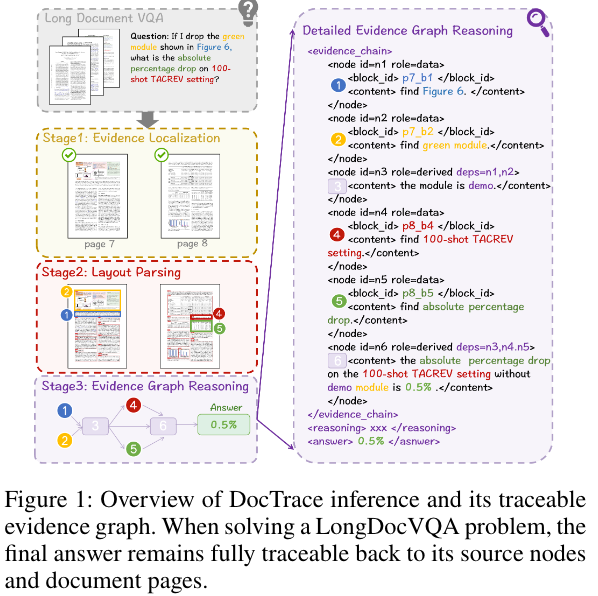<br/>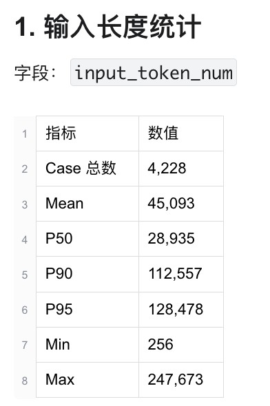<br/>||* SFT 演变：
- raw baseline：5,300
- 清洗后：5,260，删除 40 条空 answer
- Stage-6 summary 生成成功：5,160
- answerability=true：4,539
- strict native GT：4,228
- Full 版额外包含 311 条 MSMARCO-Rerank frozen answer<br/>* 训练<br/>• 当前 SFT 训练正常：  - 进度：26/125，20.8%  - 训练数据：4004 条，global batch size 32，1 epoch  - 稳定单步耗时：约 55–60 秒  - checkpoint：每 25 steps 保存一次  - checkpoint-25 已完成，约 99.3GB，保存额外耗时约 90 秒  - 当前 loss：0.3496  - token accuracy：90.63%  - 显存：约 57.74GiB/GPU  - 没有 OOM、NaN、NCCL 或进程退出<br/>* 格式<br/>SFT assistant target 的统一格式为：<br/><evidence>[{"id":"E0001","block_id":"...","quote":"..."}]</evidence><summary>... [E0001]</summary><answer>...</answer>|
|7|RL文件交付|RL 全量检查结果：<br/>  - 2,419 条；<br/>  - GT 全部存在；<br/>  - question 全部存在且能在 prompt 中找到；<br/>  - 无空 prompt；<br/>  - 无 block 边界错误；<br/>  - 无 verifier 字段。<br/>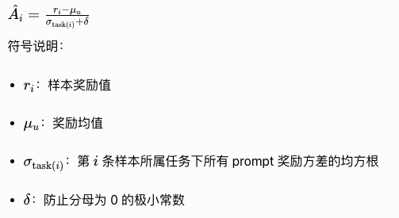|||


**v3-20260809**

**必要性⭐️⭐️⭐️**

构造完数据之后 or 之前

代码构建完毕，prompt template构建 Chat

迭代速度，实验

### **面临的问题 **
|索引|问题定位|详细|
|-|-|-|
|1|**RL 训练持续震荡，没有形成稳定优化趋势**<br/>`RL 阶段长期震荡，则表明问题不只是 Learning Rate 或 Batch Size 没有调好，而是当前数据无法持续提供稳定、同方向且可区分的优化信号。`<br/>* batch内难度不均匀。。。。<br/>    * 数据构造的时候去准备，basemodel预测得到一个score得分，调一下配比。<br/>    * 数据量很少，即使有score得分，也没办法调；任务类型也比较少，math更擅长，batch内math任务，每个batch任务类型就不均匀了。<br/>* 各类reward也拉不开距离。。。。。|从 RL-1 到 RL-10，我们依次尝试了单阶段 RL、多轮 RL、原生 GRPO（FinalAnswer + Format）、长文 GRPO（FinalAnswer + Evidence +
Summary + Format），并对 Learning Rate、Batch Size 和各项 Reward 权重进行了多轮调整，但不同实验呈现出相同现象：<br/>    * **RewardMean 随 batch 难度上下震荡**，没有持续上升趋势。<br/>    * **多个 Epoch 之间  +1分。。+0.5分 -0.5分【误差来看】**的曲线和最终效果基本没有差异。<br/>    * **Reward 高低**主要由**当前 batch 的题目难度决定【调难度 basemodel model训练的时候是动态的，batchsize的case可能到后面就是大的变化】，challenge，random最好，长度分布来调是最好的，任务类型，长度分布**，**长度的课程学习【观望】**，而不是模型能力逐步提升。<br/>    * 即使退化到只使用** FinalAnswer + Format 的原生 GRPO【Loongrl，有提到需要过程奖励】**，仍然无法稳定收敛。<br/>唯一一次 RewardMean 近似线性上升的实验，使用了约 60% FinalAnswer 和 40% Overlong Reward。但这个结果更可能说明模型学会了控制输出长度或满足形式特征，而不能证明长文检索和推理能力得到了提升SFT 阶段能够取得正向效果，说明模型、数据格式和基础训练链路并非完全不可用。|
|2|**数据量不足，长度、难度和任务分布不均匀**<br/>`同一个 batch 内的优化信号不一致，不同 batch 之间的 RewardMean 又不可直接比较。`|当前** RL 实际使用的数据量约为 1K**。其中，单个长度区间内的有效数据更少，例如 0-32K 只有约 500-600 个 case。在 Batch Size 为 32 时，【GLM-air，100B，**RL-长文领域-2k左右【开源数据集】，兼顾长文，指令遵循，真实性，还有创意写作，长文加太多，就会导致各种问题**】
一个 Epoch 在该长度段内只有约 20 个 Step，模型能够获得的独立更新机会非常有限，这会带来以下问题：<br/>    * **更新步数不足。 少量 step 很难覆盖不同题型和难度**，也难以判断 Reward 波动是训练趋势还是采样噪声。<br/>    * 样本重复率高。 **多 Epoch **主要是在重复使用相同问题，无法持续提供新的优化信号，反而容易放大特定样本和 Reward 规则的偏差。<br/>    * **Batch 难度不稳定 32的batchsize**。 简单题较多时 RewardMean 上升，困难题较多时 RewardMean 下降，batch 间缺乏可比性。<br/>    * 优化信号相互抵消。 **检索题、数值题、多跳题和选择题需要的能力不同**，将它们随机混入同一个 batch 后，不同样本产生的梯度方向可能互相冲突。|
|3|**Reward 设置****缺少逻辑闭环，各类 Reward 之间没有因果联系**<br/>`模型可以分别“刷到”某些 Reward，却不需要真正完成从证据定位、信息压缩到答案推导的完整过程。`<br/>**些许繁琐**<br/>精力问题，是否要放在Reward设计上，或者说对于我们文章的核心，**先思考再回答，RL设计是否是关键的？ 回答：SFT上提升3-4个点的底线 **<br/>**故事『先总结再推理』**|当前长文 RL 使用的 Reward 主要包括：FinalAnswer+**Evidence【没有达成期待】**+Summary【**和claude对比**】+Format，这些 Reward 目前基本按照独立指标计算后进行加权求和，但它们在任务逻辑上并不是四个相互独立的目标。理想的推理过程应当是Evidence 支持撑中间任务状态，Summary 应当压缩并保留完成问题所需的信息，Final Answer 则应当能够从 Summary 或任务状态中推出。**当前 Reward 没有验证这些环节之间的关系**，只是在分别判断每个字段“看起来是否正确”，这会产生多种不自洽情况：<br/>    * Final Answer 正确，但 Evidence 与答案无关。<br/>    * Evidence 命中了答案附近的 block，但没有覆盖完整推理链。<br/>    * Evidence 和 Summary 奖励的是 Final Answer 已经包含的信息，造成重复计分。<br/>    * Format 或 Overlong 等容易优化的 Reward 占比过高，模型优先学习形式和长度，而不是检索与推理。|


### v3数据构造
* **从开源数据集出发（周末）**
* **总结：开源数据集非主要贡献，可能case的某些字段，GTR-Bench，经纬度，朝向，字段提供---SFT和RL训练相关，次要贡献**
* **GolongRL 快手，22k 16k来自于开源，6k来自于inhouse，主要贡献1. 分类，分成九大类；2，格式清洗 一遍；3，开源的数据构造pipeline**

**Raw介绍**

|数据集|评估集/训练集|语种|上文长度token|数据量|URL|涉及哪些指令类型|数据集说明+已有的示例数据（json）|
|-|-|-|-|-|-|-|-|
|**QASPER**<br/>2021 年 NAACL-HLT<br/>完整科学论文信息寻求型 QA|评测科学论文阅读与证据定位的 benchmark<br/>限制单篇论文最多抽取若干问题，减少上下文重复。|英文问答与英文论文<br/>|**ERNIE 实测**：min `297`，P50 `5,807`，P95 `11,342`，max `39,939`。<br/>分布：`<2k` 59；`2-4k` 514；`4-8k` 1,277；`8-16k` 311；`16-32k` 35；`32-64k` 4。<br/>结论：主体为 4-8k，只有 39 条超过 16k。|**官方总量**：1,585 篇论文、5,049 个问题。<br/>**本地 train**：888 篇论文、2,593 个 task；其中 extractive 1,314、free-form 610、yes/no 397、unanswerable 272。<br/>**Claude 候选**：845 篇论文、2,200 个 task；extractive 1,288、free-form 601、yes/no 310、unanswerable 1。|[数据主页](https://allenai.org/data/qasper)<br/>[论文](https://aclanthology.org/2021.naacl-main.365/)<br/>本地：`data/v3/raw/QASPER/`|1. 在完整论文中定位答案段落、表格或图注。<br/>2. 输出 extractive、free-form、yes/no 或 unanswerable。<br/>3. 提取可定位 evidence quote 与 block ID。<br/>4. 从 evidence 构造 `answer_bearing_facts` 和 `disambiguating_constraints`。<br/>5. 生成由证据压缩得到的 question-conditioned summary，再给 final answer。|**定位**：最接近“长论文检索 + 证据 + 摘要 + 回答”的数据。原生提供多标注者答案和段落级 evidence，但当前有 541 个候选 task 存在全文不可定位的 quote，修复前不能直接付费标注。<br/>**示例 JSON**：<br/><code>{"benchmark":"QASPER","document_title":"Learning Word Embeddings from the Portuguese Twitter Stream","query":"What intrinsic evaluation metrics are used?","evidence":["Class Membership Tests ...","Class Distinction Test ...","Word Equivalence Test ..."],"answer":{"type":"extractive","canonical":"Class Membership Tests; Class Distinction Test; Word Equivalence Test"}}</code>|
|**ContractNLI**<br/>2021 年 Findings of EMNLP<br/>合同文档级自然语言推断|-<br/>|英文<br/>|**ERNIE 实测**：min `313`，P50 `2,229`，P95 `5,149`，max `12,633`。<br/>分布：`<2k` 1,143；`2-4k` 1,242；`4-8k` 399；`8-16k` 16。<br/>结论：88.2% 小于 4k，不属于原生长文主力。|**官方总量**：607 份 NDA x 17 个固定 hypothesis，共 10,319 个文档-假设对。<br/>**本地 train**：423 份合同、7,191 个 task；Entailment 3,530、Contradiction 841、NotMentioned 2,820。<br/>**Claude 候选**：420 份合同、2,800 个 task；Entailment 2,258、Contradiction 542、NotMentioned 0。|[项目页](https://stanfordnlp.github.io/contract-nli/)<br/>[论文](https://aclanthology.org/2021.findings-emnlp.164/)<br/>本地：`data/v3/raw/ContractNLI/`|1. 判断 hypothesis 为 Entailment、Contradiction 或 NotMentioned。<br/>2. 为非 NotMentioned 标签定位一个或多个非连续合同 span。<br/>3. 识别定义、适用对象、例外条款、时间条件和义务强度。<br/>4. summary 必须保留决定标签的条款和例外，final answer 输出 label。<br/>5. 当前候选应使用二分类 verifier，不可伪装成完整三分类。|**定位**：它不是普通 retrieval，而是“证据定位 + 文档级标签决策”。适合训练 evidence 与 label 的因果关系，但需要单独 reward：证据正确并不等于标签正确，标签正确也不能替代证据完整性。<br/>**示例 JSON**：<br/><code>{"benchmark":"ContractNLI","hypothesis":"Receiving Party shall not disclose the fact that Agreement was agreed or negotiated.","evidence":["The existence of this Agreement ... shall be deemed Confidential Information.","Both parties agree not to issue or release ... matter relating to the existence of this Agreement."],"label":"Entailment","label_id":"nda-10"}</code>|
|**DocFinQA**<br/>2024 年 ACL Short Paper<br/>完整 SEC 财报数值推理|从完整年度报告而非人工裁剪片段中回答数值问题|英文|**ERNIE 实测**：min `62,310`，P50 `163,168`，P95 `451,248`，max `658,088`。<br/>分布：`32-64k` 8；`64-128k` 640；`128-256k` 1,859；`256k+` 493。<br/>结论：78.4% 超过 128k，直接调用成本最高，并可能超过部分模型有效窗口。|**官方总量**：801 份完整 SEC filing、7,437 个问题。<br/>**本地 train**：659 份财报、5,735 个 task；4,323 条带原生 program/derivation。<br/>**Claude 候选**：636 份财报、3,000 个 task。<br/>当前 3,000 条 supporting block ID 均为空，需要重新定位操作数。|[数据集](https://huggingface.co/datasets/kensho/DocFinQA)<br/>[论文](https://aclanthology.org/2024.acl-short.42/)<br/>本地：`data/v3/raw/DocFinQA/`|1. 从完整财报中定位表格行、年份列、正文条件和操作数。<br/>2. 保存 operands、units、scale、calculation conditions。<br/>3. 生成多步 derivation，如差值、比例、平均值和百分比变化。<br/>4. summary 可保留操作数和条件，不强制提前写出计算结果。<br/>5. final verifier 需统一 `%`、小数比例、货币符号、单位和舍入。|**定位**：最能训练超长上下文下的“检索后计算”，但也是风险最高的数据。当前 gold answer 和 derivation 已知，evidence 未知，Claude 很容易从答案反推一组貌似合理的数字；应先做候选 block 召回，再让 Claude 验证。<br/>**示例 JSON**：<br/><code>{"benchmark":"DocFinQA","document":"Baker Hughes 2018 annual report","query":"what is the average percent change in natural gas prices?","operands":{"2018":3.15,"2017":2.99,"2016":2.52,"unit":"$/mmBtu"},"derivation":["(3.15-2.99)/2.99","(2.99-2.52)/2.52","average"],"supporting_block_ids":[],"answer":"12.1%"}</code>|
|**TAT-QA**<br/>2021 年 ACL-IJCNLP<br/>财务表格与正文联合 QA|-|英文|**ERNIE 实测**：min `128`，P50 `488`，P95 `1,193`，max `4,116`。<br/>分布：`<2k` 1,490；`2-4k` 9；`4-8k` 1。<br/>结论：99.3% 小于 2k，只能提供任务监督，不能直接提供长文长度。|**官方总量**：2,757 个混合表文 context、16,552 个问题。<br/>**本地 train**：2,201 个 context、13,215 个 task；retrieval 6,612、numerical 6,603。<br/>**Claude 候选**：1,198 个 context、1,500 个 task；arithmetic 1,251、span 154、count 75、multi-span 20。|[仓库](https://github.com/NExTplusplus/TAT-QA)<br/>[论文](https://aclanthology.org/2021.acl-long.254/)<br/>本地：`data/v3/raw/TAT-QA/`|1. 从表格或正文定位答案事实。<br/>2. arithmetic：保存操作数、年份、scale、单位和公式。<br/>3. span/multi-span：保留原文答案片段和对应 block。<br/>4. count：明确计数对象与过滤条件。<br/>5. 根据 answer type 使用不同 final verifier，不能全部按数字 exact match。|**定位**：适合验证数值 state schema 是否覆盖表头、年份、单位和推导，但必须通过受控扩展才能进入长文训练。扩展时不能拆散表头和数据行，也不能改变原始 supporting block。<br/>**示例 JSON**：<br/><code>{"benchmark":"TAT-QA","query":"What is the average total cash, cash equivalents, and marketable securities in 2015 and 2016?","table_fact":{"2016":"$133,761","2015":"$219,078","scale":"thousand"},"supporting_block_id":"...:b00004","derivation":"(219078+133761)/2","answer":{"canonical":"176419.5","unit":"thousand"}}</code>|
|**MultiHiertt**<br/>2022 年 ACL。<br/>多层级、多表格财务数值推理。|任务由 fact retrieval、question type classification 和 reasoning 组成<br/>|英文|**ERNIE 实测**：min `3,582`，P50 `8,462`，P95 `14,622`，max `31,182`。<br/>分布：`2-4k` 3；`4-8k` 648；`8-16k` 798；`16-32k` 51。<br/>结论：当前最接近 8-16k 数值训练带，但 16k 以上仍只有 3.4%。|**官方总量**：10,440 个问题。<br/>**本地 train**：7,830 个 task；7,830 条带原生 evidence index，6,306 条带 program。<br/>**Claude 候选**：1,500 个 task、1,500 个 document ID、1,034 份唯一文本。|[仓库](https://github.com/psunlpgroup/MultiHiertt)<br/>[论文](https://aclanthology.org/2022.acl-long.454/)<br/>本地：`data/v3/raw/MultiHiertt/`|1. 在多张层级表与正文中定位事实。<br/>2. 识别问题要求的公司、年份、指标、范围和单位。<br/>3. 输出 operands、calculation conditions 和程序化 derivation。<br/>4. 检查 supporting text/table index 是否覆盖全部操作数。<br/>5. 允许 summary 保存原始数字和公式条件，final answer 单独计算。|**定位**：数值类中最适合构建 `evidence -> operands/state -> derivation -> summary -> answer` 的集合。当前 native supervision 有 index，但 materialized evidence quote 为空；还存在大量 `U+0002/U+0003`，必须清洗并维护 offset 映射。<br/>**示例 JSON**：<br/><code>{"benchmark":"MultiHiertt","query":"what is the percentage change in the capital and statutory surplus from 2005 to 2006?","evidence":"Everest Re was $2,704.1 million and $2,327.6 million in 2006 and 2005.","operands":{"2006":2704.1,"2005":2327.6,"unit":"million dollars"},"derivation":"(2704.1-2327.6)/2327.6","answer":"0.16175"}</code>|
|**HotpotQA**<br/>2018 年 EMNLP<br/>Wikipedia 多文档可解释多跳 QA|当前本地使用 **distractor train**，每题包含 gold 文档与干扰文档。|英文 |**ERNIE 实测**：min `97`，P50 `1,700`，P95 `2,561`，max `4,708`。<br/>分布：`<2k` 1,883；`2-4k` 611；`4-8k` 6。<br/>结论：75.3% 小于 2k，原始输入不是长文。|**官方总量**：约 113K 个问题。<br/>**本地 distractor train**：90,447 个 task；bridge 72,991、comparison 17,456。<br/>**Claude 候选**：2,500 个 task；bridge 2,008、comparison 492。|[项目页](https://hotpotqa.github.io/)<br/>[论文](https://aclanthology.org/D18-1259/)<br/>本地：`data/v3/raw/HotpotQA/`|1. bridge：先找到中间实体，再定位最终答案。<br/>2. comparison：抽取两个实体的属性后比较。<br/>3. 输出句子级 supporting facts 与 block ID。<br/>4. 过滤 distractor，并验证每个 gold fact 是否真的必要。<br/>5. summary 必须保留中间实体和比较条件，而非只复述答案句。|**定位**：适合训练 evidence precision/recall，但“官方标为 multi-hop”不保证当前文本中每一跳都不可省略。需要先做单段可答测试，过滤弱多跳，再扩展同域 distractor。<br/>**示例 JSON**：<br/><code>{"benchmark":"HotpotQA","subtype":"bridge","query":"How many registered customers does the online gaming company Expekt.com have?","evidence":["Expekt.com Ltd ... has more than 1.8 million registered customers.","Online gambling includes poker, casinos and sports betting."],"answer":"1.8 million registered customers","level":"easy"}</code>|
|**2WikiMultiHopQA**<br/>2020 年 COLING<br/>Wikipedia/Wikidata 多跳 QA||英文|**ERNIE 实测**：min `261`，P50 `1,026`，P95 `2,114`，max `4,503`。<br/>分布：`<2k` 2,806；`2-4k` 191；`4-8k` 3。<br/>结论：93.5% 小于 2k，必须扩展上下文。|**官方总量**：192,606 个问题。<br/>**本地 train**：167,454 个 task；compositional 76,481、comparison 51,963、bridge-comparison 34,631、inference 4,379。<br/>**Claude 候选**：3,000 个 task；compositional 1,403、comparison 908、bridge-comparison 613、inference 76。|[仓库](https://github.com/Alab-NII/2wikimultihop)<br/>[论文](https://aclanthology.org/2020.coling-main.580/)<br/>本地：`data/v3/raw/2WikiMultiHopQA/`|1. compositional：串联两个关系得到答案。<br/>2. comparison：分别提取两个实体属性后比较。<br/>3. inference：根据实体关系推断答案。<br/>4. bridge-comparison：先完成桥接，再比较。<br/>5. 保存完整 subject-relation-object chain、每跳 evidence 和 hop dependency。|**定位**：当前最适合验证“多跳题保存完整 bridge chain”的数据。Claude 不应重新发明链条，而应验证原生 relation、生成 atomic claims，并保证 summary 保存所有后续 hop 需要的 bridge entity。<br/>**示例 JSON**：<br/><code>{"benchmark":"2WikiMultiHopQA","subtype":"comparison","query":"Are both Eshnigan and Vaymand located in the same country?","evidence":["Eshnigan ... Kerman Province, Iran.","Vaymand ... Markazi Province, Iran."],"bridge_chain":[["Eshnigan","country","Iran"],["Vaymand","country","Iran"]],"answer":"yes"}</code>|
|**MuSiQue**<br/>2022 年 TACL<br/>通过单跳问题组合构造多跳问题|每条保留子问题、子答案和 supporting paragraph。|英文|**ERNIE 实测**：min `1,131`，P50 `2,480`，P95 `3,524`，max `5,291`。<br/>分布：`<2k` 401；`2-4k` 2,065；`4-8k` 34。<br/>结论：82.6% 位于 2-4k，任务链完整但长度不足。|**官方总量**：约 25K 个多跳问题。<br/>**本地 answerable train**：19,938 个 task；2-hop 14,376、3-hop 4,387、4-hop 1,175。<br/>**Claude 候选**：2,500 个 task；2-hop 1,800、3-hop 553、4-hop 147。|[仓库](https://github.com/StonyBrookNLP/musique)<br/>[论文](https://aclanthology.org/2022.tacl-1.31/)<br/>本地：`data/v3/raw/MuSiQue/`|1. 按顺序执行 2-hop、3-hop 或 4-hop 子问题。<br/>2. 为每一跳保存 question、answer、supporting block 和依赖的前序实体。<br/>3. 检查删除任一 gold hop 后是否仍可作答。<br/>4. summary 必须保留 bridge entity 和关系，不能只保留最后一句。<br/>5. final answer 由完整 hop state 推出。|**定位**：比 HotpotQA 更适合严格监督 hop dependency。它的主要价值不是文本长度，而是链条质量；后续应将其作为 gold reasoning core，再加入不改变支持链的同域干扰文档。<br/>**示例 JSON**：<br/><code>{"benchmark":"MuSiQue","subtype":"3hop","query":"What region ... contains the city where A City Decides was set and Washington University is located?","bridge_chain":[{"q":"Which place is A City Decides in?","a":"St. Louis"},{"q":"Where is Washington University in St. Louis?","a":"Missouri"},{"q":"What region is Missouri in?","a":"Midwestern United States"}],"answer":"Midwestern United States"}</code>|
|**CaseHOLD**<br/>2021 年 ICAIL<br/>法律判例 holding 五选一|-|英文法律文本|**ERNIE 实测**：min `9`，P50 `243`，P95 `335`，max `577`。<br/>分布：4,500 条全部 `<2k`。<br/>结论：部分最短 context 只有残缺引用，完全不具备长文属性。|**官方总量**：53,000+ 个五选一问题。<br/>**本地 train**：42,509 个 task，五个 choice index 基本均衡。<br/>**Claude 候选**：4,500 个 task；每题一个短 context、5 个 holding；存在 6 条重复 choices；4,500 条 query 全部为同一模板。|[仓库](https://github.com/reglab/casehold)<br/>[论文](https://dl.acm.org/doi/10.1145/3462757.3466088)<br/>本地：`data/v3/raw/CaseHOLD/`|1. 从案情与引用上下文识别 governing legal rule。<br/>2. 分析每个 holding 与当前事实、法条和先例的支持或冲突。<br/>3. 输出 option_support、option_contradictions 和 elimination rationale。<br/>4. 选择唯一正确 holding。<br/>5. 不应仅根据候选措辞相似度作答。|**定位**：适合作为选择题排除推理补充集，但当前只有短引用窗口，Claude 无法可靠重建完整案情和法律规则。若不回源扩展，它会增加大量短文本、固定 query 和表面匹配信号。<br/>**示例 JSON**：<br/><code>{"benchmark":"CaseHOLD","query":"Which candidate holding correctly completes the cited case?","context":"A conviction under the statute only requires intent to persuade ...","choices":["holding 2422(b) does not require intent that the sexual activity be consummated","misrepresentation need not be driven by improper motive","attempted sexual abuse is a specific intent crime","..."],"answer":{"choice_index":0}}</code>|
|**QuALITY**<br/>2022 年 NAACL-HLT<br/>长篇故事四选一阅读理解|同一篇文章对应多道题，适合文档级缓存或多题合并标注。|英文|**ERNIE 实测**：min `2,456`，P50 `7,161`，P95 `8,604`，max `9,458`。<br/>分布：`2-4k` 498；`4-8k` 1,589；`8-16k` 413。<br/>结论：长度稳定，最接近长篇阅读，但当前没有 16k 以上样本。|**官方总量**：381 篇文章、6,737 个问题。<br/>**本地 train**：150 篇文章、2,523 个 task；其中 difficult 1,251。<br/>**Claude 候选**：150 篇文章、2,500 个 task；平均每篇 16.7 题；存在 2 条重复选项。|[仓库](https://github.com/nyu-mll/quality)<br/>[论文](https://aclanthology.org/2022.naacl-main.391/)<br/>本地：`data/v3/raw/QuALITY/`|1. 长故事事件、人物状态和时间关系追踪。<br/>2. 局部事实、全局理解、因果和反事实推断。<br/>3. 对 4 个选项分别生成 support、contradiction 和 elimination rationale。<br/>4. 从 story evidence 构造 question-conditioned summary。<br/>5. final answer 输出 choice index 与规范化选项文本。|**定位**：10 个集合中最接近“长文 + 选择题 + 因果解释”。原生没有 evidence span，Claude 的主要价值是补齐 `story evidence -> event state -> option analysis -> summary -> answer`，而不是重写答案。应使用 prompt caching，避免相同文章重复发送约 16.7 次。<br/>**示例 JSON**：<br/><code>{"benchmark":"QuALITY","document_title":"Call Him Nemesis","query":"Had the gun barrel not become extremely hot and burned Higgins, what would likely have happened?","evidence":"Police negotiation and tear gas had failed; Higgins surrendered only after the rifle burned him.","choices":["wife convinces him","police leave","police force entry","sister convinces him"],"answer":{"choice_index":2,"text":"The police would have had to force entry and take him into custody."}}</code>|

**数据分布**

|**索引**|**定位**|**内容**|
|-|-|-|
|1|字符统计|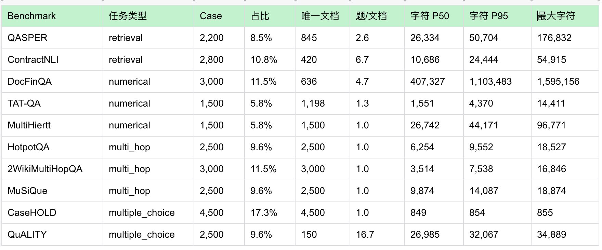|
|2|任务类型||
|3|长度分布||
|4|任务类型和答案类型分布|**任务类型**<br/>* QASPER：extractive / free_form / yes_no / unanswerable<br/>* ContractNLI：document_nli<br/>* DocFinQA、MultiHiertt：numerical<br/>* TAT-QA：arithmetic / span / count / multi-span<br/>* HotpotQA、2WikiMultiHopQA、MuSiQue：span<br/>* CaseHOLD、QuALITY：multiple_choice<br/>**答案类型**<br/>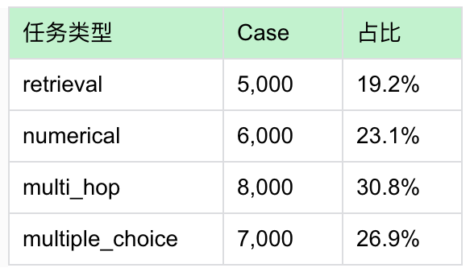<br/>* numerical 只说明答案是数字；arithmetic 进一步要求必须执行计算。<br/>* extractive 和 span 都可能来自原文，但 extractive 是 QASPER 的原生多 span 标注类型，span 是其他数据集使用的通用短答案类型。|


**论文阅读**

|索引|标题|内容|备注|
|-|-|-|-|
|1|《DocTrace: Towards Traceable Long Document VQA via Hierarchical Evidence Graph Reasoning》<br/>[https://arxiv.org/pdf/2608.03292](https://arxiv.org/pdf/2608.03292)<br/>**insight**： **DocTrace 把长文档问答从“检索若干页面后让模型直接回答”，改写成“定位证据 → 解析证据 → 构造可追溯证据图 → 根据证据图回答”。**|问题：<br/>**摘要**：<br/>**Insight 1：证据不是一个集合，而是一个计算图**<br/>【Evidence graph 是 **MLLM 生成的一种结构化序列**，**节点用 block ID 和依赖字段表示**。】<br/>  传统 RAG 获得：  [page 8, page 13, page 21]  DocTrace 希望获得：  page 8 / block 1      -> 得到中间结论 n1  page 13 / block 2      -> 得到中间结论 n2  n1 + n2      -> 得到最终答案  证据图是 DAG，包含：  - Evidence nodes：来自真实文档区块；  - Derived nodes：中间推理结果；  - Dependency edges：推理依赖；  - Answer node：最终答案。<br/>**Insight 2：分辨率应该跟任务层级匹配**<br/>【视觉 token 预算约束】<br/>* 全文扫描只需要判断“哪些页可能有用”，所以使用 512px。<br/>* 只有选中的页面才以 1568px 解析和推理。<br/>**Insight 3：证据定位和证据利用要分开优化**<br/>Stage 1 负责找证据，Stage 3 负责正确使用证据。论文实验显示，两者的错误模式和奖励需求明显不同<br/>Long Document Visual Question Answering (LongDocVQA) requires Multimodal Large Language Models (MLLMs) to locate, integrate, and reason over heterogeneous document elements distributed across multiple pages. Existing approaches, including end-to-end MLLMs, retrieval-augmented generation (RAG) pipelines, and document agents, often lack explicit mechanisms to represent and verify how grounded evidence is progressively composed during reasoning, limiting both answer accuracy and traceability. In this paper, we cast LongDocVQA as an explicit evidence graph reasoning problem rather than implicit answer prediction. To this end, we propose DocTrace, a hierarchical framework that progressively performs evidence localization, structured document parsing, and evidence graph reasoning to enable explicit evidence provenance. To effectively learn these capabilities, we develop a two-stage training framework: joint Supervised Fine-Tuning (SFT) first initializes evidence localization and graph reasoning abilities, followed by task-specific Group Relative Policy Optimization (GRPO) with dedicated rewards to further optimize these capabilities. Extensive experiments on MMLongBench-Doc, LongDocURL, and SlideVQA demonstrate that DocTrace consistently outperforms both existing open-source baselines and proprietary MLLMs. Compared with the Qwen3-VL-8B-Instruct backbone, DocTrace achieves absolute improvements of 14.4, 11.3, and 11.7 points on the three benchmarks, respectively. Beyond competitive performance, DocTrace constructs traceable evidence graphs with explicit node-level provenance, enabling transparent and verifiable reasoning for long document understanding.长文档视觉问答（LongDocVQA）任务，要求多模态大模型（MLLM）定位、整合分布在多个页面里的各类文档元素，并依托它们完成推理。现有的各类方案，包括端‑to‑端多模态大模型、检索增强生成（RAG）工作流以及文档智能体，大多缺少一套可视化机制，用来记录和校验推理过程中，真实依据是如何一步步组合推导的；这也限制了模型答题准确率与结果可追溯性。本文不再把长文档视觉问答当作隐蔽式的答案预测任务，而是将其定义为显性证据图推理问题。基于该思路，我们提出 DocTrace 分层框架：依次完成证据定位、文档结构化解析、证据图推理，以此实现所有推理证据均可溯源。为让模型掌握整套能力，我们设计两段式训练方案：先通过联合监督微调（SFT），让模型初步习得证据定位、证据图推理能力；之后使用适配本任务的分组相对策略优化算法（GRPO），搭配专属奖励函数进一步优化模型性能。我们在 MMLongBench‑Doc、LongDocURL、SlideVQA 三项数据集上开展大量对照实验，结果证明 DocTrace 性能稳定优于现有开源基线模型以及闭源商用多模态大模型。以 Qwen3‑VL‑8B‑Instruct 作为基础模型时，DocTrace 在三项测试集上的得分分别高出 14.4、11.3、11.7 个百分点。除亮眼的答题表现以外，DocTrace 能够搭建可追溯的证据图谱，每一个节点都标记证据来源，让长文档解读的推理过程公开透明、可以核验。<br/>**架构：**<br/>Stage 1：Evidence Localization 证据粗定位 [筛页面]<br/>1.输入处理把文档所有页面统一压缩到低分辨率 512px（轻量化视觉输入，不会占满模型上下文窗口，120 页超长文档也不会溢出），搭配用户问题 Q 一起输入主干模型 Qwen3-VL-8B。2.模型预测模型输出一组相关页码集合 \(\mathcal{P}_{evid} = f_{\theta_{loc}}(D_{low}, Q)\)，用标准化标签 <evidence_pages>8,13</evidence_pages> 输出筛选出的页面编号。3.输出传递只把筛选出来的少量页面送入 Stage2，其余页面直接丢弃，不再参与后续精细解析。<br/>Stage 2：Structured Document Parsing 结构化文档细解析 [拆最小证据单元]<br/>1.高清还原对 Stage1 选出的页面恢复原生高分辨率 1568px，不再使用压缩图。2.布局解析工具调用 PaddleOCR-VL1.5 文档解析模型，识别页面内所有异构元素：文本块、表格、图表、公式、图片。3.标准化证据块表示每个识别出的区块生成结构化元组：\(b_i=(t_i, x_i, c_i)\)\(t_i\)：元素类型（text/table/figure）\(x_i\)：页面内坐标框（空间位置）\(c_i\)：区块原文 / 表格数值 / 图表内容同时给每个区块分配唯一 ID：p7_b1 = 第 7 页第 1 个证据块。4.SoM 视觉标注（Set-of-Marks）在页面图像上绘制区块边框 + ID 编号，视觉绑定文字 ID 和图像区域，方便跨页对齐推理；消融实验证明去掉 SoM 后多页推理大幅掉点。5.证据池输出所有区块汇总成证据素材库 \(\mathcal{B}=\{b_1,b_2...b_M\}\)，完整传给 Stage3 作为推理原材料。<br/>Stage 3: Evidence Graph Reasoning 证据图显式推理 [搭逻辑图、出答案]<br/>1.输入Stage2 输出的全部结构化证据块 + 带区块标记的高清页面图 + 原始用户问题。2.构建两类图节点Data 数据节点：直接引用证据池里真实区块，绑定block_id，精准溯源到文档某一页某一块；Derived 推导节点：融合多个数据节点得到的中间计算结论（多跳推理中间结果）；3.构建有向依赖边 E箭头标注依赖关系：n6 deps=n3,n4,n5 代表节点 6 的结论由 3、4 页数+block数来唯一确定的、5 三个证据 / 中间结果共同推导得出；整张图是 DAG 有向无环图，无循环逻辑。4.分步生成范式（论文固定输出格式）模型强制按固定顺序输出三段内容：① <evidence_chain> 完整证据图节点定义；② <reasoning> 自然语言分步解释图内逻辑；③ `` 最终答案；若问题无足够证据，则输出拒绝回答，减少幻觉。5.概率建模逻辑模型分两步生成：\(P(A,G|\mathcal{B},Q)=P(G|\mathcal{B},Q)·P(A|G,Q)\)先生成完整证据图，再基于图生成答案，保证每一步推导都绑定原文证据。<br/><br/>结果：<br/>1. 评测使用三个 benchmark： ** 相对 backbone 分别提高 14.4、11.3 和 11.7 分**<br/>    1. MMLongBench-Doc：平均 47.5 页，包含跨页和不可回答问题；<br/>    2. LongDocURL：最长 150 页，但评测使用固定 30 页窗口；<br/>    3. SlideVQA：20 页幻灯片，多跳和数值问题占比较高<br/>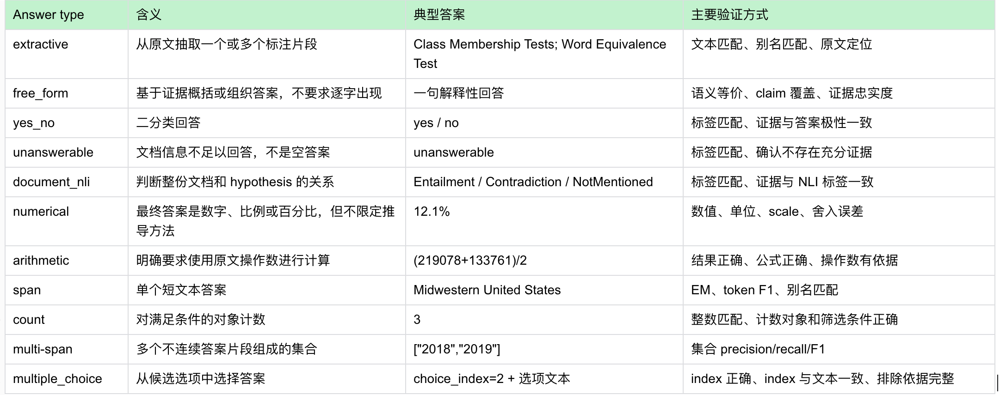<br/>2. 消融实验【SFT模型】**相对 backbone 的 11.8 分 SFT 提升中**，**证据图本身大约解释 2.5–3.1 分**；其余提升来自任务数据、页面定位、结构解析和拒答训练。证据图对多页问题贡献更明显。<br/><br/>||
|2|《 **GoLongRL:** Capability-Oriented Long Context Reinforcement Learning with Multitask Alignment》<br/>快手&中科院<br/>**研究类型**： `长上下文 RLVR 数据构造 + 多任务 RL 优化方法`|**问题：**<br/>1. **数据问题**：大量工作把长文能力近似成：长prompt + needle retrieval + Exact Match reward这会让模型主要学习“**从大量干扰信息中找到一个答案【定位】**”，但覆盖不了：- 跨文档理解；- 穷举式检索； - 数值推理；- 结构化抽取； - 排序和顺序重建；- 长文摘要。【LoongRL】<br/>2. **优化问题**：这些任务不能共用同一种 reward：**检索**：EM / F1** 选择题**：Accuracy **表格**：IoU **排序**：NDCG 顺序：Pairwise **摘要**：ROUGE-L，**直接混合做 GRPO 时，不同 reward 的方差和难度不同，****高方差任务可能产生更大梯度，从而主导训练。**<br/>**摘要：**<br/>1. 用 9 种能力重新组织长上下文 RL 数据。T1-T9<br/>**检索，推理，数值计算，总结摘要，排序**<br/>T1 精准检索（找原文句子，打分：完全匹配 EM） 7908T2 长篇阅读理解选择题（打分：正确率） 6808T3 全覆盖检索（找出所有相关片段，打分：F1） 3478T4 表格 / 文档数学计算（打分：数学公式校验） 3054T5 多表格信息提取（打分：结构重合 IoU） 937T6 文本规则归纳、聚类（打分：片段匹配 SubEM） 360T7 内容相关性排序（打分：NDCG 排序指标） 120T8 事件 / 段落还原正确顺序（打分：两两对比正确率） 180T9 超长文档摘要（打分：ROUGE 摘要指标） 120<br/>2. 用 TMN-Reweight 处理异构 reward 的多任务优化问题。<br/>**   公式**：<br/>    1. 任务级归一化（Task‑level normalization）<br/><br/><br/>    2. 难度自适应权重（Difficulty‑adaptive reweighting）<br/><br/><br/> 论文认为标准 GRPO 的 per-prompt 标准差归一化存在 difficulty bias：  - 全部 rollout 都错的困难题，方差可能很小；  - 全部 rollout 都对的简单题，方差也可能很小；  - 除以很小的方差后，极端难度问题可能被异常放大。   TMN-Reweright1. Task-level normalization不再单独给每道题 Rollout个数归一化，而是同一类任务统一一套缩放系数。比如所有排序任务共用一个缩放值、所有数学任务共用另一个，抹平不同任务打分区间差距，9 类任务训练权重更均衡，不会出现一类任务独大。Batch放一类任务，抵消，共同的一个优化方向，局部最优  GRPO：   0.34  TMN：    0.18  数值越低，说明不同任务贡献的梯度尺度越接近。 2. Difficulty-adaptive reweighting用平滑后的正确率判断题目难度：难题（模型做对概率＜50%）：放大答对样本的奖励，鼓励模型学习稀有正确思路；同时缩小答错样本惩罚，避免训练震荡；简单题（正确率＞50%）：降低答对样本权重，防止模型死记简单答案丧失创造力；同时轻微放大答错惩罚，让模型重视不该犯的低级错误。<br/>We present GoLongRL, a fully open-source, capability-oriented post-training recipe for long-context reinforcement learning with verifiable rewards (RLVR). Existing long-context RL methods often treat data construction as a matter of designing increasingly complex retrieval paths, leading to homogeneous task coverage and reward formulations that inadequately reflect practical long-context requirements.Our work offers two contributions. (1) Capability-oriented data construction with full open release. We openly release a dataset of 23K RLVR samples, the complete construction pipeline, and all training code. Guided by a taxonomy of long-context capabilities, the dataset spans 9 task types, each paired with its natural evaluation metric. It comprises curated open-source samples from established corpora and synthetic samples whose QA pairs are generated from real source documents such as books, academic papers, and multi-turn dialogues. Under the same vanilla GRPO setup, our dataset alone outperforms the closed-source QwenLong-L1.5 dataset. Moreover, our Qwen3-30B-A3B model trained on this data delivers long-context performance comparable to DeepSeek-R1-0528 and Qwen3-235B-A22B-Thinking-2507, suggesting that broader coverage and greater reward diversity substantially benefit long-context capability improvement. (2) TMN-Reweight for heterogeneous multitask optimization. To address optimization challenges from heterogeneous rewards, we propose TMN-Reweight, which combines task-level mean normalization for cross-task reward scale alignment with difficulty-adaptive weighting for more reliable advantage estimation. TMN-Reweight further improves average performance over vanilla GRPO, with general capabilities preserved or improved across reported evaluations.本文提出 GoLongRL，一套完全开源、以能力为导向的长上下文可验证奖励强化学习（RLVR）后置训练方案。现有的长上下文强化学习方法，在数据集搭建时往往只是设计愈发复杂的检索流程，最终造成训练任务类型单一、奖励计算方式脱离现实场景下长文本任务的实际需求。本文主要有两项研究成果：1. 面向模型能力搭建数据集并完整开源我们对外开源一份包含 23000 条 RLVR 样本的数据集、完整的数据制作流程以及全部训练代码。依托长‑上下文能力分类框架，数据集覆盖 9 类任务，每一类任务都配备适配自身的评估指标。数据集一部分来自成熟语料库筛选得到的开源样本；另一部分为合成样本，问答对均由书籍、学术论文、多轮对话这类真实原文生成。在基础 GRPO 相同的训练条件下，仅依靠我们的数据集，效果就已经优于闭源的 QwenLong‑L1.5 数据集。除此之外，使用该数据集训练得到的 Qwen3‑30B‑A3B 模型，它的长上下文性能可以比肩 DeepSeek‑R1‑0528、Qwen3‑235B‑A22B‑Thinking‑2507。这也证明：任务覆盖面更广、奖励标准更加多元，可以显著提升模型处理超长文本的能力。2. 适配多类型异构任务的优化算法 TMN‑Reweight为解决不同任务奖励标准不统一带来的训练难题，我们提出 TMN‑Reweight 算法。该算法一方面采用任务层级均值归一化，统一不同任务之间奖励数值的尺度；另一方面开启难度自适应权重机制，让优势值的估算更加稳定可靠。相较于原版 GRPO，TMN‑Reweight 能够进一步拉高模型综合平均分；各类测评结果显示，模型的通用能力没有受损，甚至有所提升。<br/>**内容：**<br/>1. 数据长度分布<br/>**insight：只用这套数据集、不改训练算法，4B 小模型长文本平均分直接从 53 涨到 62.2，30B 模型从 60.1 涨到 69.8**，**直接超过竞品 QwenLong-L1.5 同算法效果**，证明 “数据全面、打分贴合任务” 才是提升长文本能力的关键。<br/><br/>2. Main Result<br/>**insight：**<br/>    1. 算法收益<br/>               搭配自家数据集后，4B 模型平均分从 62.2 再涨到 63.0，在多文档汇总、长文档理解这类需要多能力配合的任务提升最大；检索类任务轻微下降，但整体能力更均衡，不会偏科。<br/>    2. 通用能力<br/>               通用推理（MMLU-Pro、数学 AIME、专业知识 GPQA）分数全部小幅上涨；智能体长期记忆、上万轮超长对话记忆提升巨大（对话记忆指标暴涨 13.6 分）；<br/>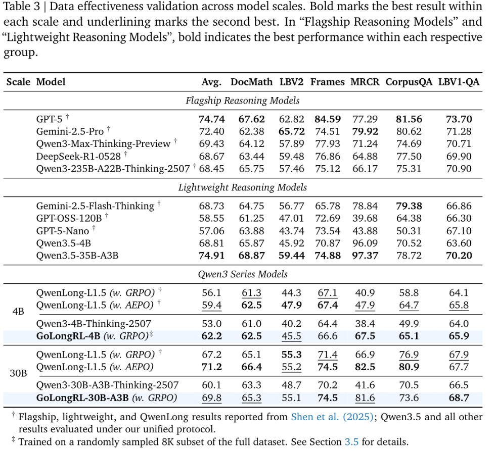<br/>|* **解决痛点**：过去长文本训练要么数据单一只会检索，要么多任务训练失衡偏科；GoLongRL 靠**9 任务全覆盖数据集 + TMN-Reweight 优化算法**同时搞定两个问题；<br/>* **性价比极高**：光换数据集就能大幅超越竞品，再加新算法进一步均衡全部长文本能力；<br/>* **完全开源：23K 完整数据集、整套数据生成流水线、全部训练代码上传 GitHub，任何人都能复现、二次开发；**<br/>* **适用场景**：多文档分析、知识库问答 RAG、智能代理、超长对话、财报 / 论文解读等所有需要读长文本的 AI 落地场景。|
|3|《**ReSum: Unlocking Long‑Horizon Search Intelligence via Context Summarization**》<br/>[https://arxiv.org/pdf/2509.13313](https://arxiv.org/pdf/2509.13313)<br/>**insight**：周期性总结刷新推理上下文、分段轨迹训练 segmented‑trajectory‑training、advantage‑broadcasting 把最终奖励分配给各个摘要片段|****||

**方案构建**

1. v2的方案更进一步：数据和Reward设计，重跑SFT-RL的实验
2. v3方法的出发点是**探针实验本身有效，然后和summary直接相关，直接证据**


|**阶段**|**核心目标与边界**|**数据格式**|**具体执行流程**|
|-|-|-|-|
|**数据构造**|**目标**：不重新生产长文档，而是把现有 LongDoc QA 转换成能够监督“先总结、再回答”的两阶段数据。|**基础样本**：`Document D + Question Q + GroundTruth A*`。<br/>**必须保留的元信息**：benchmark、task/category、语言、原文 token 长度、Easy/Medium/Hard、答案类型、是否多跳、是否数值计算。<br/>**Direct 基线**：使用冻结 checkpoint 执行 `D + Q -> A_direct`，缓存 `direct_score`、输出长度、失败类型和置信信息。<br/>**Teacher Summary**：对每个样本生成 200/500/1000/1500 等预算档位的问题条件化 Summary。|1.**去重**：对现有样本去重，避免同一基础问题的 copy 变体被当成独立问题重复采样。<br/>2**.难度基线**：运行冻结 Direct baseline，获得每题的基础难度。<br/>3.**Claude采样**：使用 Claude 或高质量 teacher 为每题生成多预算 Summary；Summary prompt 必须看到 Question，要求保留回答所需事实、实体关系、数值、单位、时间和约束。<br/>4. 清空原文上下文，让冻结 Answerer 仅根据 `Q + Summary` 回答。<br/>5. **摘要分析**：对每档 Summary 计算答案正确率、实际长度和是否直接泄漏答案。<br/>6. **构造 hard negatives**【待定】：删除关键事实、加入冲突事实、交换同文档其他问题的 Summary、保留相关但无用内容、直接抄最终答案但缺推理材料。|
|**SFT**|**目标**：先让模型学会生成稳定、grounded、问题相关且长度可控的 Summary，为 RL 提供可探索的初始策略。<br/>**  Shared Base Model**<br/>**  ├──**** Summary Adapter：D + Q -> S summary的数据**<br/>**  └── Answer Adapter：Q + S -> A Question+summary-》answer**<br/>**不追求统一摘要风格**<br/>**多预算混合训练.  200/500/1000/1500，**避免模型将 Summary 固定为单一长度。|**输入**：`Document + Question + Summary Budget`。<br/>供后续 Answerer 使用的压缩状态；必须保留回答所需事实；不得补充原文没有的信息；预算是上限而不是必须填满。<br/>**输出**：<br/>`<summary>...</summary>`|* 使用**多预算混合训练**，避免模型将 Summary 固定为单一长度。<br/>* 同一基础问题在一个 epoch 中尽量只出现一个预算版本，跨 epoch 再切换预算，降低高度相关样本重复。<br/>* 按**输入长度分 bucket 组 batch**，减少 padding 和 batch 难度剧烈变化。<br/>* **核心验证指标**：`Acc(Q, S_model)`、`Gain = Acc(Q, S_model) - Acc(Q, D)`|
|**RL**|**目标**：直接优化“模型自产 Summary 对下游回答的实际帮助”，而不是优化 Summary 的表面质量。<br/>**推荐架构**：**Trainable Summarizer + Frozen Answerer**<br/>**只提升Summary质量**<br/>评估，**指标构建，reward设计**<br/>* **v2：evidence+summary，要去做evidence效果，排除定位之后summary的效果？【上限可能高】，**<br/>* **v3：后验，answer Question+summary能不能回答对**<br/>    * **Acc（Summary）-Acc（baseline）作为奖励【】**<br/>* v2我再想一想，block拆分，还有evidence-》summary的打分，<br/>* v3的话可以控制summary长度，长度的scaling law，**200，500，1000词****，混合，一个case summaryGT 200词，另一个case summary GT 1000词，学会自己去控制summary的长度**** insight**<br/>    * **简单任务短推理，复杂任务长推理，进一步强化思维范式**<br/>* **摘要的构造，摘要的来源，人写的，可靠的来源**<br/>**先压缩后推理**<br/>Pass 2 作为 Reward Environment，不对 Answerer 反向传播。<br/>|**Policy 输入**：`D + Q + Budget`。<br/>**Group rollout**：`S_1 ... S_8 ~ pi_summary`。<br/>**Reward 环境输入**：每个 `Q + S_i`。<br/>**Frozen Answerer 输出**：`A_i`。<br/>**难易程度 Direct baseline**：每题一个 `direct_score d_q`，用于难度、paired gain、采样和日志；|**流程**：<br/>1. 对一个 prompt 采样 8 个 Summary。<br/>2. 清空原文/KV cache，冻结 Answerer 对 8 个 Summary 批量、greedy 或低温回答。<br/>3. 在同题 8 个 Summary 内计算 GRPO advantage。<br/>4. 使用下游 Reward 更新 Summary token 的生成概率；<br/>QA：<br/> **Frozen Answerer** 默认使用原始、具备回答能力的 SFT baseline，而不是正在训练的 Summarizer。原因是 Frozen Answerer 本质上是 Reward Environment。它必须在整个 RL run 中保持不变，否则同一个 Summary 在不同 step 得到的 Reward 会变化，产生非平稳目标。<br/><br/>|
|**评估**|**目标**：验证提升来自“Summary 形成有效压缩状态”，而不是 Teacher 泄漏、答案复制、格式优化或评测分布偶然性。<br/>**核心问题**：<br/>* Summary 是否提升答案？<br/>* 是否真正被使用？<br/>* 是否对 Hard 长文更有效？<br/>* 是否存在最优长度？<br/>* 原文重新加入后是补充还是干扰？|||

**v2-20260805**

**方法与主要结果**

|实验代号|定位|训练数据|GRPO / LoRA 设置|Reward 设置|
|-|-|-|-|-|
|SFT merged|RL实验的基线| SFT merged 模型|无 RL|无 RL reward|
|RL-1|**锚点：14B 是当前唯一统计显著改善的版本**|7B：1k短case<br/>14B：block+Question|低 rank LoRA，7B `G=2`，14B `G=4`|* final/summary/evidence/format = 1/0.6/0.6/0.05 + SoftOverlong<br/>* 长度阈值 256|
|RL-8|原生GRPO：Final Answer + Format|512 条 0-32k ，3 epoch，Batchsize=32，step=48|16 卡，`G=8`，32 prompts/update，48 steps；LoRA r64/a64，lr `2e-5`|* 只保留 final_answer=1.0 与 format=0.05，summary/evidence 置 0；SoftOverlong 0.2|
|RL-7|验证短长文样本反复训练是否能构造稳定 reward 上升|512 条 0-32k ，3 epoch，Batchsize=32，step=48|16 卡，`G=8`，32 prompts/update，48 steps；LoRA r8/a16，lr `1.2e-6`|* final/summary/evidence/format = 1/0.6/0.6/0.05；<br/>* SoftOverlong 0.2|
|RL-2|验证直接扩展到 0-128k 是否有效|max_input_length=129024|`G=4`，LoRA r16/a32，Q/K/V/O|* final/summary/evidence/format = 1/0.6/0.6/0.05；<br/>* SoftOverlong 0.2|
|RL-5|验证长度课程是否能避免直接长文训练震荡|0-8k -> 8k-16k -> 16k-32k 三阶段|每阶段从上一阶段最终模型继续，但 optimizer/scheduler 不复用|* final/summary/evidence/format = 1/0.6/0.6/0.05；<br/>* SoftOverlong 0.2|

* **7B 任务类型主结果**

|Method|Model / checkpoint|doc-math|doc-qa|ID AVG|frame|helmet-niah|helmet-summ|longbench-v2|OOD AVG|
|-|-|-|-|-|-|-|-|-|-|
|SFT Base|SFT merged|0.2933|0.4667|**0.3800**|0.5300|0.5400|**0.2240**|0.3600|0.4135|
|锚点|RL-1|**0.2933**|**0.4867**|**0.3900 +1**|0.5700|0.5600|0.2160|**0.3933**|0.4348 +2|
|Native-GRPO-LargeUpdate|RL-8 ckpt48|0.2933|0.4067|0.3500|0.6100|0.5800|0.1820|0.3867|0.4397|
|ShortPool-ShapedReward|RL-7 ckpt48|0.2733|0.4333|0.3533|0.6100|0.5200|0.1640|0.3533|0.4118|
|FullLength-0to128k GRPO|RL-2 ckpt50|0.2600|0.4200|0.3400|0.6200|0.5600|0.1620|0.3333|0.4188|
|Length-Curriculum GRPO|RL-5 stage2 ckpt40|0.2933|0.4333|0.3633|**0.6500**|**0.5800**|0.1600|0.3733|**0.4408 +3**|

* **14B 任务类型主结果**

|Method|Model / checkpoint|doc-math|doc-qa|ID AVG|frame|helmet-niah|helmet-summ|longbench-v2|OOD AVG|
|-|-|-|-|-|-|-|-|-|-|
|SFT Base|SFT merged|0.3667|0.5400|0.4533|0.6900|0.6400|0.3740|0.4667|0.5427|
|锚点|RL-1|**0.4000**|**0.5867**|**0.4933 +4**|**0.7400**|**0.6600**|0.3400|**0.4667**|**0.5517 +1**|
|Native-GRPO-LargeUpdate|-|-|-|-|-|-|-|-|-|
|ShortPool-ShapedReward|-|-|-|-|-|-|-|-|-|
|FullLength-0to128k GRPO|RL-2 ckpt40|0.3800|0.5333|0.4567|0.7000|0.6000|**0.3780**|0.4333|0.5278|
|Length-Curriculum GRPO|RL-5 stage1 ckpt40|0.3933|0.5667|0.4800|0.7000|0.6400|0.3680|0.4400|0.5370|


**问题**

|索引|问题|定位|分布|insight|
|-|-|-|-|-|
|1|数据分布|**数据本身的难度分布决定了下限**|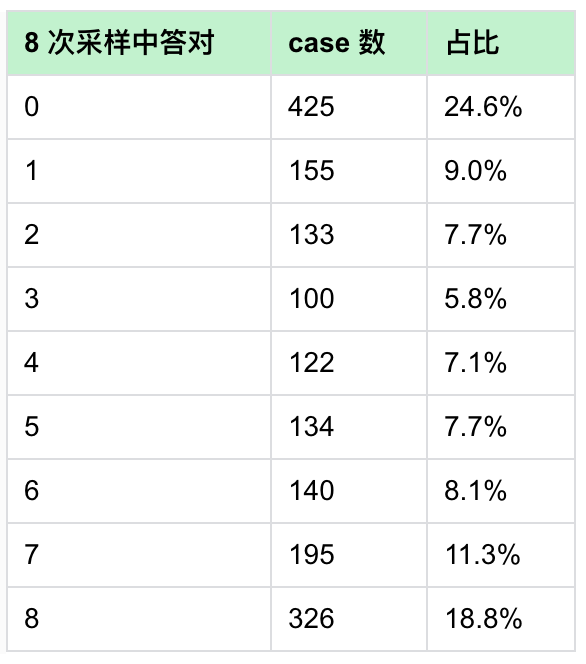|**无效Case占比高：0/8 与 8/8 合计 751 个 case = 43.4%**，这些 case 组内必然零方差，无论训练多久都不产生梯度。|
|2|评估部署|**bf16 merge 删掉了 RL实验近90%的更新**|**方法**：对每个 checkpoint 重建全部 LoRA 对 `dW = (B @ A) * (lora_alpha / r)`，在 fp32 下加到 base 权重上再 cast 到 bf16，测量更新的存活比例 `‖W_merged − W_base‖ / ‖dW‖`<br/>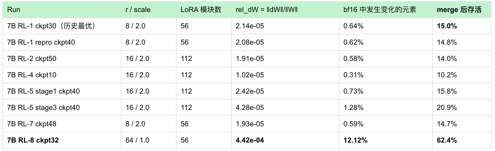|RL-8 之前，**bf16 里 99% 以上的权重元素完全没变**。bf16 只有 8 位尾数（约 0.4% 相对分辨率），任何低于该量级的逐元素更新直接舍入消失。|
||||||


## v2-20260801
**结果**

|Size|Version|数据与 train rows|Prompt / completion|
|-|-|-|-|
|7B|RL-1|**merged，1730**|**1024 / 384**|
|14B|RL-1|exact448 压缩版，1730|448 / 384|
|7B|RL-2|**SFT prompt 129k，1730**|**129024 / 2048 **<br/>**rl-1是超级截断，最大输入是1k，左截断，最大输出是384token（codex）**|
|14B|RL-2|SFT prompt 129k，1730|129024 / 2048<br/>**恢复128k输入+2k输出**|
|7B|RL-4|0-32k 原生集，1200|30720 / 2048|
|14B|RL-4|0-32k 原生集，1200|30720 / 2048|
|7B|RL-5|0-8k / 8k-16k / 16k-32k：616/336/297|8192 -> 16384 -> 30720 / 2048|
|14B|RL-5|同一课程集：616/336/297|8192 -> 16384 -> 30720 / 2048|

insight：

1. RL训练震荡，有多方面原因，第一个是我们reward设计的问题，我觉得概率小，因为final answer+format，原生GRPO和我们的reward曲线是一致的，而且我觉得reward要放在v3来做，就是需要rl有效果，且更进一步的时候去做reward。GRPO，reward 四种，那其实可以用rewardmodel，是用的qwen-3.7-max模型，rl-6是调整batch里面case的难度，目的是奖励的一致性，final_answer给到振动太大了，导致振荡的主要因素final answer是0/1二值化分布，正确与否对总的reward影响很大，case难度如果是能够均匀的话，嗯，太细化了。对于一个case可以多学习几遍，**小批量多训练几次，同分布**，reward设计也有一个很大的优化空间，**final answer去除**，
2. 7b和14b同时训的，7b用16张卡：batchsize=32，学习率 warmup cosine【调研一下，之前是v1的时候没效果，然后学习率调整，固定学习率】，batchsize内的分布：比例，70PP 0-32k，20PP 32k-64k，10PP 64k-128k，先学习0-32k复用rl-2，多个epoch，rewardv5，step，32k的数据有1k个，300step，长文，kv太长了，推理慢，更新也慢，20min+20min，maxtoken=1k，训练过程中rollout分布 500token-800token，vllm，我看看，500个case，

|Size|Model|doc-math|doc-qa|ID Task AVG|frame|helmet-niah|helmet-summ|longbench-v2|OOD Task AVG|
|-|-|-|-|-|-|-|-|-|-|
|7B|SFT merged|0.2933|0.4667|0.3800|0.5300|0.5400|**0.2240**|0.3600|0.4135|
|7B <br/>上周五 少量数据<br/>codex跑的<br/>|V2-RL-1 ckpt30|0.2933|**0.4867**|**0.3900 +1**|0.5700|0.5600|0.2160|**0.3933**|0.4348 +2|
|7B|V2-RL-2 ckpt50 **更进一步 **<br/>**200case**<br/>最大输入和最大输出|0.2600|0.4200|0.3400 -4|0.6200|0.5600|0.1620|0.3333|0.4188 不变|
|7B|V2-RL-4 **ckpt10**<br/>-4 我们是考虑到qwen系列原生支持32k，最大输入128k超长，它学习不了，-4阶段我们只用**0-32k的数据**来训练<br/>|**0.3000**|0.4667|0.3833 不变|0.6200|0.5200|0.1920|0.3600|0.4230 +1分|
|7B|V2-RL-5 stage1 ckpt40<br/>分阶段，串行|0.2733|0.4200|0.3467 -4分|0.6465|0.5000|0.1980|0.3533|0.4244 +1分|
|7B|V2-RL-5 stage2 ckpt40|0.2933|0.4333|0.3633  -1分|**0.6500**|**0.5800**|0.1600|0.3733|**0.4408**|
|7B|V2-RL-5 stage3 ckpt40|0.2933|0.4200|0.3567 -2分|0.6300|0.5400|0.1940|0.3600|0.4310 +2分|
|||||||||||
|14B|SFT merged|0.3667|0.5400|**0.4533**|0.6900|0.6400|0.3740|0.4667|0.5427|
|14B|V2-RL-1 ckpt20|**0.4000**|**0.5867**|**0.4933 +4**|**0.7400**|**0.6600**|0.3400|0.4667|**0.5517 +1**|
|14B|V2-RL-2** ckpt40**<br/>batchsize=4 160case|0.3800|0.5333|0.4567 **不变**|0.7000|0.6000|**0.3780**|0.4333|0.5278** -2分**|
|14B|V2-RL-4 ckpt10|0.3933|0.5267|0.4600 **不变**|0.6700|0.6000|0.3760|**0.5133**|0.5398 不变 |
|14B|V2-RL-5 stage1 ckpt40|0.3933|0.5667|0.4800|0.7000|0.6400|0.3680|0.4400|0.5370|

**训练可视化**


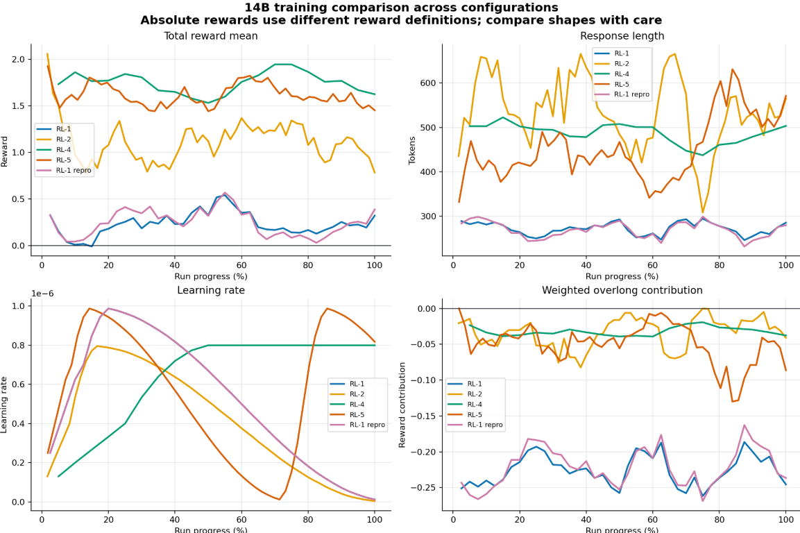


### 训练
|索引|训练配置|训练可视化|评估|
|-|-|-|-|
|v2-rl-1-7b|**评估配置**：<br/>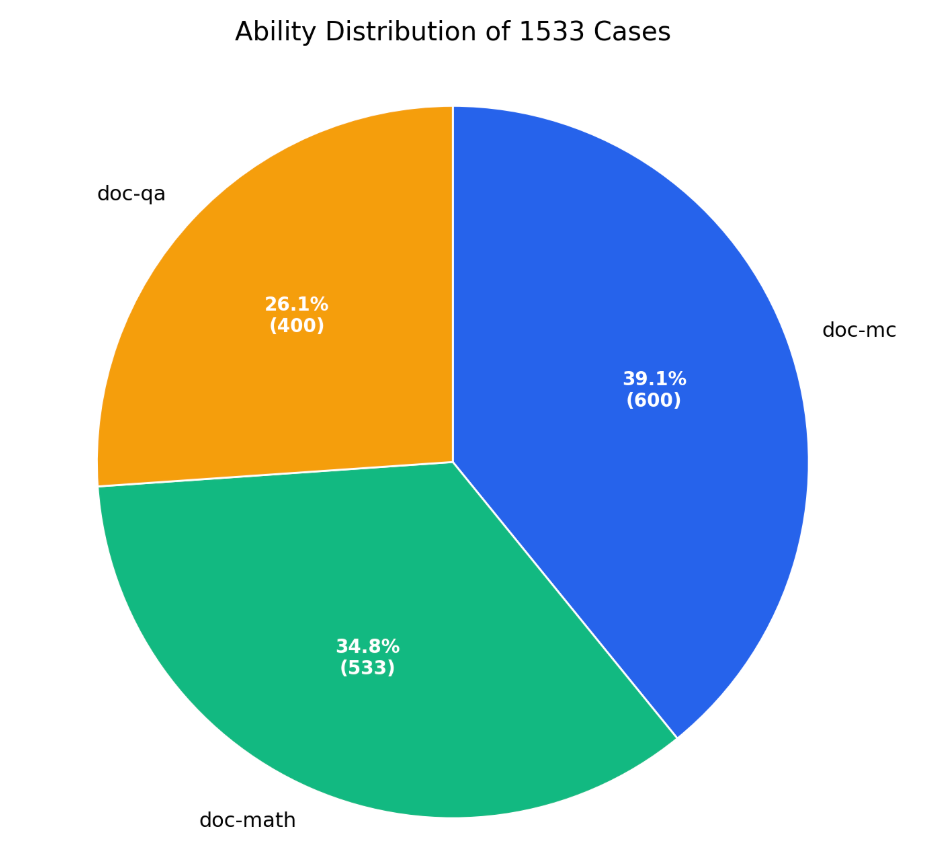<br/>训练：<br/>* 训练框架固定为 `ms-swift`，环境为 `/root/Anaconda3/envs/swift`；本机 `10.55.101.94` 训练 7B，远端 `10.55.99.41` 使用单节点 8 卡训练 14B。<br/>* v2 基座为 v1 SFT LoRA merge 后的 Qwen2.5-7B/14B full model。<br/>* RL 数据由 v1 的 `5_rl_1.jsonl`、`6_rl_2.jsonl`、`7_rl_3.jsonl` 合并，最终训练集 1,730 条、验证集 105 条。||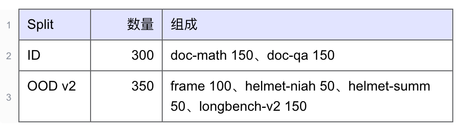|
|v2-rl-1-14b|||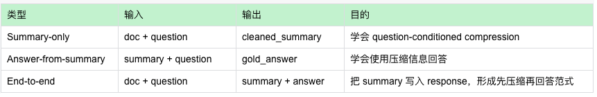|

### 训练配置
|Size|Version|数据与 train rows|Prompt / completion|精度与 LoRA|MB/GA; SP|G/GB|LR; scheduler|~~beta; epsilon low/high~~|Reward；SoftOverlong|Steps / 在线评估|实际结果|
|-|-|-|-|-|-|-|-|-|-|-|-|
|7B|RL-1|merged，1730|1024 / 384|4-bit QLoRA；r8/a16；Q,V|1/4; 1|2/8|**1.2e-6; cosine**|~~0.08; 0.08/0.12~~|V5，F/S/E/Fmt=1/0.6/0.6/0.05；权重 0.2，256+64|40；无在线 eval|ckpt30 最优，step32 早停|
|14B|RL-1|exact448 压缩版，1730|448 / 384|BF16 LoRA；r8/a16；Q,V|1/2; 8|4/16|**1.0e-6; cosine**|~~0.12; 0.05/0.08~~|V5，1/0.7/0.6/0.05；权重 0.2，256+128|40；无在线 eval|ckpt20 最优|
|7B|RL-2|**SFT prompt 129k，1730**|**129024 / 2048**|BF16 LoRA；r16/a32；Q,K,V,O|1/2; 8|4/16|**8.0e-7**; **cosine**|~~0.12; 0.06/0.10~~|V6，1/0.8/0.45/0.05；权重 0.1，896+256|60；无在线 eval|ckpt50 评估，未超过 RL-1|
|14B|RL-2|**SFT prompt 129k，1730**|**129024 / 2048**|4-bit QLoRA；r16/a32；Q,K,V,O|1/1; 8|4/8|**8.0e-7**; **cosine**|~~0.14; 0.05/0.08~~|V6，1/0.8/0.45/0.05；权重 0.1，896+256|60；无在线 eval|ckpt40 评估，未超过 RL-1|
|7B|RL-4|0-32k 原生集，1200|30720 / 2048|BF16 LoRA；r16/a32；Q,K,V,O|4/4; 8|8/128|1.0e-6; constant+warmup|~~0.10; 0.06/0.10~~|V6.1，2/0.8/0.25/0.05；权重 0.1，896+256|75；每 10 step 固定 32-case proxy|ckpt10 最优，ckpt20 回退后早停|
|14B|RL-4|0-32k 原生集，1200|30720 / 2048|BF16 LoRA；r16/a32；Q,K,V,O|2/8; 8|8/128|8.0e-7; constant+warmup|~~0.12; 0.05/0.08~~|V6.1，2/0.8/0.25/0.05；权重 0.1，896+256|75；每 10 step 固定 32-case proxy|ckpt10 最优，ckpt20 回退后早停|
|7B|RL-5|0-8k / 8k-16k / 16k-32k：616/336/297|8192 -> 16384 -> 30720 / 2048|BF16 LoRA；r16/a32；Q,K,V,O|4/2; 8|8/64|1.2e-6; cosine|~~0.08; 0.08/0.12~~|V5，1/0.6/0.6/0.05；权重 0.2，896+256|每阶段 40；每 10 step eval|三阶段完成；stage2 外评峰值，stage3 回退|
|14B|RL-5|同一课程集：616/336/297|8192 -> 16384 -> 30720 / 2048|BF16 LoRA；r16/a32；Q,K,V,O|2/4; 8|8/64|1.0e-6; cosine|~~0.12; 0.05/0.08~~|V5，1/0.7/0.6/0.05；权重 0.2，896+256|每阶段 40；每 10 step eval|仅 stage1 完成；stage2 中止，stage3 未运行|

## 1. 背景与判断
**背景**：

当前业务目标是把模型可用上下文从 128k 扩到 256k 甚至更长。midt 阶段已经在做上下文扩展，因此 RL 阶段不应重复解决“能不能塞进 256k”的问题，而应解决“塞进去以后是否会用”的问题。

**难点**：

* 相关证据在超长上下文中找不到，或只依赖问题关键词做浅层匹配；
* 多处证据需要组合时，模型漏读、误连、幻觉补全；
* 上下文越长，最终答案奖励越稀疏，RL 很难知道哪一步 grounding 错了；
* 256k 输入下训练 rollout 成本高，直接全长度 RL 不经济；
* 长文生成时容易结构单调、重复、前后不一致，且长度控制和质量目标冲突。

**主线**：

> 在已具备 256k 上下文窗口的模型上，通过可验证奖励和过程奖励，强化长文证据定位、证据组合、答案可追溯、跨段一致性和长输出控制。


## 2. 近期相关工作
参考[长文训练策略调研0424](https://ku.baidu-int.com/knowledge/HFVrC7hq1Q/pKzJfZczuc/w3A5Id66Mm/2oa4zV-z5yIcgI?t=mention&mt=doc&dt=doc)

[长文能力提升调研（数据建设）](https://ku.baidu-int.com/knowledge/HFVrC7hq1Q/pKzJfZczuc/ySjqF_DPLt/Ez7wQepe2VHz5w?t=mention&mt=doc&dt=doc)

|索引|工作|详细内容|备注|
|-|-|-|-|
|1|[LongRLVR: Long-Context Reinforcement Learning Requires Verifiable Context Rewards](https://www.alphaxiv.org/abs/2603.02146?chatId=019f0317-4fe8-77c4-9096-3c0a32595e5c)<br/>**ICLR 2026**<br/>**Insight：长文 RL 不能只奖励最终答案，必须给 context/evidence reward，否则模型不知道自己该在长文中关注哪些证据。**|**摘要**：<br/>* 长文本推理依赖于**上下文定位 (Contextual Grounding)**，即从海量信息中准确提取相关片段。如果只奖励最终答案，模型很难学到哪些中间片段是必要的，这导致了“消失的定位梯度”问题。 <br/>* **LongRLVR**，通过增加密集且可验证的**上下文奖励**来增强原本稀疏的答案奖励。这种辅助信号直接激励模型选择正确的定位信息，从而提供稳健的学习梯度，解决底层的优化挑战。<br/><br/>**LongRLVR架构**<br/>准备工作：**将长文档切块并按语义聚类， 利用超大模型（如 Qwen3-235B）针对这些聚类生成问题、答案及配套的证据 ID**。<br/>A. 显式定位 (Explicit Grounding)<br/>模型在生成最终答案前，被要求先**输出一组证据块标识符（Chunk IDs）**。<br/>> "The model is tasked to retrieve useful chunks from the long context before generating the final answer." <br/>B. 调制 F-Score 上下文奖励 (Modulated Context Reward)<br/>不只是看答案对不对，还要根据模型找出的证据块计算奖励：<br/>F-Score： 衡量定位的准确率（Precision）和召回率（Recall），确保模型找全了证据。<br/>双重信号叠加：<br/>* **无条件奖励： 只要找对一部分证据就给奖，解决梯度消失。**<br/>* 协同奖励： 当且仅当最终答案也正确时，大幅提升定位奖励的权重，确保定位是为了更好地回答问题。<br/><br/>**实验结论：**<br/>* **显著优于 SFT 和标准 RLVR**：LongRLVR 在所有测试的模型（LLaMA 和 Qwen 系列）以及所有长文本基准测试（RULER-QA, LongBench v2, LongReason）上均取得了**一致且大幅度**的领先。<br/>* **实现“以小博大”的参数效率**：通过 LongRLVR 训练的小尺寸模型展现出了极强的竞争力，甚至能超越参数量大得多的传统模型<br/>|* **一句话总结**：LongRLVR认为长上下文 RL 不能只奖励最终答案，而要加入可验证的 evidence/context reward，让模型学会在长文里找到并使用正确证据。<br/>* **可参考的部分**：<br/>    * reward 设计里加入证据奖励：答案对不够，还要引用/定位到正确段落，如段落 id、条款 id、时间戳、span。<br/>    * 评测指标除了 answer accuracy，还要看 evidence recall、unsupported claim rate。<br/>|
|2|**LoongRL: Reinforcement Learning for Advanced Reasoning over Long Contexts**<br/>[https://arxiv.org/abs/2510.19363](https://arxiv.org/abs/2510.19363)<br/>**ICLR 2026 Oral**<br/>**Insight：数据构造可以强制诱导模型行为；KeyChain 通过“先定位再回答”的任务设计，让模型学会 plan-retrieve-reason-recheck。**<br/>|**摘要**：<br/>* LoongRL 用` KeyChain` 构造高难长上下文多跳任务，再做 RL，可以让模型学会规划-检索-推理-复核，并且短长度训练能泛化到 128K 长上下文。<br/>* `KeyChain`把短的多跳 QA 改造成长上下文任务：通过插入 UUID 链，把真正的问题藏在大量干扰文档中，模型必须一步步追踪链条，找到真实问题，再检索相关事实并推理出答案。<br/>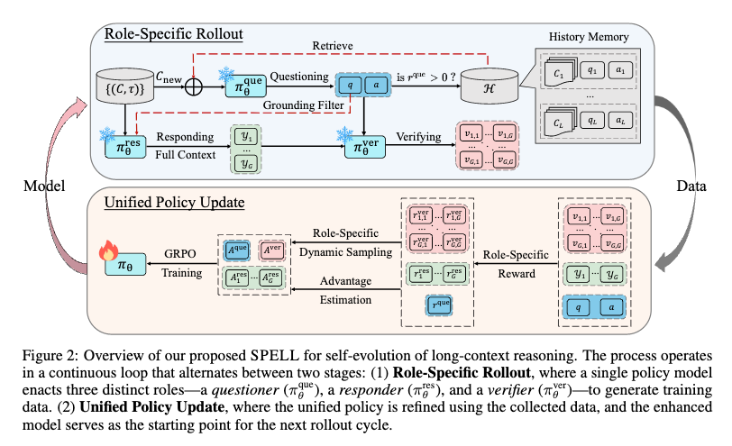<br/>**LoongRL架构：**<br/>* **核心**：原始数据是短上下文多跳 QA，比如 HotpotQA、MuSiQue、2WikiMultiHopQA，LoongRL 先把它扩成长上下文（context_long = **原始相关文档** + 大量干扰文档），然后 KeyChain 做一件关键的事：把真正的问题 Q 藏起来。它会在**长上下文**里插入一串 UUID key-value 链：<br/>    * `  UUID_A1 -> UUID_A2`<br/>    * `  UUID_A2 -> UUID_A3`<br/>    * `  UUID_A3 -> 原始问题 Q`<br/> 同时还会插入多条干扰链：<br/>    * `  UUID_B1 -> UUID_B2`<br/>    * `  UUID_B2 -> 干扰问题 Q_fake`<br/><br/>    * `  UUID_C1 -> UUID_C2`<br/>    * `  UUID_C2 -> 另一个干扰问题 Q_fake`<br/>最后给模型的新问题不是原始问题 Q，而是：** ****请从 starting UUID_A1 开始，沿着上下文中的 key-value 链找到真正要回答的问题，然后回答它**。<br/>* **效果**：<br/>    1. 模型必须从起始 UUID 开始，在长文档中逐步追踪链条，找到真实问题后再进行推理——这强制诱发了**结构化思维**。**先追链**：从起始 UUID 找到真正的问题 Q；**再答题**：在长上下文里找相关证据，做多跳推理，回答 A。<br/>    2. 相比于普通长上下文 QA 的问题，模型可能直接靠浅层检索、关键词匹配，甚至靠参数知识猜答案。KeyChain 强迫模型形成一个流程：plan -> retrieve -> reason -> recheck<br/>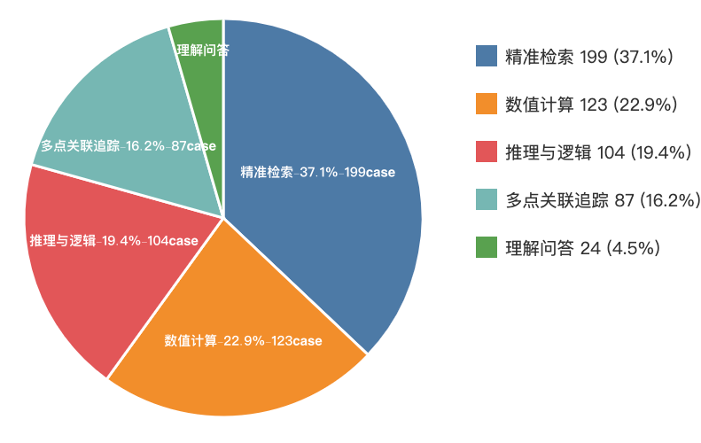<br/>**结果**：<br/>1. **性能比肩大尺寸模型**："LoongRL-7B achieves an average of 72.4 on LongBench v1, surpassing all R1-distilled models and QwenLong-L1-32B." <br/>2. **方法卓越性**：比起效果有限甚至降低效果的Distill蒸馏来讲，LoogRL效果更好且稳健。<br/>3. **短上下文能力保留良好**，但有取舍：LooongRL在MMLU，MATH等通用数据集上略有起伏。<br/><br/><br/>|* **一句话总结：**`LoongRL` 用** 16K 的训练成本RL** + KeyChain 数据，在 7B/14B 小模型上实现了媲美 o3-mini 和 DeepSeek-R1 的长上下文推理能力，同时几乎无损地保留了短上下文通用能力。<br/>* **关键启示**：<br/>    * 设计一种必须跨多个位置追踪信息链，才能还原真实问题并完成回答的长上下文任务。【Oral背书】<br/>    * 难度递增的多阶段训练：<br/>        1. Warm-up：仅非KeyChain数据，提升基础检索能力 <br/>            * **step: 42**<br/>            * **batch_size: 512 **<br/>            * **group size **$G = 8$** **<br/>            * epoch: 1<br/>        2. Stage I 引入KeyChain数据，诱发计划-检索-推理-复核模式 <br/>            * **step: 168**<br/>            *  **batch_size: 512 **<br/>            * group size $G = 8$ <br/>            * epoch>1<br/>        1. tage II 难例挖掘 只保留全错的30-40%样本 聚焦难例避免过拟合<br/>            * step: 118<br/>            *  batch_size: 512 <br/>            * group size $G = 8$ |
|3|QwenLong-L1.5: Post-Training Recipe for Long-Context Reasoning and Memory Management<br/>[https://arxiv.org/abs/2512.12967](https://arxiv.org/abs/2512.12967)<br/>通义千问<br/>项目地址：[https://github.com/Tongyi-Zhiwen/Qwen-Doc](https://github.com/Tongyi-Zhiwen/Qwen-Doc)<br/>**Insight：长文 RL 不是简单把 GRPO 跑在更长输入上，而是需要高质量合成数据、长度 curriculum、任务均衡和稳定训练机制。**|**摘要：**<br/>* **QwenLong-L1.5**基于 Qwen3-30B-A3B-Thinking 构建，通过一套系统的训练后（Post-training）方案，使其在长文本任务上的表现达到了与 GPT-5 和 Gemini-2.5-Pro 相当的水平。<br/>* **核心目标**是解决现有模型在长文本处理中常见的两个痛点：一是大多数模型只擅长简单的“大海捞针”检索，而不擅长跨多处信息的**多跳推理**；二是物理上下文窗口（如 256K）无法应对数百万 token 的极端场景。<br/><br/>**长文本数据合成pipeline**<br/>1. **建立长文语料池Document Corpus**，一共有五种大类，得到约 82,175 篇高质量文档，总量约 9.2B tokens，覆盖叙事文本、专业文档、表格、代码、对话的不同结果，是一个『大而杂』的长文原料库。<br/>    1. **代码仓库**--高质量开源代码<br/>    2. **学术资料**--STEM、医学、法律、社科、AI 论文、教材<br/>    3. **专业文档**--年报、财报、产品手册、医学教材、政府文件<br/>    4. **通用知识和文学**--小说、侦探故事、Wikipedia 长页<br/>    5. **对话数据**---少量 LLM 模拟的多轮长对话。<br/>2. **把长文拆分成结构化数据**，不对整篇长文生成问题，而是先挖出局部信息，论文中有三种QA合成方法。<br/>  - 实体；  - 属性；  - 关系；  - 时间；  - 数值；  - 表格字段；  - 因果关系；  - 观点关系；  - 跨文档共指关系<br/>> Long documents -> atomic facts / triplets / tables / relations -> compositional QA<br/>    1.  In-depth Multi-hop Reasoning QA -- 深度多跳推理<br/>        * 基于**知识图谱**的多跳推理构建，目的是打破简单的关键词检索，迫使模型连接分散在不同地方的信息，覆盖**多事实推理**，**时序推理**，**因果分析**和**假设情景**推断等任务。<br/>        * **具体做法**是首先从不同领域文档抽取三元组，然后在领域级别做聚合，把多个文档的图谱连起来，然后在图谱中利用随机游走或 BFS 算法采样出“长程路径”。为了增加难度，这些节点被刻意分布在不同的文档中。<br/>    2. Corpus-level Numerical Reasoning QA -- 跨文档数值推理<br/>        * 基于**SQL**的数值推理构造，针对财务报表，统计报告等文档，用SQL来确保答案的绝对精准，覆盖**统计**，**数值计算**，**差值计算**，**排序比较**和**时间范围计算**等任务。<br/>        * **具体做法**是解析含表格的长文档并聚合为跨文档结构化表，然后将自然语言转为SQL语句，在表格上执行SQL获取数值计算的真值。<br/>    3. General Long-Context Reasoning -- 长文推理任务<br/>        * 基于Multi-Agent【出题者proposer-解题者solver-校验者verifier】构建，目标是观点分析等泛化性任务，涵盖**观点分析**，**长上下文学习**，**对话记忆**，**因果分析**和**假设推理**的任务。<br/>        * **具体做法**是给一组文档，proposer先生成一个问题和参考答案，solver去回答这个问题，得到predicted答案，最后由verifier去判断两个答案是否一致，通过验证的QA会进入缓存，后续的Proposer会要求生成不重复且难度更好的任务。<br/>3. **扩长上下文**，插入大量的相关文档，增加检索难度和倒逼模型在长文中找到关键证据。<br/>4. **数据验证和过滤**<br/>    * **概要**：从约42.7k的合成样本中筛选出**14.1k的高质量RL**样本用于训练，最大的输入长度120k，平均输入长度为34k。<br/>    * **筛选标准**：1. 去除过难或者过简单的样本；2. 去重；3.去除在没有源文档也能回答的知识性问题；4.去除加入无关文档后pass@k为0的脆弱样本。<br/>    * **任务覆盖**：**多事实推理，数值计算，假设情景推断，长上下文学习，时序推理，因果分析，观点分析，对话捞针**<br/>    * QwenLong-L1 的 DocQA-RL-1.6K 数据集：[https://huggingface.co/datasets/Tongyi-Zhiwen/DocQA-RL-1.6K](https://huggingface.co/datasets/Tongyi-Zhiwen/DocQA-RL-1.6K)<br/>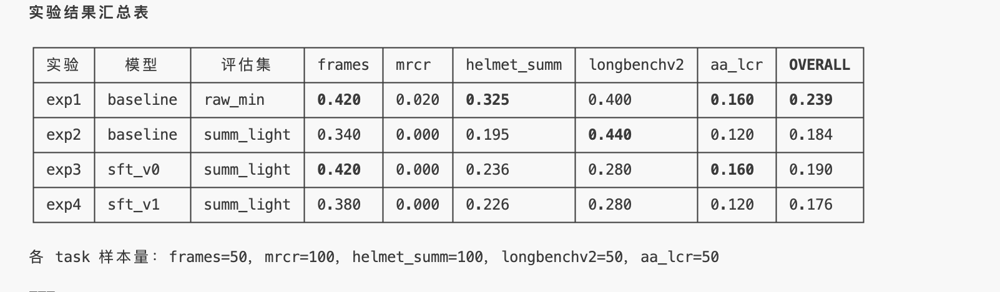<br/>**长文本RL训练**<br/>1. **难点：**<br/>    * **输入长度差异大**，20k、60k、120k 混在一起，训练 batch 分布很不稳；<br/>    * **任务类型差异大**，选择题、DocQA、多跳、NIAH、数值计算的 reward 分布不同；<br/>    * 长文错误回答里往往也包含很多**正确中间步骤**，直接给负 advantage 会误伤；<br/>    * 输入越长，模型**输出 reasoning 也越长**，如果 rollout 长度不跟着扩，训练信号会被截断；<br/>    * 如果一开始就放开**很长 rollout**，模型容易 response length 膨胀、entropy 飙升、训练崩。<br/>2. **多阶段训练**<br/>    1. **长度扩展**<br/>        *  第一，输入长度逐步增加，模型先在相对短的长文任务上学会 grounding、检索、推理，再进入更长上下文。<br/>        * 第二，输出长度也同步增加。<br/>> 论文观察到输入越长，模型需要的 reasoning 内容通常越长。如果只扩输入、不扩 rollout，模型可能还没推理完就被截断，reward 会很脏。<br/>  Stage 1: max input 20K, max output 12K  Stage 2: max input 60K, max output 20K  Stage 3: max input 120K, max output 50K  Stage 4: full-context RL<br/>    2. **任务均匀采样**：在一个batch中各类任务如多项选择，文档多跳推理，通用阅读理解，对话记忆和数值计算按照比例放入，避免训练中出现policy跳变，reward不稳，response失控。<br/>    3. **Task-Specific 优势估计**：在GRPO中避免任务之间的reward相互污染，QA 的 reward 归一化只跟 QA 比，NIAH 只跟 NIAH 比，数值计算只跟数值计算比。<br/>    4.  **AEPO**：Adaptive Entropy-Controlled Policy Optimization 动态控制负样本梯度：论文发现模型某些回答错了，所以得到负 advantage，但这些回答里的高熵 token 往往是模型探索中的不确定位置。如果直接强力惩罚，可能会把**有价值的探索压掉**，让梯度方差变大，造成 entropy 剧烈波动，甚至让训练 collapse。<br/>**模型太发散 -> 少惩罚负样本，先用正样本把方向拉回来 | 模型太保守 -> 放回负样本，让它继续区分好坏**<br/>设两个 entropy 阈值：  entropy_low  entropy_high  训练时：  如果 batch entropy > entropy_high:      屏蔽 negative advantage 样本      只用 positive advantage 样本更新      相当于在线 rejection sampling / 正样本 SFT  如果 batch entropy < entropy_low:      重新放回 negative advantage 样本      防止 entropy collapse，保留探索<br/>    5. **Memory RL 和 Full-Context RL 分开训， QwenLong-L1.5 **发现memory management 数据和 single-pass full-context 数据混在一起，会伤害 RL 训练效率和稳定性。<br/>        * full-context:  一次读完整上下文 -> 推理 -> 回答<br/>        * memory-agent：分 chunk 阅读 -> 更新 memory -> 制定下一步计划 -> 最终回答，目的是虑到即使有 256k 窗口，业务里还是会有 1M、4M 甚至更长的输入，所以设计了一个读 chunk、更新 memory、生成 plan、最后回答的 agent 流程。<br/>FuseChat 里的模型合并算法：Select, Calculate, Erasehttps://arxiv.org/abs/2408.07990 1. Select     找出不同 expert 参数更新里变化差异大的位置。     这些位置被认为更可能代表某个 expert 的独特能力。  2. Calculate     根据这些参数更新的强度，自动计算每个 expert 在不同参数矩阵上的合并权重。  3. Erase     如果多个 expert 在同一个参数位置的更新方向冲突，就擦掉少数方向，减少参数干扰。<br/><br/>**结果**：<br/>1. **长上下文 RL 的收益主要体现在真正长、信息密集的任务上**：QwenLong-L1.5最大收益在长上下文和信息聚合任务MRCR: +31.72 CorpusQA: +9.69 LongBench-V2: +6.16，在长文检索、消歧、多跳 grounding 和全局聚合有更好的提升。<br/>2. **Stage 1 就拿到大部分基础收益**：论文指出与其一开始堆 256k，不如先做一批高质量 32k/64k evidence QA、多跳 QA、抽取聚合，让模型先学会“找证据再回答”。<br/>  Base: 61.92  Naive GRPO: 67.24  Full-context RL Stage-1: 69.59  Stage-2: 70.46  Stage-3: 71.59  Final Stage-4: 71.82<br/>3. **Progressive length extension 对长、密集任务更重要：**分阶段训练是长文本激活的关键。<br/>`MRCR:`<br/>`  Stage-1: 76.35`<br/>`  Stage-2: 81.53`<br/>`  Stage-3: 82.69`<br/>`  Stage-4: 82.99`<br/>|* **核心insight**：长上下文 RL 的收益来自“高质量合成数据 + progressive length curriculum + 多任务稳定训练”，而不是简单把 GRPO 跑在更长输入上；<br/>* 关键启示<br/>    1. RL 阶段重点不是继续扩窗口，而是让模型会用 256k，midt 解决物理长度，RL 要强化长文证据定位、信息聚合、多跳推理和拒答/冲突判断。<br/>    2. 数据要做成可验证长文任务
先从业务文档抽 atomic facts、表格、条款、时间线，再合成 evidence QA、抽取聚合、多跳问题，reward 同时看答案和证据。<br/>    3. 训练要分阶段推进
不要一上来全量 256k RL，可以从 32k/64k grounding 开始，再到 128k 多跳干扰，最后用 256k hard cases 校准长位置鲁棒性。|
|4|SPELL: SELF-PLAY REINFORCEMENT LEARNING FOR EVOLVING LONG-CONTEXT LANGUAGE MODELS<br/>**ICLR2026**<br/>[https://github.com/Tongyi-Zhiwen/Qwen-Doc](https://github.com/Tongyi-Zhiwen/Qwen-Doc)<br/>**Insight： 静态数据跟不上模型能力边界，self-play 可以动态生成“刚好有挑战”的长文任务，持续提供有效 RL 信号。**|**摘要**：<br/>* SPELL 的目标是解决长文 RL 缺少人工标注和可验证 reward 的问题，所以让同一个模型在 questioner、responder、verifier 三个角色之间自我博弈，自动造题、答题、验题，并用这些信号继续 RL。<br/><br/>SPELL：<br/>* **三角色闭环**：SPELL 用的是一个统一 policy model，但通过不同 prompt 让它扮演三个角色：questioner -> responder -> verifier -> policy update。<br/>* **具体流程**<br/>    1. Step 1: 当前 policy 用 questioner prompt 生成 q + a_ref<br/>    2. Step 2: 当前 policy 用 responder prompt 对同一个 q 采样 G 个回答<br/>    3. Step 3: 当前 policy 用 verifier prompt 对每个回答做多次判断<br/>    4. Step 4: 计算三类 reward<br/>    5.           - responder: max(CEM, verifier majority) 回答者奖励<br/>    6.           - questioner: Gaussian(success_rate) 出题者奖励<br/>    7.           - verifier: self-consistency / rule-consistency 验证者奖励<br/>    8. Step 5: 把三类 role 的 prompt-output-reward 都放进训练 batch<br/>    9. Step 6: 用 GRPO 更新同一个 policy<br/>    10. Step 7: 更新后的 policy 进入下一轮，继续扮演三个角色<br/>备注：questioner 只看一部分文档生成问题，但 responder 会看到完整文档集，剩余文档就自然变成 distractors。这样问题不只是 QA，还带有长文检索压力。训练不是只更新 responder，而是 questioner、responder、verifier 都更新同一个模型。也就是说，模型不仅学会答题，也学会出更好的题、做更可靠的判断。<br/>* **难度自适应：**SPELL 不希望 questioner 出太简单或太难的问题。 questioner 的 reward 在 responder 成功率接近 0.5 时最高。questioner 会被鼓励生成“当前模型有一半概率答对”的题，这类题最接近模型能力边界，训练信号最强。<br/>* **自动 curriculum**：第一轮时，questioner 只看随机采样的一小部分文档，生成一个 QA。如果这个 QA 是可解的，就会被加入 history memory：history memory = 最近可解的 QA + 对应源文档，后续 questioner 再造题时，会同时看到：新采样文档 + history memory 里的旧文档和旧 QA  1. 上下文范围变大  2. 避免重复和低难题。<br/><br/>**结果：**<br/>1. **Self-play 比静态 RLVR 更适合强模型**，SPELL 对弱模型和强模型都有效，但最有意思的是：强模型上，静态 RLVR 的收益会变小，而 SPELL 还能继续提升。论文里提到，Qwen3-30B-A3B-Thinking 上，SPELL 平均提升，而 RLVR 几乎没有收益。原因是**静态数据跟不上模型能力边界**，self-play questioner 会动态生成“当前模型刚好不会稳定做”的题。<br/>2. **questioner 和 verifier 都不能省**。Ablation 里：<br/>    * 冻结 questioner，平均掉 4.6 分--任务难度能跟着模型能力变强<br/>    * 去掉 history memory，平均掉 2.9 分--curriculum 更稳定<br/>    * 去掉 verifier，只靠规则 reward，平均掉 3.2 分，DocMath 掉 6.4 分--补规则 reward 的语义盲区<br/>|**关键启示**：<br/>    1. 业务长文数据可以做 self-play 扩增，可以让模型基于业务文档自动生成：问题 + 参考答案 + 证据位置，再让 responder 回答，verifier 判断，形成 RL 数据闭环。<br/>    2. 训练数据要动态卡在模型能力边界，不要只训全对题，也不要堆全错 hard cases。更适合 RL 的样本是：采样 4-8 次，有的答对、有的答错，这类样本 reward 方差最大，最能推动模型学习。|
|||||

## 3.方向探索
### 3.1 面向通用长文任务的层级摘要强化学习【v1 20260630】
**一句话总结**：我们不是只让模型在长文里找答案，而是让模型学会把长文压缩成可继续推理和生成的高质量中间状态，从 LoongRL 的"定位后回答"，推进到更通用的"压缩后推理/生成"，覆盖摘要、生成、对话和代码长上下文等基础长文任务。

#### 研究概览
|可视化|摘要|模块|内容|
|-|-|-|-|
||强化学习（RL）的核心目标是提升模型的回答质量。从 midt 阶段的知识补充，到 SFT 阶段的格式规范，再到 RL 阶段的质量优化，底层机制是通过多条 rollout 采样，从中筛选出最符合期望的回答。<br/>对于长文任务而言，**定位后推理**是关键能力。LoongRL 通过插入 UUID 链，强制模型在无关文档中定位到真正相关的上下文，使模型形成"先定位、再回答"的范式，这一点做得相当精准。然而，该方法在摘要、多轮对话、上下文学习、长文生成等基础长文任务上难以实现有效提升。<br/>本工作提出一种**层级压缩范式**：模型自发学会逐段阅读并生成 segment summary，最终将所有 summary 聚合压缩得到最终结果。该范式在多类任务上均有预期收益：<br/>* **摘要任务**：大模型对靠后文本注意力更集中，容易忽略前文内容；层级 summary 可将前文关键信息显式保留，从而改善摘要质量。<br/>* **上下文学习**：要求 summary 保留高质量细节，包括环境配置、函数名、超参数、路径等关键信息，叙述可以精简但细节不能缺失。<br/>* **长文生成**：本质上是在高质量 summary 基础上进行扩写，预期同样受益于该范式。<br/>**训练设计**参考 LoongRL 的两阶段策略：第一阶段学习压缩范式，第二阶段在难题上做能力提升。奖励设计采用稠密 reward：整体输出质量好给奖励，单段 summary 质量好也独立给奖励。<br/>**数据合成**包含两个互补方向：？？？<br/>1. **短到长**：以短文本为 GT，扩写为长文本作为输入，用于训练摘要压缩能力；<br/>2. **长到短**：~~以长文本压缩为短文本（作为 context），原始长文本作为生成目标，用于长文生成模块，同时保证压缩与扩写的对称性~~。<br/>此外，还将混入代码相关数据（对代码进行摘要与扩写，验证基础功能是否保留），以及小说类长文档数据（按章节拆分并逐层总结），以覆盖更广泛的长文任务类型。|**研究方向**|**面向通用长文任务的"层级压缩-推理/生成"RL 后训练**|
|||**核心范式**|长文输入 → 分段阅读 → segment summary / memory → 聚合 summaries → 最终回答 / 总结 / 生成 / 上下文学习|
|||**与 LoongRL 的区别**|* LoongRL 强调 定位 → 找到真正问题 → 回答；<br/>* 本方向强调 压缩 → 聚合 → 推理/生成|
|||**核心假设**|如果模型学会"**看一段、压缩一段、保留关键信息、最后聚合**"，不仅能提升摘要，也能提升长文生成、上下文学习和多轮对话|
|||**解决的问题**|* 长上下文模型存在 recency bias，前文信息容易被忽略；<br/>* 层级 summary 可以把前文关键信息压缩成后续可用的中间表示|
|||**覆盖任务**|长摘要、多轮对话记忆、长上下文学习、长文生成、代码长上下文理解、小说/报告类长文本归纳|

#### 数据合成
|数据合成方向|构造方式|训练目标|适用任务|
|-|-|-|-|
|**短到长：扩写数据**|**短文本/大纲/摘要 = GT summary，扩写成长文本作为 input**|**从长文本还原短文本**|**摘要、信息压缩**|
|**长到短再到长：压缩-复原**|**长文本 → 短文本，短文本作为 context，长文本作为 generation target**|**基于 summary 复原/扩写长文**|**长文生成、扩写、报告生成**|
|* 代码数据|代码仓库/文件 → 模块功能、函数接口、路径、依赖、超参数摘要|压缩代码信息，或基于摘要生成/解释代码|代码理解、代码生成、长上下文代码 QA|
|* 小说/长文档|章节 → 章节摘要 → 全局摘要|基于全局摘要做情节问答、人物关系、续写|小说理解、长文归纳、长篇生成|

#### 训练阶段
|训练阶段|目标|训练形式|重点能力|
|-|-|-|-|
|Stage 1：压缩范式学习<br/>待定：扩写范式给出更多reward，对压缩后的summary再进行扩写|让模型学会稳定生成高质量 segment summary|chunk_i → summary_i，再由多个 summary_i → global summary|保留关键事实、实体、时间、地点、数值、代码路径、函数名、超参数、依赖关系、用户状态等|
|Stage 2：基于 summary 做难任务|在压缩能力基础上完成复杂长文任务|长文 → summaries → final answer / generation / dialogue answer / ICL|基于压缩信息做推理、生成、问答、对话记忆和上下文学习|

#### Reward 维度
|Reward 维度|含义|
|-|-|
|final_quality|最终回答、摘要或生成结果整体质量|
|segment_summary_coverage|单段 summary 是否覆盖该 chunk 的关键信息|
|global_summary_coverage|聚合 summary 是否覆盖全局关键内容|
|key_detail_preservation|是否保留实体、时间、数值、函数、路径、参数、超参数等关键细节|
|consistency|segment summary、global summary 和最终答案之间是否一致|
|hallucination penalty|是否引入原文不存在的信息|
|redundancy penalty|是否重复、冗余、灌水|
|总体形式|`R = final_quality + segment_summary_coverage + global_summary_coverage + key_detail_preservation + consistency - hallucination - redundanc`|

#### 【20260702】
* 观察：
    * 现有工作把目光聚焦在『**定位后推理』，**数据合成，训练策略还有reward设计等都围绕这一核心来展开，如果继续在这方面去研究困难很大。
    * 我们发现在不是所有的任务都需要定位后推理这样一种范式的，摘要、多轮对话、上下文学习、长文生成等信息密度均匀分布的基础长文任务上，直觉上更适合『**压缩后推理**』的范式。
    * 业界普遍认为模型更关注最前段和最末端，符合人类的"首因效应"和"近因效应"的认知，也有论文背书，所以这种压缩后把关键高质量summary放到尾部会更利于长文任务的进行，直接上是makesense的。


> 《Lost in the Middle: How Language Models Use Long Contexts》："The 'Lost in the Middle' (LiM) effect describes how models favor information from the beginning (primacy  bias) and end (recency bias) over the middle of an input."
* 工作：我们不是只让模型在长文里找答案，而是让模型学会把长文压缩成可继续推理和生成的高质量中间状态，从 LoongRL 的"定位后回答"，推进到更通用的"压缩后推理/生成"，覆盖摘要、生成、对话和代码长上下文等基础长文任务。
* 实验探针：
    * 数据集：QwenLong-L1 的 DocQA-RL-1.6K 数据集：[https://huggingface.co/datasets/Tongyi-Zhiwen/DocQA-RL-1.6K](https://huggingface.co/datasets/Tongyi-Zhiwen/DocQA-RL-1.6K)
    * 方法：按照token分桶均匀去选出200个case，用deepseek-v4-pro生成gold-summary，然后用deepseek-v4-flash来做三种不同上下文的预测回答。
    * **结论**：高质量 question-focused summary 对长文回答有帮助；prompt-only “先总结再回答”不稳定；后续研究重点应该是训练 summary 生成过程。
    * **风险**：现有summary生成有部分答案泄露的情况，需要优化。

* **主表**

|Method|Easy 0-32k|Medium 32-64k|Hard 64k+|Avg|path|summary_path|
|-|-|-|-|-|-|-|
|**long context**|**0.597**|**0.431**|**0.304**|**0.455**|output/summary_bottleneck_docqa_200_eval_20260701_223238/predictions_rescored.jsonl||
|~~long context + summary~~|~~0.653~~|~~0.569~~|~~0.429~~|~~0.560~~|~~output/summary_bottleneck_docqa_200_eval_20260701_223238/predictions_rescored.jsonl~~|~~output/summary_bottleneck_docqa_200_generated_20260701_205155/master_records.jsonl~~|
|long context + flash summary|0.559|0.444|0.231|0.441|output/qc_summary_eval_183_full_doc_flash/predictions.jsonl|output/qc_summaries_200_full_doc_merged/summaries_deepseek-v4-flash_merged.jsonl|
|long context + gpt-5.4 summary|**0.597**|**0.486**|**0.321**|**0.480**|output/qc_summary_eval_200_full_doc_gpt54/predictions.jsonl|output/qc_summaries_200_full_doc_gpt54_merged/summaries_gpt-5.4_merged.jsonl|
|**long context (requiring summary)**|**0.472**|**0.333**|**0.268**|**0.365**|**output/summary_bottleneck_docqa_200_eval_20260701_223238/predictions_rescored.jsonl**||


* **summary-only任务【gpt-5.4回答】**

|Summary Model|Easy 0-32k|Medium 32-64k|Hard 64k+|Avg|Total|Correct|
|-|-|-|-|-|-|-|
|`deepseek-v4-flash`|0.319|0.236|0.179|0.257|183|47|
|`gpt-5.4`|0.417|0.222|0.268|0.305|200|61|

    * **insight**：更强 teacher 生成的 summary 更能支持仅凭 summary 回答问题。


* **长度分桶：**16k Token Buckets

|任务类型|长度分桶 16k Token Buckets|||能力维度（任务类型）||数据来源|信息泄露case|
|-|-|-|-|-|-|-|-|
|* Doc-QA：171<br/>* 数值计算：80<br/>* MCQ：40|Bucket|Count|可视化|表格|可视化|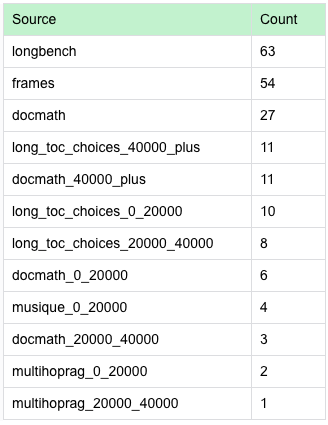|数值计算|
||0k-16k|36|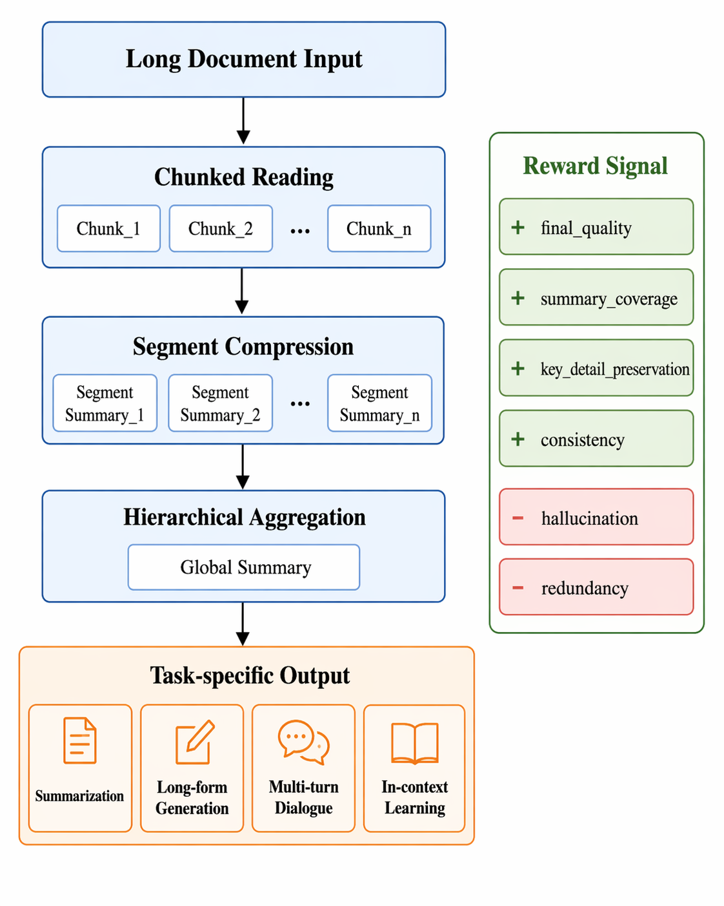||||**输入文档**：`docqa_01655`, `doc-math`, `128k-256k`<br/>**问题**：计算 2021 上半年 adjusted ROATCE。<br/>**GT**:<br/>Therefore, the answer is 6.4492577269408615.<br/>**summary **中直接包含：<br/>The adjusted ROATCE ... equals 6.4492577269408615%.|
||16k-32k|36||||||
||32k-48k|36||||||
||48k-64k|36||||||
||64k-80k|36||||||
||80k-96k|9||||||
||96k-112k|3||||||
||112k-128k|5||||||
||128k-256k|3||||||

#### 【20260703】
**观点**：我们不是反对“定位后推理”，而是把它扩展成“定位 -> 压缩 -> 推理”，**定位后推理是必要前提，但不一定是充分条件****，summary 是对定位结果的去噪、组织和压缩**，让模型面对的是高密度推理状态，而不是一组松散原文片段。


|长度分档|样本数|多证据比例（>=3）|P50证据跨度(chars)|P90证据跨度(chars)|
|-|-|-|-|-|
|0-32k|72|51.4%|886|24,976|
|32-64k|72|65.3%|5444|106,043|
|64k+|56|60.7%|5461|113,405|

* **结论**：随着上下文变长，答案所需证据越来越分散，压缩可以帮助长尾困难样本的解决，在128k-256k token的扩展中有足够的实现的价值。
* **风险**：

    1. **压缩后回答的必要性证明：**目前业界的主流是定位后推理，我们的观点是在单点检索，多点高密度检索上效果没有下降，在多点低密度任务上有效果；
    2. **高质量summary如何构建的问题：**目前的初步想法是基于公开长文构造doc + question得到question-contition的summary【生成】，再用『只看 summary 能否答对』进行【过滤】，得到能训练模型先压缩关键证据再回答的长文数据。
    3. **训练策略**：先用SFT去warm-up，学会先总结再回答的格式，用 RL 优化 summary 质量和最终答案，其中 reward 看final answer 是否正确、summary 是否足够回答【后验】和事实性检测。


#### 数据构造
**背景**：

* 数据建设：benchmark verifier
* 训练：GRPO：单阶段，两阶段无长文，后面有长文，均匀混合；
* 长文：verifier，训了就有很好的水平，verifier合理+RL策略也是正常的。ID+OOD。
* VS系统，接收RL数据，有query，verifier list【rule，高质】，reward shaping，verifier的组合
* 1M长下文：底层架构+
* 数据合成：问题在，RL，makesense，从问题


**目标**：不强制模型每题都写固定格式 summary，而是要构造一种 RL 环境，让模型在探索中发现：当证据分散、冗余、需要聚合时，先压缩成中间状态更容易拿高 reward。


**什么数据是必要的：**

1.  Summary-Helpful 数据

    * 特点：没有 summary 可能答，但很容易错；summary 好了会显著降低难度。
    * 筛选：证据分散+后验的实验，是否加summary

```
  teacher 生成：

  {
    "question_conditioned_summary": "...",
    "key_facts": [...],
    "answer": "..."
  }

  然后过滤：

  summary + question -> 能答对
  summary facts -> 能被 doc 支持
```
2. Retrieval-Sufficient 数据

    * 特点：一个短 span 就能回答。
    * 目标：如果证据很短、很明确，不需要长篇总结，直接定位回答即可。

3. Summary-Necessary-Hard 数据【后期 RL 的关键数据】

    * 特点：直接回答 pass@k 很低，但 teacher summary 后 pass@k 明显提高。
    * 筛选：前期RL的rollout全错样本


**Reward如何设计**

  R = final_answer_reward——主奖励：答案对不对

    +** optional_summary_sufficiency_reward——条件奖励：生成了summary的情况下，能否答对**

    + faithfulness_reward——事实一致性奖励

    + key_detail_coverage_reward——关键信息奖励

    - hallucination_penalty——幻觉惩罚

    - unnecessary_summary_penalty——冗长惩罚


**阶段一：SFT数据**

核心思路是：先用强模型构造 question-conditioned summary，再把数据拆成“学会压缩”，“基于压缩回答”，“端到端压缩后回答”三种格式；

```
三类SFT格式：
 A. Summary-only
  input: doc + question
  target: question-conditioned summary

  B. Answer-from-summary
  input: summary + question
  target: answer

  C. End-to-end
  input: doc + question
  target: summary + answer
```
**阶段二：RL训练 stage-1**

核心思路：模型自己 rollout，然后 reward 同时看 final answer、summary sufficiency、faithfulness、key detail preservation 和 format。


#### 【20260707】
**summary生成**

* **准备阶段**

|**目标文件**|**结果文件**|**唯一健**|**脚本**|
|-|-|-|-|
|QwenLong-L1 的 DocQA-RL-1.6K 数据集：[https://huggingface.co/datasets/Tongyi-Zhiwen/DocQA-RL-1.6K](https://huggingface.co/datasets/Tongyi-Zhiwen/DocQA-RL-1.6K)<br/>总量：1.59k<br/>划分：train训练集<br/>**测试集：2.01k尚未使用**<br/>|summary文件<br/>`/home/disk6/xiazhaoyuan/workspace/paper/ernie/output/remaining_docqa_aligned_by_key_20260706_220027/master_records_keyaligned.jsonl`<br/>summary-only评估文件：<br/>`/home/disk6/xiazhaoyuan/workspace/paper/ernie/output/summaryonly_full_1533_qwen_math_judge_20260707/full_1533_case_level_details_enriched.jsonl`|**id + source + ability + question**<br/>eg.`docqa_long_toc_choices_0_20000_000000`+`long_toc_choices_0_20000`+`doc-mc`+"`甲公司（住所地为A市B区）与乙公司（住所地为C市D区）签订了一份位于E市F区的厂房租赁合同，约定争议由E市F区法院管辖。后因乙公司拖欠租金，甲公司向E市`| summary生成程序：`/home/disk6/xiazhaoyuan/workspace/paper/ernie/code/scripts/generate_question_conditioned_summaries.py`<br/>System prompt：  你是长文 question-conditioned summary 数据生成专家。你必须输出可解析 JSON，不要输出 Markdown。  User prompt 模板：  请根据 doc 和 question 生成 question-conditioned summary。  重要约束：  1. 你只能使用 doc 中的信息；  2. 输入中没有标准答案，你不能猜测或编造；  3. summary 的目标是保留回答 question 所需的关键证据、实体、数值、时间、条件、例外和推理中间量；  4. 如果 doc 中证据不足，summary 中要明确说明证据不足，而不是硬给答案；  5. summary 不要直接写“答案是...”，除非这是 doc 原文已经显式给出的事实；  6. summary 控制在 150-350 个中文字符或 100-220 个英文词内。  请输出 JSON：  {    "summary": "question-conditioned summary",    "key_facts": ["关键事实1", "关键事实2", "关键事实3"],    "evidence_quotes": ["原文短引用1", "原文短引用2"],    "risk_notes": ["可能的歧义或缺失信息"]  }  [Question]  {question}  [原始长文 doc]  {full_doc}<br/>summary-only评估（含划分）：<br/>`summary/home/disk6/xiazhaoyuan/workspace/paper/ernie/code/scripts/evaluate_summary_only_sufficiency.py`|

* 分析阶段

|长度分布<br/>|任务类型<br/>qa固定格式回答"there isXXX"，mc选择题，math数值计算<br/>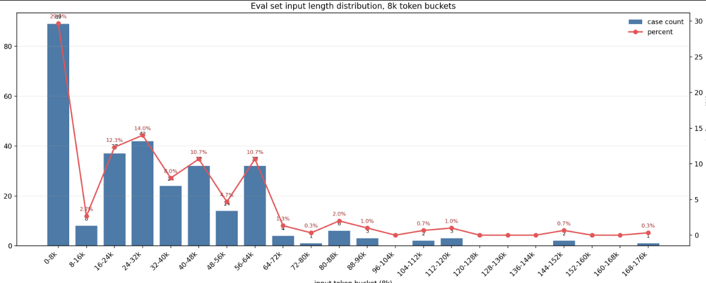|
|-|-|
||**Insight**：<br/>* DocQA的训练集1533个case长度都偏短，超过64k的只有3个case，0-16k占据75%的比例。<br/>* 任务上，均匀分布，评估过程中对于math使用了llm作为judge<br/>* 能力维度会更偏向于定位，summary的专项任务很少，只有3%，如果在docqa有很好表现，那么会有很大优势。<br/>|

* **金标：回答者统一为claude-opus-4-6**

|Summary-Gen-Model|0-20k Easy|20-40k Medium|40k+ Hard|Avg Acc|
|-|-|-|-|-|
|claude-opus-4-6|0.762|0.454|0.242|0.690|

    * **insight**：Claude生成的summary质量很高，可以拿来作为后续数据合成的语料。

* SFT/RL数据生成（包含Verifier构建）

|索引|阶段|目标|脚本|文件|统计|
|-|-|-|-|-|-|
|1|清洗数据|* 保留summary-only能回答正确的case，代表着它是一个高质量summary，可以拿来训练<br/>* 清洗部分summary中的答案尾端，我们不希望在summary中有答案<br/> 请清洗下面的 question-conditioned summary，只删除尾部明显直接泄露最终答案的总结句。  要求：  1. 保留回答问题所需的证据、实体、数值、时间、条件、例外和推理中间量；  2. 对数学题保留公式、中间计算和必要数值；只删除“答案是/therefore the answer is/因此最终答案为”这类最终答案包装句；  3. 不要新增原 summary 没有的信息；  4. 不要改写大部分 summary，不要压缩，不要润色，只做最小删除；  5. 输出 JSON，不要输出 Markdown。  JSON 格式：  {    "cleaned_summary": "...",    "removed_answer_leakage": true/false,    "removed_text": ["被删除的短句"]  }  [Ability]  {ability}  [Question]  {question}  [Original Summary]  {question_conditioned_summary} <br/>* 检验事实性，利用字段『**evidence_quotes"**』在原doc去检索|`/home/disk6/xiazhaoyuan/workspace/paper/ernie/code/scripts/build_sft_rl_from_enriched_cases.py`<br/>1. 用 id + source + ability + question 对齐唯一键<br/>2. 先过滤 correct == true<br/>3. 再做 evidence_quotes 原文支持检查<br/>4. 只有通过前面过滤的目标 case，才调用 Claude 清洗 summary|**输入文件**：<br/>case：<br/>`/home/disk6/xiazhaoyuan/workspace/paper/ernie/output/summaryonly_full_1533_qwen_math_judge_20260707/full_1533_case_level_details_enriched.jsonl`<br/>summary-only-eval：<br/>`/home/disk6/xiazhaoyuan/workspace/paper/ernie/output/summaryonly_full_1533_qwen_math_judge_20260707/full_1533_case_level_details_enriched.jsonl`<br/>**输出文件**：<br/>`/home/disk6/xiazhaoyuan/workspace/paper/ernie/output/clean_summary_cases_v2_no_evidence_filter_20260707/clean_cases.jsonl`|总量：1058个case<br/>|
|3|文件整备|merge|~~脚本~~<br/>~~~~`/home/disk6/xiazhaoyuan/workspace/paper/ernie/code/scripts/merge_case_level_fields.py`~~~~<br/>**脚本**<br/>`/home/disk6/xiazhaoyuan/workspace/paper/ernie/code/scripts/regenerate_structured_reasoning_cases.py`|~~**结果文件：**~~<br/>~~~~`output/clean_summary_cases_v2_no_evidence_filter_20260707/merged_case_level_fields.jsonl`~~~~<br/>结果文件<br/>`/home/disk6/xiazhaoyuan/workspace/paper/ernie/output/clean_summary_cases_v2_no_evidence_filter_20260707/structured_reasoning_cases_20260713_172615.jsonl`|rows: 1058  bad_jsonl: 0  field_count: 23  has_qc: False  has_failed_task_names: False  核心字段缺失：  doc: 0  question: 0  gold_answer: 0  gold_summary: 0  summary_only_reasoning: 0  summary_only_predicted_summary: 0  key_facts: 0  evidence_quotes: 0  可选生成字段缺失：  longdoc_reasoning: 13  longdoc_predicted_answer: 13  summary_to_answer_reasoning: 18  summary_to_answer_predicted_answer: 18  分布：  ability:  doc-math 360  doc-qa   347  doc-mc   351  length_tier_20k:  0-20k    946  20-40k    89  40k+      23|
|3|SFT数据准备|分阶段进行，随着size的提升，需要的数据量上涨<br/>**数据量需求表**<br/>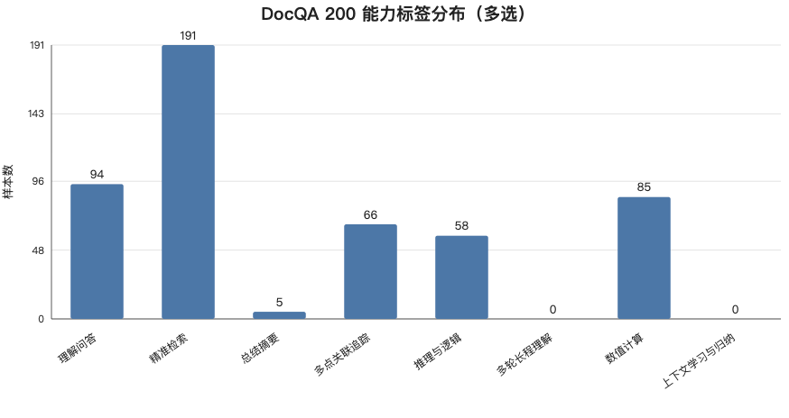<br/>**SFT v0 三类数据**<br/>|~~~~`/home/disk6/xiazhaoyuan/workspace/paper/ernie/code/scripts/build_sft_from_clean_summary_cases.py`~~~~<br/>`/home/disk6/xiazhaoyuan/workspace/paper/ernie/code/scripts/build_sft_from_structured_reasoning_cases.py`<br/><br/>doc2summary:    input: doc + question    output: <reason></reason>            <answer>Therefore，XXX</answer>  summary2answer:    input: gold_summary + question    output: <reason></reason>            <answer>Therefore，XXX</answer>  doc2answer:    input: doc + question    output: <reason>让我们首先先总结一下question相关的片段                    <summary>gold_summary</summary>                    longdoc_reasoning            </reason>            <answer>Therefore，XXX</answer><br/>1. 补消融实验：两类数据SFT，三类数据SFT，评估集200case，longdoc，第二种短文训练packing<br/>2. 主表main result，|输出文件：<br/>`/home/disk6/xiazhaoyuan/workspace/paper/ernie/data/sft_structured_reasoning_v1/sft_messages.jsonl`|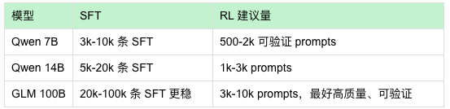|
|3|RL数据的数据构造|1. 树结构，关键的段落，和question相关，metric命中率<br/>2. 链：F-Score<br/>3. reward设置<br/>最终答案的finalreward输出格式的<reason><summary>上的奖励evidence_location_reward，判断summary有没有覆盖原文证据，来判断找的准不准的过程奖励summary_compression_reward的压缩奖励，主要看实体，数字，条件等关键超参是否保留。|rl构造脚本：<br/>`/home/disk6/xiazhaoyuan/workspace/paper/ernie/code/scripts/build_rl_from_structured_reasoning_cases.py`|rl数据文件：<br/>`/home/disk6/xiazhaoyuan/workspace/paper/ernie/data/rl_summary_bottleneck_v0/rl_prompts_train.jsonl` **830个case**<br/>`/home/disk6/xiazhaoyuan/workspace/paper/ernie/data/rl_summary_bottleneck_v0/rl_prompts_dev.jsonl`<br/>**100个case**<br/>`/home/disk6/xiazhaoyuan/workspace/paper/ernie/data/rl_summary_bottleneck_v0/rl_prompts_test.jsonl` **100个case**||
|4|效果评估|参考文档[后训练长文能力提升专题](https://ku.baidu-int.com/knowledge/HFVrC7hq1Q/pKzJfZczuc/KRMcaCYx6j/tvbVpV4HmWVnQU?t=mention&mt=doc&dt=doc)<br/><br/>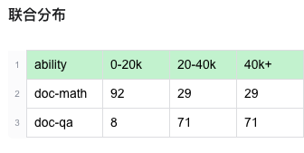|构造和评估脚本：<br/>benchmark：`/home/disk6/xiazhaoyuan/workspace/ernie/ernie_ability_enhanced/tools/shangche_eval/build_eval_set_benchmark.py`<br/>qwenlong：<br/>`/home/disk6/xiazhaoyuan/workspace/paper/ernie/eval/qwenlong/build_eval_set_qwenlong.py`|评估数据集：<br/>不加轻 prompt：<br/>`/home/disk6/xiazhaoyuan/workspace/ernie/ernie_ability_enhanced/data/shangche/eval_sets/long_text_eval_seed41_350_raw_min.jsonl`<br/><br/>加轻 prompt：<br/>`/home/disk6/xiazhaoyuan/workspace/ernie/ernie_ability_enhanced/data/shangche/eval_sets/long_text_eval_seed41_350_summary_light.jsonl`<br/><br/>qwenlong：<br/>`/home/disk6/xiazhaoyuan/workspace/paper/ernie/eval/qwenlong/docqa_test_300_seed41_ability_length_balanced.jsonl`<br/>奖励文件：<br/>`/home/disk6/xiazhaoyuan/workspace/paper/ernie/data/rl_summary_bottleneck_v0/reward_refs.jsonl`|qwenlong长度分布：<br/>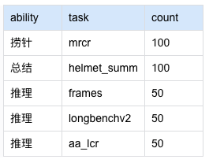|


* 实验结果

|Experiment|Easy 0-20k|Medium 20-40k|Hard 40k+|Avg|备注|
|-|-|-|-|-|-|
|claude-opus-4-6 longdoc|0.989|0.899|0.783|0.925|评测代码：code/scripts/evaluate_longdoc_summary_baselines.py<br/>评测脚本：<br/>/home/disk6/xiazhaoyuan/workspace/paper/ernie/code/scripts/run_longdoc_summary_baselines_200.sh<br/>评测结果文件：<br/>/home/disk6/xiazhaoyuan/workspace/paper/ernie/output/longdoc_summary_baselines_200_seed41_20260708_010327|
|**claude-opus-4-6 claude_summary_200字**|**1.000**|**0.966**|**0.957**|**0.980**||
|claude-opus-4-6 longdoc+claude_summary|1.000|0.966|0.870|0.970|****|
|**qwen3.5-flash longdoc**|**0.773**|**0.753**|**0.652**|**0.750**|****|
|qwen3.5-flash claude_summary|0.977|0.944|0.870|0.950||
|qwen3.5-flash longdoc+claude_summary|0.977|0.966|0.957|0.970|****|
|**qwen3.5-flash longdoc+qwen_summary_200**|**0.784**|**0.730**|**0.565**|**0.735**|200词：/home/disk6/xiazhaoyuan/workspace/paper/ernie/output/qwen35_flash_qc_summaries_seed41_short/summaries_qwen3.5-flash_llmrepaired.jsonl<br/>500词：/home/disk6/xiazhaoyuan/workspace/paper/ernie/output/qwen35_flash_qc_summaries_seed41_500/summaries_qwen3.5-flash_llmrepaired.jsonl<br/>1000词：/home/disk6/xiazhaoyuan/workspace/paper/ernie/output/qwen35_flash_qc_summaries_seed41_1000/summaries_qwen3.5-flash_llmrepaired.jsonl|
|qwen3.5-flash longdoc+qwen_summary_500|0.841|0.798|0.696|0.805||
|**qwen3.5-flash longdoc+qwen_summary_1000**|**0.852**|**0.899**|**0.826**|**0.870**|****|

    * **summary对强模型也有作用**：Claude 自身也从 0.925 提升到 0.970，说明 summary 不只是弱模型补丁，对强长文模型也能减少 medium/hard的注意力发散。
    * **弱模型的注意力分散严重，需要总结去噪**：qwen3.5-flash 加 Claude summary 后从 0.750 提升到 0.970，hard 桶从 0.652 到 0.957。
    * **summary的长度是关键**：弱模型自己生成的短 summary 不稳定，但当 summary 扩展到 500/1000 级别后，longdoc+summary 能显著提升回答质量，尤其在 40k+ hard case 上

* **任务类型**

|Method|Ability|Base Acc|Summary Acc|Delta|修正|退化|备注|
|-|-|-|-|-|-|-|-|
|qwen_summary_1000|doc-math|0.494|0.765|**+0.272**|**29**|7|* docqa_docmath_0_20000_000028：average Interest expense，summary 误导成文档未提供平均值；<br/>* docqa_docmath_20000_40000_000378：CAGR，summary 认为缺 full-year 数据；<br/>* docqa_docmath_20000_40000_000390：warrant redemption，summary 口径误导；<br/>* docqa_musique_0_20000_001085、001454：多跳 QA 被summary 压缩掉关键跳。|
|qwen_summary_1000|doc-mc|0.974|1.000|+0.026|2|0||
|qwen_summary_1000|doc-qa|0.829|0.829|+0.000|4|4||

**insight**：flash summary 真正带来的提升主要来自“把分散数值和计算中间量压缩到可用上下文尾部”，但风险是弱模型 summary 会误判证据不足或抽错计算口径，所以 RL/SFT的重点应该不是简单鼓励更长 summary，而是奖励关键数值覆盖、公式口径正确和不误拒答

* **能力维度（多标签统计）：**

|Summary|能力|Base Acc|Acc|Delta|Fixed|Regressed|Net|能力维度|备注|
|-|-|-|-|-|-|-|-|-|-|
|qwen_summary_1000|数值计算|0.659|0.846|**+0.187**|30|7|**+23**|<br/>|测试脚本文件：`/home/disk6/xiazhaoyuan/workspace/paper/ernie/code/scripts/label_capability_dimensions.py`<br/>prmopt：<br/>请阅读完整 doc 和 question，判断这个样本需要哪些能力维度才能答对。只能从以下标签中多选，可以选 1-4 个：{label_list}标签定义：- 理解问答：需要理解文档内容并回答自然语言问题，是一般阅读理解能力。- 精准检索：需要在长文中准确定位特定实体、数值、日期、条款、选项、表格单元或短证据。- 总结摘要：需要对较大文本片段、章节、文档整体或多段信息做概括归纳。- 多点关联追踪：需要跨多个段落、表格、实体、时间点、事件或文档片段串联信息链。- 推理与逻辑：需要条件判断、排除比较、因果分析、反事实假设、规则适用、多步逻辑。- 多轮长程理解：需要理解对话历史、状态变化、长期记忆、跨轮用户意图或历史决策。- 数值计算：需要算术、比例、增长率、平均值、差值、财务指标、日期/数量计算。- 上下文学习与归纳：需要从上下文示例、格式、规则、模式或隐含任务定义中归纳并应用。标注要求：1. 只根据 doc + question 判断需要的能力，不要看 gold answer；2. 一个 case 可以多选，但不要泛化乱选；3. primary_label 选最核心、最不可缺少的能力；4. 如果是表格/财报数学题，通常至少包含“精准检索”和“数值计算”，如果还有反事实或多步公式，再加“推理与逻辑”；5. 如果只是找一个短答案，不要强行标“总结摘要”；6. 如果需要跨多个 passage/实体/关系跳转，标“多点关联追踪”。请输出 JSON：{{  "labels": ["标签1", "标签2"],  "primary_label": "最核心标签",  "rationale": "一句话说明标注依据",  "confidence": 0.0}}<br/>结果文件：<br/>`/home/disk6/xiazhaoyuan/workspace/paper/ernie/output/capability_labels_seed41_200_qwen37max/capability_labels.jsonl`|
|qwen_summary_1000|推理与逻辑|0.808|0.923|+0.115|15|3|+12|||
|qwen_summary_1000|多点关联追踪|0.793|0.862|+0.069|11|5|+6|||
|qwen_summary_1000|理解问答|0.917|0.833|-0.083|0|2|-2|||

**insight**：qwen_summary_1000 的收益主要集中在“数值计算 + 精准检索 + 推理与逻辑”类样本，说明 summary 的价值不是泛化提升所有 QA，而是把长文里的关键数值、表格字段和计算条件压缩成更容易使用的中间态。


### 3.2 训练探索
|索引|训练方法|时间|文件|关键超参|训练可视化|效果|
|-|-|-|-|-|-|-|
|1|SFT<br/>（训练侧）|~~202507013~~<br/>20250714|sft文件：`/home/disk6/xiazhaoyuan/workspace/paper/ernie/output/clean_summary_cases_v2_no_evidence_filter_20260707/structured_reasoning_cases_20260713_172615.jsonl`<br/>评估处理脚本：<br/>`/home/disk6/xiazhaoyuan/workspace/ernie/ernie_ability_enhanced/tools/shangche_eval/build_eval_set_benchmark.py`<br/>评估文件：<br/>* 不加轻 prompt：<br/>`/home/disk6/xiazhaoyuan/workspace/ernie/ernie_ability_enhanced/data/shangche/eval_sets/long_text_eval_seed41_350_raw_min.jsonl`<br/>* 加轻 prompt：<br/>`/home/disk6/xiazhaoyuan/workspace/ernie/ernie_ability_enhanced/data/shangche/eval_sets/long_text_eval_seed41_350_summary_light.jsonl`|  1. 模型 & 长上下文：base=Qwen2.5-7B-Instruct，rope_scaling: yarn factor=2 (32K→64K)，bf16 + flash-attn 2  2. LoRA：rank=16，α=32，dropout=0.05，target=all-linear，trainable 40.37M/7.66B (0.53%)  3. 数据 & 长度：max_length=65536（100% 覆盖），packing=true，truncation=right（兜底不触发），split_ratio=0.01  4. 优化器：3 epoch，per_device bs=1，grad_accum=4，LR=1e-4（LoRA 常用），cosine，warmup 3%，wd=0.1  5. 分布式：3× H800（GPU 2/3/6），deepspeed=zero2，gradient_checkpointing=true  6. 评估/保存/日志：eval_steps=100（末端一次），save_steps=200（末端一次），logging=5，report=tensorboard  7. 实测指标：耗时 1h 3m，train_loss 0.986→0.434，eval_loss=0.547，eval_token_acc=0.846<br/># SFT predictions on one case per task- base:    `/home/mnt/xiazhaoyuan/model/Qwen2.5-7B-Instruct`- adapter: `/home/xiazhaoyuan/sft_qwen2_5_7b/outputs/sft-qwen2_5_7b-20260714_032225/v0-20260714-032234/checkpoint-72` (LoRA, 40.4M trainable, 3 epochs, eval_loss 0.559, eval_token_acc 0.842)- decode:  greedy (do_sample=False), max_new_tokens per task below## Task: `summary2answer`- sample id: `docqa_docmath_0_20000_001462::summary2answer`  ·  prompt tokens: 196**System**```你是长文问答助手。请仅根据给定 summary 回答问题。```**User (input)**```请根据 summary 回答 question。[Summary]The question asks for the difference between the average salaries and fees and the average incentive schemes from 2018 to 2019. From the table: Salaries and fees were €4m in both 2019 and 2018, giving an average of €4m. Incentive schemes were €2m in 2019 and €3m in 2018, giving an average of €2.5m. The difference between these two averages is €4m - €2.5m = €1.5m.[Question]What is the difference between average salaries and fees and average incentive schemes from 2018 to 2019? (in million)```**Gold assistant**```<reason>From the summary: Average salaries and fees = €4m, Average incentive schemes = €2.5m. Difference = €4m - €2.5m = €1.5m.</reason><answer>Therefore, the answer is 1.5 million.</answer>```**Model prediction (SFT-LoRA)**```<reason>From the summary, the average salaries and fees from 2018 to 2019 is €4m, and the average incentive schemes is €2.5m. The difference is €4m - €2.5m = €1.5m.</reason><answer>Therefore, the answer is €1.5m.</answer>```---## Task: `doc2summary`- sample id: `docqa_docmath_0_20000_000902::doc2summary`  ·  prompt tokens: 301**System**```你是长文信息压缩助手。请根据长文和问题生成 question-conditioned summary。```**User (input)**```请阅读完整长文，并围绕问题生成 question-conditioned summary。[Question]What would be the average subtotal cost of property and equipment that the Company owned from 2018 to 2019 if the subtotal cost of property and equipment in 2018 was $300,000?[Document]||2019|2018||Computer equipment|$137,763|$94,384||Furniture and fixtures|187,167|159,648||Subtotal|324,930|254,032||Less accumulated depreciation|148,916|104,702||Property and equipment, net|$176,014|$149,330| NOTE 5 – PROPERTY AND EQUIPMENT The Company owned equipment recorded at cost, which consisted of the following as of December 31, 2019 and 2018: Depreciation expense was $80,206 and $58,423 for the years ended December 31, 2019 and 2018, respectively```**Gold assistant**```<reason>The question asks for the average subtotal cost of property and equipment from 2018 to 2019, with a hypothetical 2018 value of $300,000. From the document, the 2019 subtotal cost is $324,930 and the actual 2018 subtotal cost is $254,032. The question substitutes $300,000 for the 2018 value. The average would be (324,930 + 300,000) / 2.</reason><answer>The subtotal cost of property and equipment in 2019 was $324,930. The question posits a hypothetical 2018 subtotal cost of $300,000. The average subtotal cost would be calculated as ($324,930 + $300,000) / 2.</answer>```**Model prediction (SFT-LoRA)**```<reason>The question asks for the average subtotal cost of property and equipment from 2018 to 2019 if the 2018 subtotal was $300,000. The 2019 subtotal is $324,930. The average would be (300,000 + 324,930) / 2.</reason><answer>The 2018 subtotal cost of property and equipment was $254,032. The 2019 subtotal cost was $324,930. If the 2018 subtotal was $300,000 instead, the average would be (300,000 + 324,930) / 2 = $624,930 / 2 = $312,465.</answer>```---## Task: `doc2answer`- sample id: `docqa_musique_0_20000_001206::doc2answer`  ·  prompt tokens: 3159**System**```你是长文问答助手。面对长文问题时，先压缩出与问题相关的 summary，再完成推理和回答。```**User (input)**```请阅读完整长文并回答问题。[Question]When did compulsory national service end in the country where Prince of Thieves, whose main character John is depicted alongside, was made?[Document]Passage 1:Conscription in AustraliaIn 1964 compulsory National Service for 20 - year - old males was introduced under the National Service Act (1964). The selection of conscripts was made by a sortition or lottery draw based on date of birth, and conscripts were obligated to give two years' continuous full - time service, followed by a further three years on the active reserve list. The full - time service requirement was reduced to eighteen months in October 1971.Passage 2:Idol on ParadeIdol on Parade also known as Idle on Parade is a 1959 youth-oriented British comedy film produced by Warwick Films, directed by John Gilling and starring Anthony Newley, Sid James and Lionel Jeffries. It was John Antrobus' … [middle 11328 chars trimmed for display] …ervice for males, while females are exempted from conscription but may otherwise serve in the military. As of 2009[update], mandatory military service is nine months for male citizens between the ages of 19 and 45. Additionally, Greek males between the age of 18 and 60 who live in strategically sensitive areas may be required to serve part-time in the National Guard. However, as the military has sought to become a completely professional force, the government has promised to reduce mandatory military service or abolish it completely.Passage 20:The Submission of Prince Dipo Negoro to General De KockThe Submission of Prince Dipo Negoro to General De Kock () is an oil painting on canvas painted by Nicolaas Pieneman between 1830 and 1835. It depicts, from a victorious Dutch colonial perspective, the capture of Prince Diponegoro in 1830, which signaled the end of the Java War (1825–1830).```**Gold assistant**```<reason>让我们首先先总结一下question相关的片段<summary>The question asks when compulsory national service ended in the country where 'Prince of Thieves' (whose main character John is depicted alongside) was made. From Passage 4, we learn that during the 20th century, King John was normally depicted in fictional books and films alongside Robin Hood. From Passage 8, 'Robin Hood: Prince of Thieves' is a 1991 American romantic action adventure film. However, from Passage 17, the principal exteriors of Robin Hood: Prince of Thieves were shot on location in the United Kingdom. The question refers to the country where the film was 'made' - this could mean either the US (production country) or the UK (filming location). Given that the passage about John states he is depicted 'alongside Robin Hood' and the film is Robin Hood: Prince of Thieves, and considering the filming was done in the UK, the relevant country appears to be the United Kingdom. From Passage 16 (Conscription in the United Kingdom): 'National Service ended gradually from 1957. It was decided that those born on or after 1 October 1939 would not be required, but conscription continued for those born earlier whose call-up had been delayed fo… [middle 1378 chars trimmed for display] … Robin Hood: Prince of Thieves is a 1991 American film. But wait - the question says 'the country where Prince of Thieves... was made.' The principal exteriors were shot in the UK (Passage 17), but it's classified as an American film. However, re-reading the question: 'Prince of Thieves, whose main character John is depicted alongside' - this seems to refer to Robin Hood: Prince of Thieves, and John is depicted alongside Robin Hood. But actually, looking at Passage 4 again, it discusses how John is depicted alongside Robin Hood in various works. The question seems to be asking about the country where Robin Hood: Prince of Thieves was made. Since the filming locations were primarily in the United Kingdom (Passage 17), and the Robin Hood legend is English, the answer likely refers to the UK. From Passage 16, National Service in the UK ended gradually from 1957, with the last National Servicemen leaving in May 1963, and call-ups formally ending on 31 December 1960.</reason><answer>Therefore, the answer is Compulsory national service (conscription) formally ended in the United Kingdom on 31 December 1960, with the last National Servicemen leaving the armed forces in May 1963.</answer>```**Model prediction (SFT-LoRA)**```<reason>让我们首先先总结一下question相关的片段<summary>The question asks when compulsory national service ended in the country where Prince of Thieves was made. From Passage 17: 'Principal exteriors were shot on location in the United Kingdom.' So Prince of Thieves was made in the United Kingdom. From Passage 16: 'National Service ended gradually from 1957. It was decided that those born on or after 1 October 1939 would not be required, but conscription continued for those born earlier whose call-up had been delayed for any reason. In November 1960 the last men entered service, as call-ups formally ended on 31 December 1960, and the last National Servicemen left the armed forces in May 1963.' So compulsory national service ended in the United Kingdom in May 1963.</summary>The question asks when compulsory national service ended in the country where Prince of Thieves was made. From Passage 17, Prince of Thieves was made in the United Kingdom. From Passage 16, compulsory national service ended gradually from 1957, with the last men entering service in November 1960 and the last National Servicemen leaving the armed forces in May 1963.</reason><answer>Therefore, the answer is May 1963.</answer>```<br/>请阅读长文并回答问题。回答  格式要求：    <reason>    <summary>与问题相关的关键信息摘要</summary>    推理    </reason>    <answer>Therefore, the answer is ...</answer>|v0:3类数据<br/>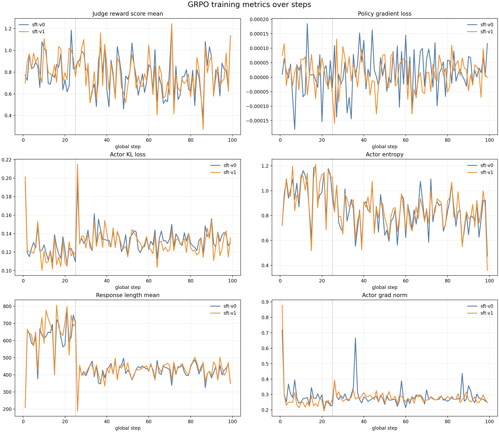<br/>v1：2类数据，去除了summary2answer的短文内容<br/>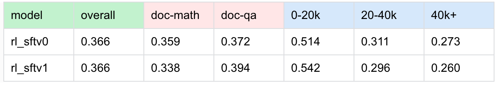|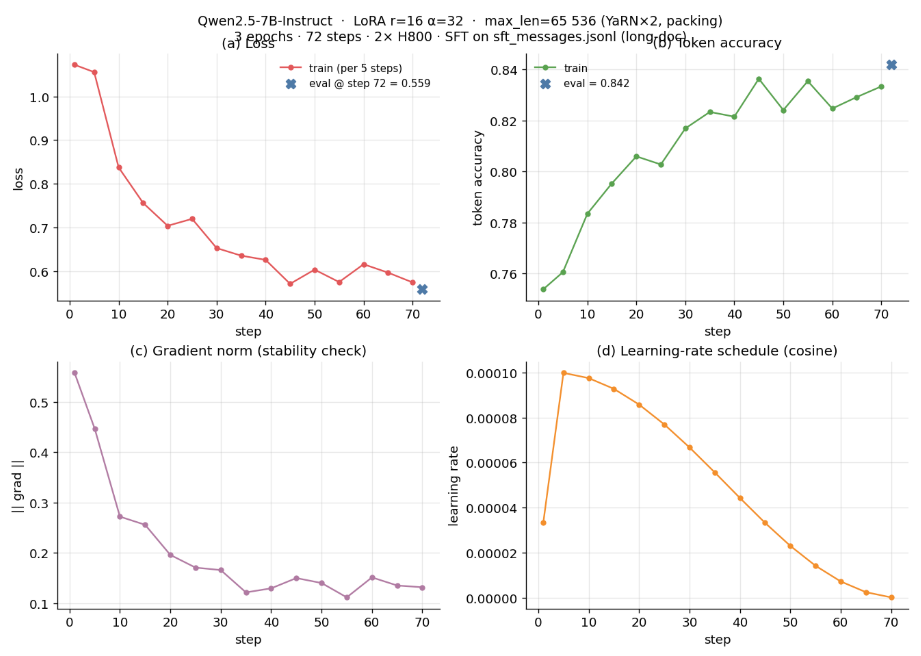<br/>分析一：<br/>QwenLong 1000 条 SFT 学到的是 QwenLong 风格上的行为模板，不是通用长文 benchmark 上稳定可迁移的策略。<br/>{"eval_id": "frames-0001", "task": "frames", "n_input_tokens": 5340, "prediction": "<reason>\n<summary>根据文本，瑞典火柴在2010年被斯堪的纳维亚烟草集团收购，而菲利普莫里斯的收购提议是在2022年5月启动的。</summary>\n推理\n文本中提到，瑞典火柴在2010年被斯堪的纳维亚烟草集团收购，而菲利普莫里斯的收购提议是在2022年5月启动的。因此，这两个事件之间的时间顺序是明确的。\n</reason>\n<answer>Therefore, the answer is Diageo reducing the volume of Red Stripe beer bottles in the US from 12 fl. oz. to 11.2 fl. oz.</answer>"}{"eval_id": "frames-0002", "task": "frames", "n_input_tokens": 7488, "prediction": "<reason>\n<summary>与问题相关的关键信息摘要</summary>\n根据提供的文本，G40是英国邮政编码的一个非地理区域，它位于格拉斯哥。文本中提到了G40区域内的一个铁路站，即Bridgeton railway station，它位于格拉斯哥的Bridgeton地区，服务于Argyle Line。此外，文本还提到Calton和Dalmarnock地区也有铁路站，但没有明确说明这些站是否属于G40区域。因此，我们需要关注Bridgeton railway station，因为它最接近G40区域。\n推理\n文本中提到的Bridgeton railway station位于G40区域的Bridgeton地区，是Argyle Line上的一个站点。Argyle Line连接格拉斯哥市中心和西部郊区。\n</reason>\n<answer>Therefore, the answer is Bridgeton railway station.</answer>"}<br/>基线没能学会先summary再回答的模式，可以看出强行遵循格式<br/>{"eval_id": "frames-0031", "task": "frames", "n_input_tokens": 7300, "prediction": "<reason>The text states that David McCampbell was born in Bessemer, Alabama. The question asks about the largest demographic of full and part time students attending a college in Bessemer in 2020. From the Bessemer history section, it mentions 'Bessemer has its own school system independent of Jefferson County schools, Bessemer City School District.' From the Bessemer City School District section, it states 'The Board of Education also operates the Quitman Mitchell Opportunity Center, which includes an adult learning center, Even Start child care center, and New Horizon Alternative School.' However, the question asks about a college. From the Bessemer City School District section, it mentions 'Lawson State Community College operates the former Bessemer Technical College campus.' From the Lawson State Community College section, it states 'As of fall 2020, LSCC's student body consists of 2,823 students. There are 42 percent full time and 58 percent part time students.' The largest demographic is 58% part-time students.</reason>\n<answer>Therefore, the answer is 58% part-time students.</answer>"}{"eval_id": "frames-0009", "task": "frames", "n_input_tokens": 830, "prediction": "<reason>\nThe text provides information about David Lloyd Jones's first description of an orchid, Pterostylis aestiva, published in 1972. However, the text does not provide any information about the height of the flower on this orchid species. The text only mentions that he described this orchid and published it, but does not give any details about its physical characteristics.</reason>\n<summary>David Lloyd Jones described Pterostylis aestiva in 1972, which was his first description of an orchid. The text does not provide any information about the height of the flower on this species.</summary>\nThe question asks about the height of the flower on the first orchid David L. Jones described and published. However, the text does not provide any information about the physical characteristics of Pterostylis aestiva, including its flower height.</reason>\n<answer>Therefore, the answer is that the text does not provide information about the height of the flower on Pterostylis aestiva.</answer>"}<br/>sft乱回答，格式混淆，也没有遵循先summary再推理的范式<br/><br/> end_to_end 任务（1002条），且是 <reason>让我们首先先总结一下question相关的片段\n<summary>...\n推理</reason>|
|2|sft<br/>（评估侧）|20250715|**新评估文件（qwenlong）**：<br/>`/home/disk6/xiazhaoyuan/workspace/paper/ernie/data/raw/DocQA-RL-1.6K/test/docqa_test_300_seed41_ability_length_balanced.jsonl`<br/>**脚本**：`/home/disk6/xiazhaoyuan/workspace/paper/ernie/eval/qwenlong/build_eval_set_qwenlong.py`<br/>**分布**<br/><br/>|        {"role": "system", "content": 你是长文问答助手。面对长文问题时，先压缩出与问题相关的 summary，再完成推理和回答。},        {"role": "user", "content":            f"请阅读完整长文并回答问题。\n\n[Question]\n{question}\n\n[Document]\n{doc}"}<br/>    custom_prompt = (        f"{q_line}"        f"[参考答案]\n{gt}\n\n"        "[候选答案]\n{response}\n\n"        "请判断候选答案与参考答案是否一致，返回严格 JSON：\n"        '{"score": 0.0, "recall": 1, "total": 1, "reason": "简短理由"}。\n'        "score 为 0.0~1.0 之间的连续值，完全一致为 1.0，完全错误为 0.0。"|评估文件夹：<br/>`/home/disk6/xiazhaoyuan/workspace/paper/ernie/eval/qwenlong`|<br/><br/><br/>SFT 有明确提升，尤其短文档（0-20k）：sft_v0 +15.9pp（0.393→0.552），sft_v1 +10.5pp。doc-math 两个 SFT 都显著优于 baseline。40k+ 长文档 sft_v0 略低于baseline（0.311→0.290），说明超长文档仍有提升空间——这正是 RL 的用武之地。|
|3|RL训练||**训练脚本：**<br/>|时间线<br/>|<br/>**insight**：<br/>1. reward 没有实质性提升，训练基本没学到东西 Judge reward score mean 全程在 0.6~1.0 附近震荡，step 0 到 step 100 没有明显上升趋势。<br/>2. step 25 附近有明显的分布断层，切换策略带来的影响<br/>FULL_MAX_PROMPT_LENGTH=32256 FULL_MAX_RESPONSE_LENGTH=512FULL_MAX_MODEL_LEN=32768<br/>3. sft-v0 与 sft-v1 几乎重合，说明起点没有转化为训练差异 两条曲线在所有指标上都高度同步、几乎看不出区分度，尤其 step 25 之后完全贴合。||
|4|SFT<br/>评估侧|20250718|**评估文件夹：**<br/>`/root/paddlejob/workspace/env_run/xiazhaoyuan/output/benchmark_latest_non_summary_129k_4096`<br/>* 评估文件：250个case<br/>* 涵盖数据集：<br/>    * 捞针：MRCR 【100个case】<br/>    * 推理类：Longbenchv2 【100个case】，AA-LCR【50个case】，frames【50个case】<br/>* 模型：`/root/paddlejob/workspace/env_run/xiazhaoyuan/output/benchmark_vllm_129k_4096/merged_models`|**主要结果**<br/><br/>**格式遵循**<br/>|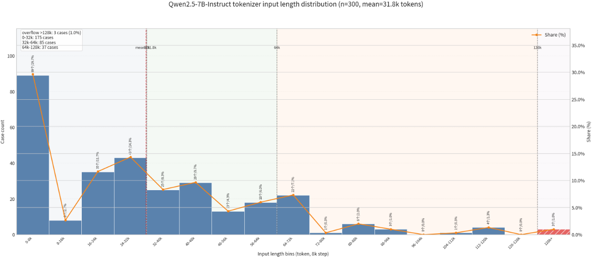<br/>长度分桶||
|5|RL训练||**训练集构造**<br/>Qwenlong-test-1.7k<br/>文件：`/home/disk6/xiazhaoyuan/workspace/paper/ernie/code/scripts/build_qwenlong_rl_annotation_set.py`<br/>return f"""你需要为一个长文 RLVR 样本构造可验证 reward reference。输入给你完整原文、问题和标准答案。请只基于原文生成字段，不能引入原文外信息。我们的方法不是链式 A1->A2->A3，而是树式聚合：Question -> A1, A2, A3, ... -> question-conditioned summary -> reasoning -> answer。因此你要同时给出“定位到哪些证据”和“这些证据如何被压缩成 summary”。重要要求：1. gold_summary 是 answer-free question-conditioned summary：只保留回答该问题所需的信息、约束、数字、实体、关系和中间量。2. gold_summary 不能写最终答案，不能写“Therefore, the answer is ...”，也不能用等价表述直接泄露最终结论；但必须保留足够信息，让另一个模型仅凭 summary+question 可以推出答案。3. 给定的 Gold Answer 只用于帮助你反查证据、校验 key facts 和 teacher_reasoning，不能被复制进 gold_summary。4. evidence_quotes 必须尽量是原文中的短引用，后续会用字符/anchor 匹配做定位奖励。5. key_facts 是压缩后的关键事实，可以不是原文原句，但必须能被 evidence_quotes 支持。6. teacher_reasoning 是从 gold_summary 推到 gold_answer 的简洁推理。7. teacher_answer 必须与给定 gold_answer 语义一致，格式参考：{answer_format}8. 输出必须是严格 JSON，不要 markdown。JSON schema:{{  "gold_summary": "question-conditioned summary without final answer sentence",  "key_facts": [    {{      "id": "F1",      "fact": "compressed necessary fact",      "role": "entity|number|relation|constraint|calculation_input|temporal|comparison|other",      "importance": 1    }}  ],  "evidence_quotes": [    {{      "id": "E1",      "quote": "short exact quote from original document",      "supports": ["F1"],      "role": "locate|ground|calculate|compare|disambiguate|constraint",      "rank": 1    }}  ],  "evidence_tree": {{    "root": "question",    "nodes": [      {{        "node_id": "A1",        "description": "what this evidence group contributes",        "quote_ids": ["E1"],        "fact_ids": ["F1"],        "rank": 1      }}    ],    "aggregation": "A1 + A2 + ... -> summary"  }},  "teacher_reasoning": "reason from summary/key facts to the final answer",  "teacher_answer": "{answer_format}",  "summary2answer_check": {{    "sufficient": true,    "missing_information": [],    "calculation": "if applicable"  }},  "quality_flags": {{    "faithful_to_document": true,    "summary_contains_final_answer_sentence": false,    "summary_directly_leaks_final_answer": false,    "requires_multiple_evidence": true  }}}}[Gold Answer]{row.get("gold_answer")}[Question]{row.get("question")}[Document]{row.get("doc")}"""<br/>**训练**：<br/>配置文件：`/root/paddlejob/workspace/env_run/xiazhaoyuan/train/rl_qwen2.5-7b/rl/qwenlong_remaining_claude_v0_64k_rl.yaml`<br/>日志：`/root/paddlejob/workspace/env_run/xiazhaoyuan/output/rl_qwenlong_remaining_claude_v0_64k`<br/>启动脚本：<br/>`/root/paddlejob/workspace/env_run/xiazhaoyuan/output/rl_qwenlong_remaining_claude_v0_64k/run_full_rl_then_rotate.sh`|**输出文件：**<br/>`/home/disk6/xiazhaoyuan/workspace/paper/ernie/output/qwenlong_rl_test_remaining_claude_v0`<br/>**日志**：<br/>`/root/paddlejob/workspace/env_run/xiazhaoyuan/output/rl_qwenlong_remaining_claude_v0_64k/logs/sftv0_train.log`<br/>**预测脚本**：<br/>  QwenLong 300  /root/miniconda3/envs/verl/bin/python /root/paddlejob/workspace/env_run/  xiazhaoyuan/data/eval/vllm_batch_predict.py \    --eval-set /root/paddlejob/workspace/env_run/xiazhaoyuan/output/    rl_qwenlong_remaining_claude_v0_64k/eval/docqa_test_300_qwenlong.jsonl \    --output /root/paddlejob/workspace/env_run/xiazhaoyuan/output/    rl_qwenlong_remaining_claude_v0_64k/eval_runs/20260719_2325/qwenlong/    pred_sft_v0.jsonl \    --served-model sft_v0 \    --base-url http://127.0.0.1:8001/v1 \    --tokenizer /root/paddlejob/workspace/env_run/xiazhaoyuan/output/    rl_qwenlong_remaining_claude_v0_64k/merged_models/sft_v0 \    --max-new 4096 \    --input-max-tokens 65536 \    --model-max-len 133120 \    --concurrency 4 \    --timeout 3600  /root/miniconda3/envs/verl/bin/python /root/paddlejob/workspace/env_run/  xiazhaoyuan/data/eval/vllm_batch_predict.py \    --eval-set /root/paddlejob/workspace/env_run/xiazhaoyuan/output/    rl_qwenlong_remaining_claude_v0_64k/eval/docqa_test_300_qwenlong.jsonl \    --output /root/paddlejob/workspace/env_run/xiazhaoyuan/output/    rl_qwenlong_remaining_claude_v0_64k/eval_runs/20260719_2325/qwenlong/    pred_sft_v1.jsonl \    --served-model sft_v1 \    --base-url http://127.0.0.1:8002/v1 \    --tokenizer /root/paddlejob/workspace/env_run/xiazhaoyuan/output/    rl_qwenlong_remaining_claude_v0_64k/merged_models/sft_v1 \    --max-new 4096 \    --input-max-tokens 65536 \    --model-max-len 133120 \    --concurrency 4 \    --timeout 3600  Benchmark 250  /root/miniconda3/envs/verl/bin/python /root/paddlejob/workspace/env_run/  xiazhaoyuan/data/eval/vllm_batch_predict.py \    --eval-set /root/paddlejob/workspace/env_run/xiazhaoyuan/data/eval/    non_summary_eval_250.jsonl \    --output /root/paddlejob/workspace/env_run/xiazhaoyuan/output/    rl_qwenlong_remaining_claude_v0_64k/eval_runs/20260719_2325/benchmark/    pred_sft_v0.jsonl \    --served-model sft_v0 \    --base-url http://127.0.0.1:8001/v1 \    --tokenizer /root/paddlejob/workspace/env_run/xiazhaoyuan/output/    rl_qwenlong_remaining_claude_v0_64k/merged_models/sft_v0 \    --max-new 4096 \    --input-max-tokens 129024 \    --model-max-len 133120 \    --concurrency 4 \    --timeout 3600  /root/miniconda3/envs/verl/bin/python /root/paddlejob/workspace/env_run/  xiazhaoyuan/data/eval/vllm_batch_predict.py \    --eval-set /root/paddlejob/workspace/env_run/xiazhaoyuan/data/eval/    non_summary_eval_250.jsonl \    --output /root/paddlejob/workspace/env_run/xiazhaoyuan/output/    rl_qwenlong_remaining_claude_v0_64k/eval_runs/20260719_2325/benchmark/    pred_sft_v1.jsonl \    --served-model sft_v1 \    --base-url http://127.0.0.1:8002/v1 \    --tokenizer /root/paddlejob/workspace/env_run/xiazhaoyuan/output/    rl_qwenlong_remaining_claude_v0_64k/merged_models/sft_v1 \    --max-new 4096 \    --input-max-tokens 129024 \    --model-max-len 133120 \    --concurrency 4 \    --timeout 3600  对应完整路径：    rl_qwenlong_remaining_claude_v0_64k/eval/docqa_test_300_qwenlong.jsonl  - benchmark 输入集：/root/paddlejob/workspace/env_run/xiazhaoyuan/data/    eval/non_summary_eval_250.jsonl  - sft_v0 合并模型：/root/paddlejob/workspace/env_run/xiazhaoyuan/output/    rl_qwenlong_remaining_claude_v0_64k/merged_models/sft_v0  - sft_v1 合并模型：/root/paddlejob/workspace/env_run/xiazhaoyuan/output/    rl_qwenlong_remaining_claude_v0_64k/merged_models/sft_v1  - 输出目录：/root/paddlejob/workspace/env_run/xiazhaoyuan/output/rl_qwenlong_remaining_claude_v0_64k/eval_runs/20260719_2325/、<br/>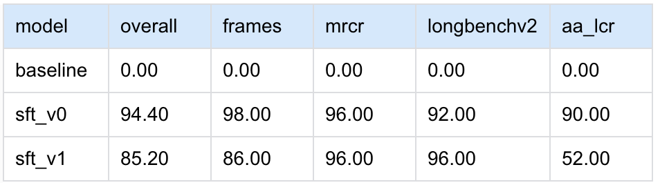|输出目录：<br/>`/root/paddlejob/workspace/env_run/xiazhaoyuan/output/rl_qwenlong_remaining_claude_v0_64k/eval_runs/20260719_2325/`<br/>RL模型：<br/>`/root/paddlejob/workspace/env_run/xiazhaoyuan/output/rl_qwenlong_remaining_claude_v0_64k/merged_models/sft_v0`<br/>`/root/paddlejob/workspace/env_run/xiazhaoyuan/output/rl_qwenlong_remaining_claude_v0_64k/merged_models/sft_v1`<br/>||


## 0720汇总
### **实验结果一览表：**
**1. QwenLong 长度三分档**

|model|easy 0-20k|medium 20k-40k|hard 40k+|Avg|source|
|-|-|-|-|-|-|
|baseline|39.3|31.2|31.1|33.9|`/home/disk6/xiazhaoyuan/workspace/paper/ernie/eval/qwenlong`|
|sft-v0|**55.2**|33.0|29.0|39.1||
|sft-v1|49.8|32.9|32.7|38.5||
|rl-v0|48.6|**42.8**|32.4|**41.3**|`.../rl_qwenlong_remaining_claude_v0_64k/eval_runs/20260719_2325/qwenlong/judge_sft_v0.jsonl`|
|rl-v1|45.6|38.4|**32.8**|38.9|`.../rl_qwenlong_remaining_claude_v0_64k/eval_runs/20260719_2325/qwenlong/judge_sft_v1.jsonl`|

**2. QwenLong 任务二分档**

|model|doc-qa|doc-math|Avg|source|
|-|-|-|-|-|
|baseline|41.3|26.5|33.9|`/home/disk6/xiazhaoyuan/workspace/paper/ernie/eval/qwenlong`|
|sft-v0|41.3|36.9|39.1||
|sft-v1|43.4|33.5|38.5||
|rl-v0|**49.6**|32.9|**41.3**|`.../rl_qwenlong_remaining_claude_v0_64k/eval_runs/20260719_2325/qwenlong/judge_sft_v0.jsonl`|
|rl-v1|48.1|29.7|38.9|`.../rl_qwenlong_remaining_claude_v0_64k/eval_runs/20260719_2325/qwenlong/judge_sft_v1.jsonl`|

**3. Benchmark 长度三分档**

|model|0-32k|32k-64k|64k+|Avg|source|
|-|-|-|-|-|-|
|baseline|13.5|30.0|15.3|19.6|`.../benchmark_latest_non_summary_129k_4096/judge_baseline.jsonl`|
|sft-v0|19.9|30.0|16.9|22.3|`.../benchmark_latest_non_summary_129k_4096/judge_sft_v0.jsonl`|
|sft-v1|19.3|20.0|16.9|18.7|`.../benchmark_latest_non_summary_129k_4096/judge_sft_v1.jsonl`|
|rl-v0|17.0|**35.0**|**18.6**|**23.5**|`.../rl_qwenlong_remaining_claude_v0_64k/eval_runs/20260719_2325/benchmark/judge_sft_v0.jsonl`|
|rl-v1|**20.5**|35.0|13.6|23.0|`.../rl_qwenlong_remaining_claude_v0_64k/eval_runs/20260719_2325/benchmark/judge_sft_v1.jsonl`|

**4. Benchmark 任务类型分类（主表） 250个case 噪声大 6point超出了噪声，****sft有效果，rl震荡无效果**

评估，RL，batch=16

|model|aa_lcr|frames|longbenchv2|mrcr|Avg|source|
|-|-|-|-|-|-|-|
|baseline|14.0|32.0|24.0|3.0|18.3|`.../benchmark_latest_non_summary_129k_4096/judge_baseline.jsonl`|
|sft-v0|16.0|48.0|30.0|3.0|24.3|`.../benchmark_latest_non_summary_129k_4096/judge_sft_v0.jsonl`|
|sft-v1|**16.0**|**50.0**|24.0|2.0|23|`.../benchmark_latest_non_summary_129k_4096/judge_sft_v1.jsonl`|
|rl-v0|16.0|46.0|32.0|0.0|23.5|`.../rl_qwenlong_remaining_claude_v0_64k/eval_runs/20260719_2325/benchmark/judge_sft_v0.jsonl`|
|rl-v1|14.0|48.0|**32.0**|**3.0**|**24.3**|`/root/paddlejob/workspace/env_run/xiazhaoyuan/output/rl_qwenlong_remaining_claude_v0_64k/eval_runs/20260719_2325/benchmark/judge_sft_v1.jsonl`|

**5. 格式遵循：<reason><summary></summary></reason>  <answer></answer> **

|model|**qwenlong**|benchmark|details|source|
|-|-|-|-|-|
|baseline|**0.0**|0.0|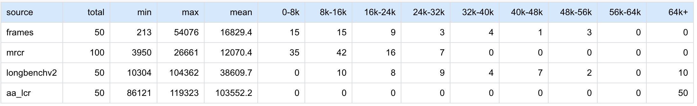|`.../benchmark_latest_non_summary_129k_4096/pred_baseline.jsonl`|
|sft-v0|**83.0**|94.4||`.../benchmark_latest_non_summary_129k_4096/pred_sft_v0.jsonl`|
|sft-v1|**86.7**|85.2||`.../benchmark_latest_non_summary_129k_4096/pred_sft_v1.jsonl`|
|rl-v0|**78.3**|**35.6**||qwenlong: `.../qwenlong/pred_sft_v0.jsonl`；benchmark: `.../benchmark/pred_sft_v0.jsonl`|
|rl-v1|**89.3**|**46.8**||qwenlong: `.../qwenlong/pred_sft_v1.jsonl`；benchmark: `.../benchmark/pred_sft_v1.jsonl`|

**P0：看一看，用的同一套代码，基于规则来统计的。case study**

### **0720下午小会**
1. 要审核，一周，特事特办，要有一个完整的版本

[论文投稿规范（初稿）](https://ku.baidu-int.com/knowledge/HFVrC7hq1Q/tjIp17bwPd/jClcjOn68Y/hoFK-WK2ONQRlA?t=mention&mt=doc&dt=doc)

2. overleaf链接，摘要和内容
3. partner的信息，责任划分


### **接下来的计划**
GRPO和SFT补一个对照，测一测短文任务有没有下降，长文和短文冲突的，如果我们能证明没有影响，价值很高。

**面临问题：**

1. **效果提升幅度小**：Qwenlong相比于基线，只提升了7个点左右（33.9 -> 39.1 ->41.3）;而benchmark方向也只提升了5个点左右SFT的效果（18.3 -> 24.3 ->23.5），这里RL之后甚至变差，我分析之后发现在是格式遵循被打破，从原本的94.4%到35.6%。

**方法**：怀疑是SFT阶段的数据分布未能做好，需要重新调配SFT的数据。

初步设想：Qwenlong'数据做SFT和RL；v1版本，我想加入一些多元 的数据，能力上去覆盖捞针，摘要，推理三大主流，在长度分布上去覆盖0-32k，32k-64k，64k-128k均匀分布，

|格式设计|||
|-|-|-|
|        {"role": "system", "content": 你是长文问答助手。面对长文问题时，先压缩出与问题相关的 summary，再完成推理和回答。},        {"role": "user", "content":            f"请阅读完整长文并回答问题。\n\n[Question]\n{question}\n\n[Document]\n{doc}"}请阅读长文并回答问题。回答  格式要求：    <reason>    <summary>与问题相关的关键信息摘要</summary>    推理    </reason>    <answer>Therefore, the answer is ...</answer>|||

2. ** ****P0**** Reward设计策略**：目前的策略是用**LLM judger来给Rollout一次性打四个分**，输入各类关键字段如GT，Question，Predicted，keyfact，evidence_quota等去对summary来打分。存在的问题是reward震荡厉害，没有形成一个稳定上涨的趋势，这样的话其实不利于RL训练。

summary的范式，reward聚焦在summary上的，输出环节有<summary></summary>，这个中间态是我们设计reward核心，也是我们和其他工作的区别。

具体来讲，？？？？,文章的结构，树结构，长文的类型，UUID+SFT结合起来，这样的RL的rollout环节才能有UUID。

RL在哪个环节加UUID？因为RL在模型已经会的情况下加强。<reason><evidence>UUID.**list or tree**</evidence><summary>, block_size=1024,对文档切分，加索引（UUID），此处可以设计一个奖励，服务RL，SFT的效果会降低？7B模型，本身能力上也有欠缺。**定位UUID**+**总结Summary**+**推理（Claude的推理）**

**V1**：对比工作是一个链式奖励【**召回率**】，**1->2->3->4,doc出现的先后顺序，我们的则是**~~**一个树形结构奖励**~~**，3->4->1->2,重要性排序.**

树形编辑距离。编辑距离是力扣题，两个字符串通过增删改经过最小x次相同，x就是它们的编辑距离。文章结构，**两个树多少次修改之后一样。**

**question-》主要证据node-》次次node**

**V2**：**多叉树**，同一层是重要性排序，**并列**，不同层是因果，**递进，RootNode==quesiton，Node=Block，可以用question和block中间的语义相似度？？Block和Block之间**

|reward|打分目标|主要判定方式|取值范围|备注|
|-|-|-|-|-|
|`answer_score`|最终答案是否正确|judge 评估 `candidate_answer` 与 `ground_truth` 的语义一致性|0.0 ~ 1.0|1. 公式：score = answer_score + 0.3 * evidence_score + 0.3 * compression_score + 0.1 * format_score<br/>2. prompt模板<br/>JUDGE_SYSTEM_PROMPT = (    "You are a strict but fair evaluator for long-document QA RL. "    "Return only valid JSON with keys answer_score, evidence_score, compression_score, format_score, rationale.")JUDGE_USER_TEMPLATE = """\Question:{question}Reference answer:{ground_truth}Reference evidence quotes:{evidence_quotes}Reference key facts:{key_facts}Gold summary:{gold_summary}Candidate summary:{candidate_summary}Candidate final answer:{candidate_answer}Candidate full output:{candidate_full_output}Score each dimension from 0 to 1.0.answer_score: semantic correctness of the final answer.evidence_score: whether the summary captures supporting evidence.compression_score: whether the summary keeps key facts without unnecessary bulk.format_score: whether reasoning, summary and final answer are clearly separated.Return JSON only."""<br/>|
|`evidence原文_score`<br/>****`UUID去扫`****|`summary` 是否保住了支撑答案的关键信息|judge 评估 `candidate_summary` 是否覆盖 `evidence_quotes` / `key_facts`|0.0 ~ 1.0||
|`compression_score`<br/>**summary能否覆盖key_facts**|`summary` 是否有压缩效果<br/>**长度？200词 vs 500词 vs 1000词，qwen-7b来讲的话，用时间换效果，【推理时间】**|judge 评估 summary 是否保留要点、避免冗余铺陈|0.0 ~ 1.0||
|`format_score`|格式是否清晰分离|judge 评估输出中是否能明确区分 `<reason>`、`<summary>`、`<answer>`|0.0 ~ 1.0||

3. **多阶段训练**：目前主流训练长文的方法是课程学习，逐步去提高input的长度 32k->64k->128k，目前的v0只有一个混合的RL训练，而且数据单调，只有Qwenlong一个数据来源，目前的初步想法是去在训练数据下功夫，研究数据配比，回答格式，长度变化等等，希望**可以得到一个我们的数据合成pipeline**，这也是论文的重要组成部分。

**P0**：**Repeat重复**，证据-》summary->推理回答，**context的重复，可用性很高**，TASK，math数值计算，一个QA问答，一个MCQ选择题

|数据|个数|长度分布|类型分布|
|-|-|-|-|
|SFT|2k/3k|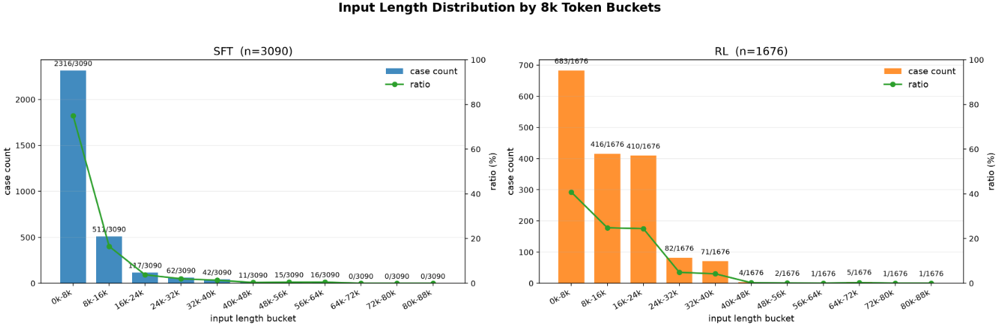||
|RL|1.6k|||


### v1阶段 7天
**数据构造**

目标数据：QwenLong-L1 的 DocQA-RL-1.6K 数据集：[https://huggingface.co/datasets/Tongyi-Zhiwen/DocQA-RL-1.6K](https://huggingface.co/datasets/Tongyi-Zhiwen/DocQA-RL-1.6K)；训练集：1.6k；测试集：2.0k

|索引|阶段|代码|结果|备注|
|-|-|-|-|-|
|1|收集|`/root/paddlejob/workspace/env_run/xiazhaoyuan/scripts/0_build_v1_docqa_remaining.py`|训练集（**3297case**）：`/root/paddlejob/workspace/env_run/xiazhaoyuan/data/v1/0_docqa_remaining_3297_doc_question.jsonl`<br/>评估集（**300case**）：`/root/paddlejob/workspace/env_run/xiazhaoyuan/v0/xiazhaoyuan_archive/data/eval/docqa_test_300_seed41_ability_length_balanced.jsonl`||
|2|**UUID**<br/>RL的过程奖励|`/root/paddlejob/workspace/env_run/xiazhaoyuan/scripts/1_build_docqa_uuid_blocks.py`<br/>关键超参：**block_size=1024token overlap=0，1k  插入正文【BlockUUID：八位的数字小写字母】**;UUID=8位数字小写字母，~~自然段落~~<br/>input<br/>doc context<br/>返回<br/>uuid list 【uuid，impotance】<br/>summary<br/>answer|文件：`/root/paddlejob/workspace/env_run/xiazhaoyuan/data/v1/1_docqa_remaining_3297_uuid_blocks_1024_0.jsonl`<br/>||
|3|**Repeat**<br/>|脚本：`/root/paddlejob/workspace/env_run/xiazhaoyuan/scripts/2_build_docqa_repeat_contextdoc.py`<br/>* **一个case只能使用一次**，**最多重复3次**<br/>3.3k样本，希望数据集里面虽然我们是重复，但我们也不希望有大量同质化的东西进来<br/>32k的case，~~重复1遍，重复4遍，~~希望能够保证多样性<br/>repeat ：context 排除question<br/>* 分布为：<br/>输入: 3297  输出预计: 3908  新增 repeat 样本: 611  final:  0-32k      3078  32k-64k    650  64k-128k   180  repeat 分布:  repeat=1   3297 repeat=原context和原question 从1开始计数  repeat=2    575 重复一次  repeat=3     36 重复两次  base 复用:  unique_base_used 611  max_base_reuse   1  unfilled_quota   {}  策略参数也已固定为你指定的：  target_32k_64k = 650  target_64k_128k = 180  max_repeat_32k_64k = 3  max_repeat_64k_128k = 3  base_reuse_cap = 1  same_ability = true|文件：`/root/paddlejob/workspace/env_run/xiazhaoyuan/data/v1/2_docqa_repeat_doc_with_block_uuid_with_repeat_target650_180_maxrep3.jsonl`||
|4|Claude采样<br/>获得我们需要的字段|脚本：`/root/paddlejob/workspace/env_run/xiazhaoyuan/scripts/3_annotate_claude_reward_refs.py`<br/>你需要为一个长文 RLVR 样本构造 reward reference。输入包含带 block UUID 标记的长文、问题和标准答案。请只基于文档内容生成标注，不能引入文档外信息。文档中每个证据块前都有如下格式的 8 位 block id：[[BLOCK_UUID:qp7ytb4w]]这次输出要求和以前不同：1. summary 是 question-conditioned summary，只保留回答问题所需的信息、数字、实体、约束、比较关系和中间量。2. summary 不能写最终答案句，不能写 “Therefore, the answer is ...”，不能直接泄露最终答案。3. reasoning 是“总结后推理”：假设只能看到你写出的 summary 和 question，说明如何从 summary 中的关键信息推出 Gold Answer。不要重新引用全文，不要把全文证据罗列成 reasoning。4. block_importance_rank 不要返回原文 quote，只返回 block uuid 和 importance 的 pairwise list，并按 importance 从高到低排序。importance 是 0 到 1 的浮点数，表示该 block 对构造 summary/reasoning 的重要性。128k的文档，那么这个字段就会有128个元素的列表5. block_importance_rank 只允许使用文档中真实出现过的 8 位 block uuid。6. 给定 Gold Answer 只用于反查证据和校验 summary/reasoning，不要把 Gold Answer 直接塞进 summary。7. teacher_answer 必须与 Gold Answer 语义一致，格式参考：{fmt}8. 输出必须是严格 JSON，不要 markdown，不要额外解释。JSON schema:{{  "summary": "answer-free question-conditioned summary",  "reasoning": "post-summary reasoning: derive the final answer using only the summary and question",  "block_importance_rank": [    ["8 lowercase letters/digits block id", 0.95]  ],  "teacher_answer": "{fmt}",  "quality_flags": {{    "faithful_to_document": true,    "summary_contains_final_answer_sentence": false,    "summary_directly_leaks_final_answer": false,    "evidence_uuid_from_document": true  }}}}|文件：`/root/paddlejob/workspace/env_run/xiazhaoyuan/data/v1/3_claude_reward_refs_target650_180_maxrep3_clean_3835.jsonl`****<br/>数据量：3835个case|分布：<br/>* doc-mc: 688<br/>* doc-math: 679<br/>* doc-qa: 2468<br/>* 0-32k: 3019<br/>* 32k-64k: 641<br/>* 64k-128k: 175|
|5|数据准备|脚本：<br/>`/root/paddlejob/workspace/env_run/xiazhaoyuan/scripts/split_formal_data_by_stage.py`<br/>**分阶段训练方案**：<br/>* **SFT:** 约 60%~70% 的训练池，重点吃 0-32k，再混一部分 32k-64k，64k-128k 只保留少量，防止长样本把 SFT 拖慢 <br/>    * 1800个case<br/>    * 目的：学格式--证据定位-summary-推理<br/>    * 0-32k的样本为主<br/>* RL-1 0-32k: 主要用短样本，作为最稳的 policy 优化阶段 <br/>* RL-2 32k-64k: 主要用中样本，提升中长上下文稳定性<br/>* RL-3 64k-128k: 主要用长样本，重点给 14B，7B 只做 smoke 或小规模验证<br/>* 串行||文件：`/root/paddlejob/workspace/env_run/xiazhaoyuan/data/v1/4_sft.jsonl`<br/>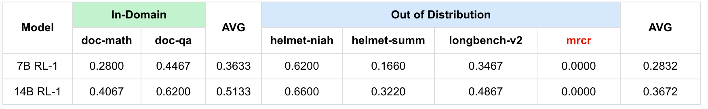||


**评估构建**：

|索引|领域|文件|长度分布|
|-|-|-|-|
|1|**In-Domain**|* 数据量：300个case<br/>* 来源：Qwenlong<br/>* 地址：`/root/paddlejob/workspace/env_run/xiazhaoyuan/v0/xiazhaoyuan_archive/data/eval/docqa_test_300_seed41_ability_length_balanced.jsonl`|* 一共300个case，按照长度来划分<br/>* **0-32k：175cases**<br/>* **32k-64k：85cases**<br/>* **64k-128k：37cases**<br/>|
|2|**OOD**|* 数据量：300<br/>* 去掉了frames等任务<br/>* 能力维度：<br/>    * 精准检索 100 -- **helmet-niah | mrcr-32k token 0-32k**<br/>    * 摘要任务 50 -- **helmet-summ** summ<br/>    * 推理类 150--longbench-v2_**32k** | longbench-v2_**64k** | longbench-v2_**128k**  每种是50个case<br/>* 地址：`/root/paddlejob/workspace/env_run/xiazhaoyuan/data/raw/ernie/benchmark_eval_300_seed41.jsonl`|**Query一览表**<br/>* **benchmark**: `helmet-niah`<br/>    * **question**: What is the special magic uuid for `bec9c099-fe24-430d-bd3f-8e01671a5d02` mentioned in the provided text?<br/>    * **GT**: 796167f2-d2aa-4e60-ab6b-0ce7e60c6b69<br/>* **benchmark**: `mrcr`** 捞针，精准检索 输出回答**<br/>    * **question**: Prepend `HrpZ5QcCLH` to the 2nd (1 indexed) poem about visits. Do not include any other text in your response.<br/>    * **GT**: HrpZ5QcCLHIn the realm of visits, footsteps trace, ...<br/>* **benchmark**: `helmet-summ`<br/>    * **question**:**Now please summarize the case**.<br/>    * **GT**: On June 12, 1968 the United States Department of Justice (DOJ) filed a lawsuit under Title VII...<br/>* **benchmark**: `longbench-v2`** QA 官方定位：推理类**<br/>    * **question**: What is the correct answer to this question: In this cloud storage system, the scheduler is a crucial component responsible for allocating file blocks...<br/>    * **GT**: `D`|


**训练&评估**

|索引|阶段|配置|内容|备注|
|-|-|-|-|-|
|1|方案构建|**关键输入**<br/>* 原始正式 SFT 数据：`/root/paddlejob/workspace/env_run/xiazhaoyuan/data/v1/4_sft.jsonl`<br/>* 保留评估集：`/root/paddlejob/workspace/env_run/xiazhaoyuan/data/v1/8_eval_holdout.jsonl`<br/>* 阶段切分结果：<br/>    * `4_sft.jsonl`<br/>    * `5_rl_1.jsonl`<br/>    * `6_rl_2.jsonl`<br/>    * `7_rl_3.jsonl`<br/>**关键代码**<br/>* `train/sft/convert_annotations_to_swift_v1.py`<br/>**转换产物**<br/>* `train/sft/data/swift_format_stage1_20260723T080318Z/train.jsonl`<br/>* `train/sft/data/swift_format_stage1_20260723T080318Z/val.jsonl`|**分阶段训练方案**：<br/>* SFT: 约 60%~70% 的训练池，重点吃 0-32k，再混一部分 32k-64k，64k-128k 只保留少量，防止长样本把 SFT 拖慢<br/>* RL-1 0-32k: 主要用短样本，作为最稳的 policy 优化阶段<br/>* RL-2 32k-64k: 主要用中样本，提升中长上下文稳定性<br/>* RL-3 64k-128k: 主要用长样本，重点给 14B，7B 只做 smoke 或小规模验证<br/>||
|2|SFT训练|**关键配置**<br/>* 7B 配置：`train/sft/configs/7b_sft_stage1_gbs16_20260723T112017Z.yaml`<br/>* 14B 配置：`train/sft/configs/14b_sft_stage1_gbs16_20260723T112017Z.yaml`<br/>**关键启动代码**<br/>* `train/sft/scripts/launch_two_node_sft_from_yaml.sh`<br/>* `train/sft/scripts/run_node_sft_from_yaml.py`<br/>**共同训练参数**<br/>batch_size: 1gradient_accumulation_steps: 16lora_rank: 64lora_alpha: 128lora_dropout: 0.05learning_rate: 1e-4num_train_epochs: 2max_length: 131072 输入token最大长度max_new_tokens: 4096 输出token最大长度rope_scaling: yarnattn_impl: flash_attnsequence_parallel_size: 8bf16: true<br/>**模型路径**<br/>* 7B base model: `/root/paddlejob/workspace/env_run/xiazhaoyuan/model/Qwen2.5-7B-Instruct`<br/>* 14B base model: `/root/paddlejob/workspace/env_run/xiazhaoyuan/model/Qwen2.5-14B-Instruct`<br/>**训练输出**<br/>* 7B 输出目录: `/root/paddlejob/workspace/env_run/xiazhaoyuan/train/sft/output/7b_sft_stage1_gbs16_20260723T112017Z`<br/>* 14B 输出目录: `/root/paddlejob/workspace/env_run/xiazhaoyuan/train/sft/output/14b_sft_stage1_gbs16_20260723T112017Z`|||
|3|SFT评估|**评估集**<br/>* ID: `/root/paddlejob/workspace/env_run/xiazhaoyuan/eval/docqa_test_300_seed41_ability_length_balanced.jsonl`<br/>* OOD: `/root/paddlejob/workspace/env_run/xiazhaoyuan/eval/benchmark_eval_300_seed41.jsonl`<br/>**关键代码**<br/>* `eval/scripts/run_eval_pipeline.sh`<br/>* `eval/scripts/merge_lora_to_full_model.py`<br/>* `eval/scripts/vllm_batch_predict.py`<br/>* `eval/scripts/judge_predictions.py`<br/>* `eval/scripts/summarize_eval.py`<br/>* `eval/scripts/test_judge_connection.py`<br/>**Judge 配置**<br/>* `docs/environment_skill.json`<br/>* judge model: `qwen3.7-max`<br/>**评估输出**<br/>* 7B baseline: `/root/paddlejob/workspace/env_run/xiazhaoyuan/eval/output/7b_base_eval_20260724T031703Z`<br/>* 14B baseline: `/root/paddlejob/workspace/env_run/xiazhaoyuan/eval/output/14b_base_eval_20260724T031704Z`<br/>* 7B SFT: `/root/paddlejob/workspace/env_run/xiazhaoyuan/eval/output/7b_sft_stage1_gbs16_eval_20260723T131808Z`<br/>* 14B SFT: `/root/paddlejob/workspace/env_run/xiazhaoyuan/eval/output/14b_sft_stage1_gbs16_eval_20260723T131809Z`|Task任务划分<br/><br/>Length长度划分<br/>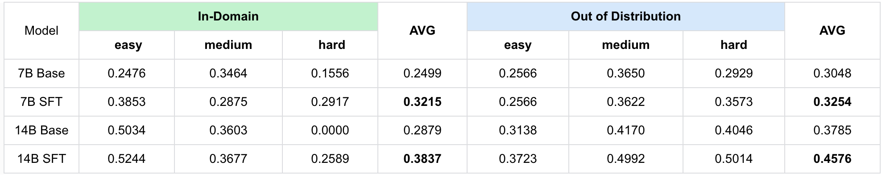||
|4|RL-1训练<br/>主训32k<br/>数据量 1500个case|**Reward 设计**<br/>final_answer_score: qwen3.7-max judge，输出 0/1。summary_score: qwen3.7-max judge，输出 0-1 连续分。evidence_score: 规则打分，解析 <evidence>...</evidence> 中 UUID，并结合 block_importance_rank 计算 recall、precision、brevity。format_score: 规则打分，对 8 个标签序列做编辑距离：<reason><evidence></evidence><summary></summary></reason><answer></answer>。总分权重：final_answer=1.0，summary=0.4，evidence=0.3，format=0.2。<br/>**配置文件**<br/>7B 配置：train/rl/configs/7b_rl1_grpo_gbs16_rollout8_20260724T143646Z.yaml14B 最终 resume 配置：train/rl/configs/14b_rl1_grpo_gbs16_rollout8_20260724T143646Z_resume_oomfix3_20260724T191830Z.yaml模型路径7B RL base：/root/paddlejob/workspace/env_run/xiazhaoyuan/eval/output/7b_sft_stage1_gbs16_eval_20260723T131808Z/merged_model14B RL base：/root/paddlejob/workspace/env_run/xiazhaoyuan/eval/output/14b_sft_stage1_gbs16_eval_20260723T131809Z/merged_model训练输出7B 输出目录：/root/paddlejob/workspace/env_run/xiazhaoyuan/train/rl/output/7b_rl1_grpo_gbs16_rollout8_20260724T143646Z14B 输出目录：/root/paddlejob/workspace/env_run/xiazhaoyuan/train/rl/output/14b_rl1_grpo_gbs16_rollout8_20260724T143646Z7B 最终 checkpoint：global_step_71/actor/lora_adapter14B 最终 checkpoint：global_step_71/actor/lora_adapter<br/>* 7B 配置：`train/rl/configs/7b_rl1_grpo_gbs16_rollout8_20260724T143646Z.yaml`<br/>* 14B 最终 resume 配置：`train/rl/configs/14b_rl1_grpo_gbs16_rollout8_20260724T143646Z_resume_oomfix3_20260724T191830Z.yaml`<br/>**训练参数**<br/>框架：verl + ms-swift 产出的 SFT merged model算法：GRPOtrain_batch_size: 16ppo_mini_batch_size: 16rollout.n: 8rollout.prompt_length: 131072rollout.response_length: 4096rollout.max_model_len: 135168learning_rate: 1e-6  SFT两个数量级total_training_steps: 71test_freq: 10save_freq: 20lora_rank: 64lora_alpha: 128<br/>|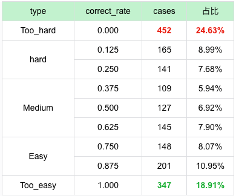<br/>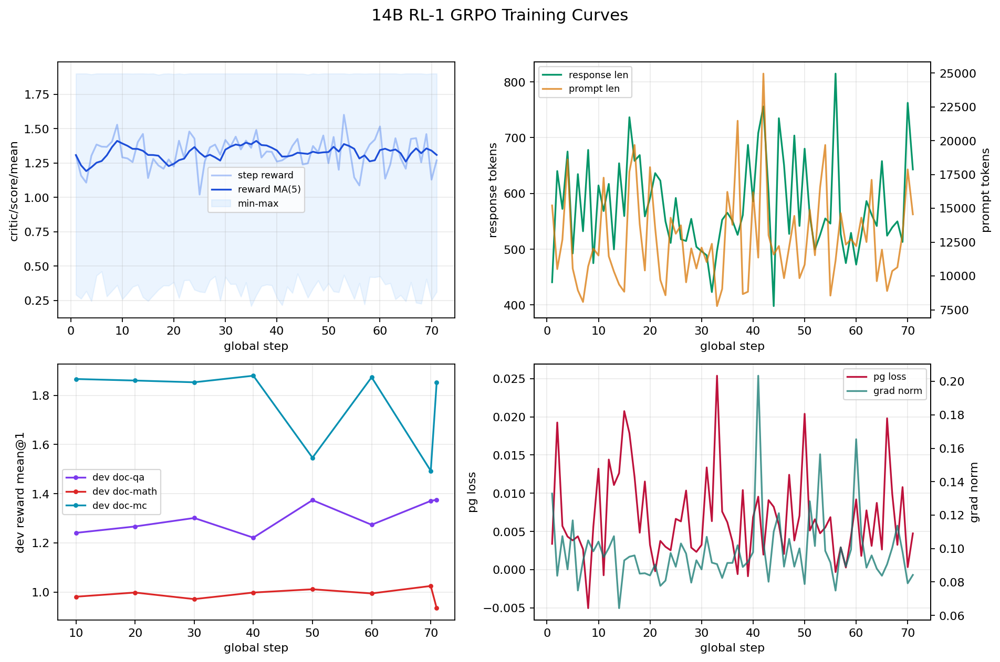||
|5|RL-1 评估|**评估集**<br/>* ID：`/root/paddlejob/workspace/env_run/xiazhaoyuan/eval/docqa_test_300_seed41_ability_length_balanced.jsonl`<br/>* OOD：`/root/paddlejob/workspace/env_run/xiazhaoyuan/eval/benchmark_eval_300_seed41.jsonl`<br/>**Judge 配置**<br/>* 配置来源：`/root/paddlejob/workspace/env_run/xiazhaoyuan/docs/environment_skill.json`<br/>* judge model：`qwen3.7-max`<br/>**评估输出**<br/>* 7B RL-1：`/root/paddlejob/workspace/env_run/xiazhaoyuan/eval/output/7b_rl1_grpo_gbs16_rollout8_eval_20260724T143646Z`<br/>* 14B RL-1：`/root/paddlejob/workspace/env_run/xiazhaoyuan/eval/output/14b_rl1_grpo_gbs16_rollout8_eval_20260724T143646Z`|Task任务划分<br/><br/>Length长度划分<br/>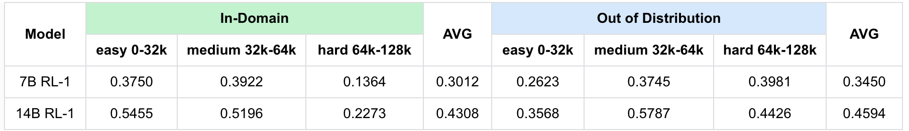||
|6|RL-2 训练|**关键脚本：**<br/>* `train/rl/prepare_rl_data_v1.py`<br/>* `train/rl/reward_fn_v2.py`<br/>* `train/rl/verl_patches/threaded_judge_v1.py`<br/>* `train/rl/scripts/run_node_rl_from_yaml.py`<br/>* `train/rl/scripts/print_rl_status.py`<br/>**Reward 设计**<br/>final_answer_score: qwen3.7-max judge，输出 0/1 二值化。summary_score: qwen3.7-max judge，输出 0-1 连续分。和claude对比分类：5档 1-0，间隔是0.2，每一档后面会有一个语义上的解释，1档认为是非常好，关键的参数都有，逻辑清晰XXXXXclaude-summary：GT，因为输入有标准答案，加上claude能力强，evidence来支撑的话：怎么去设置，evidence是block id，一个block是1k的token，我们用llm judger，一个block里面是部分和question相关的，输入是关键block【已有，但有噪声，用claude已经获取】，question，qwen_predicted_summary,输出一个0-1的得分？？？面对challengeV2：多叉树，同一层是重要性排序，并列，不同层是因果，递进，RootNode==quesiton，Node=Block，可以用question和block中间的语义相似度？？Block和Block之间evidence_score: 规则打分，使用 block_importance_rank 权重，按 F1/F-score 思路计算 evidence 选择的加权 precision、recall 与综合得分，同时保留长度/数量约束。exp：block1：0.95 importance  block2：0.85 block3，4，5，6 0.051+2：F1[（0.95+0.85）/<evidence>数量.count + （（0.95）+0.85）/值.sum ]/2format_score: 规则打分，对 8 个标签序列做编辑距离：扣分制，全有满分<reason><evidence>UUID</evidence><summary></summary></reason><answer></answer>。总分权重：final_answer=1.0，summary=0.8，evidence=0.8，format=0.1。1. 四个reward的分析2. 权重分布，evidence的权重上调judge 并发：16；重试：3；失败样本由 reward manager 使用同 batch 未失败样本均值回填。<br/>**关键配置**：<br/>* 7B 配置：`/root/paddlejob/workspace/env_run/xiazhaoyuan/train/rl/configs/7b_rl2_grpo_gbs16_rollout8_oneepoch_oomfix3_20260725T140632Z.yaml`<br/>* 14B 配置：`/root/paddlejob/workspace/env_run/xiazhaoyuan/train/rl/configs/14b_rl2_grpo_gbs16_rollout8_oneepoch_20260725T110319Z.yaml`<br/>超参数<br/>- 框架：`verl`- 算法：`GRPO`- `train_batch_size`: `16`- `ppo_mini_batch_size`: `16`- `rollout.n`: `8`- `rollout.prompt_length`: `131072`- `rollout.response_length`: `4096`- `rollout.max_model_len`: `135168`- `learning_rate`: `1e-6`- `total_training_steps`: `26`- `total_epochs`: `1`- `test_freq`: `10`- `lora_rank`: `64`- `lora_alpha`: `128`<br/>v2：<br/>1. **一次RL，END2END**<br/>2. **两阶段，第一阶段 RL END2END，第二阶段用第一阶段八次采样全错的CASE-hardcase，再去做一次RL**|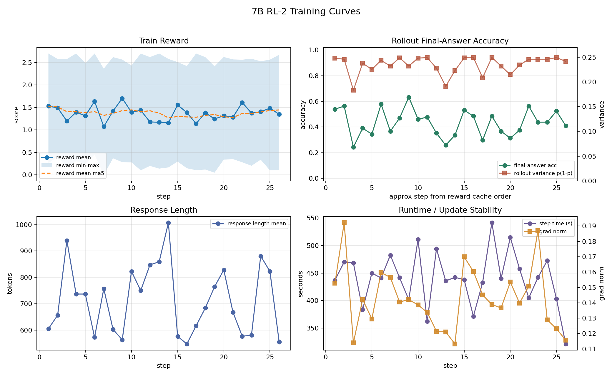<br/>||
|7|RL-2 评估|**评估集**<br/>* ID：`/root/paddlejob/workspace/env_run/xiazhaoyuan/eval/docqa_test_300_seed41_ability_length_balanced.jsonl`<br/>* OOD：`/root/paddlejob/workspace/env_run/xiazhaoyuan/eval/benchmark_eval_300_seed41.jsonl`<br/>评估配置：<br/>* `/root/paddlejob/workspace/env_run/xiazhaoyuan/eval/output/7b_rl2_grpo_gbs16_rollout8_eval_20260725T140632Z/eval_config.yaml`<br/>* `/root/paddlejob/workspace/env_run/xiazhaoyuan/eval/output/14b_rl2_grpo_gbs16_rollout8_eval_20260725T110319Z/eval_config.yaml`<br/>|<br/>任务划分<br/><br/>长度划分<br/>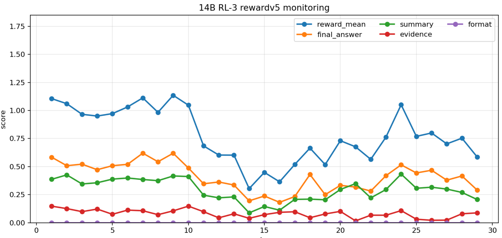<br/>『收益不稳定』||
|8|RL-3 数据准备|**目的：**从Rollout正确率角度解决"收益不稳定"<br/>**做法**：获取Rollout Acc在0.5区间左右的数据作为RL-3训练的主要数据<br/>**数据筛选**<br/>RL-3 不再直接使用原始 `7_rl_3.jsonl` 的少量长样本，而是基于 RL-2 模型对训练池做 `rollout=8` 采样，然后按 final answer 正确次数构造训练数据。<br/>* 主体样本：`3/8`、`4/8`、`5/8` 正确，目标是提供更大的 GRPO 组内差异。<br/>* 辅助样本：`2/8`、`6/8` 正确。<br/>* 少量边界样本：`1/8`、`7/8` 正确。<br/>* 排除：`0/8` 与 `8/8`，避免全错或全对导致优势信号过弱。<br/>* 排除 SFT source，降低答案泄露风险。】<br/>**RL-3 rollout 统计**<br/>* 7B：`/root/paddlejob/workspace/env_run/xiazhaoyuan/train/rl/data/rl3/output/7b_rl2_rollout8_all_cases_20260726T111500Z`<br/>* 14B：`/root/paddlejob/workspace/env_run/xiazhaoyuan/train/rl/data/rl3/output/14b_rl2_rollout8_all_cases_20260726T111500Z`|全局分布<br/>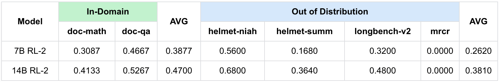<br/>RL-3训练<br/>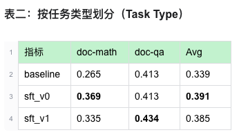<br/>||
|9|RL-3训练|**训练规模：**<br/><br/>**关键代码：**<br/>* `train/rl/prepare_rl_data_v3.py`<br/>* `train/rl/reward_fn_v3.py`<br/>* `train/rl/verl_patches/threaded_judge_v1.py`<br/>* `train/rl/scripts/run_node_rl_from_yaml.py`<br/>* `train/rl/scripts/print_rl_status.py`<br/>**关键参数**：<br/>框架：verl算法：GRPOtrain_batch_size: 16ppo_mini_batch_size: 16rollout.n: 8rollout.prompt_length: 131072rollout.response_length: 4096rollout.max_model_len: 135168learning_rate: 1e-6total_epochs: 1save_freq: 10lora_rank: 64lora_alpha: 128DETAILS：- 7B 配置：`/root/paddlejob/workspace/env_run/xiazhaoyuan/train/rl/configs/7b_rl3_grpo_gbs16_rollout8_difficulty_oomfix1_20260727T053642Z.yaml`- 14B 前 30 步配置：`/root/paddlejob/workspace/env_run/xiazhaoyuan/train/rl/configs/14b_rl3_grpo_gbs16_rollout8_difficulty_oomfix1_20260727T072920Z.yaml`- 14B step31-50 单节点配置：`/root/paddlejob/workspace/env_run/xiazhaoyuan/train/rl/configs/14b_rl3_grpo_gbs16_rollout8_difficulty_step30_single_20260727T151129Z.yaml`- 14B step31-50 两节点尝试配置：`/root/paddlejob/workspace/env_run/xiazhaoyuan/train/rl/configs/14b_rl3_grpo_gbs16_rollout8_difficulty_step30_2node_20260727T130043Z.yaml`<br/>|<br/>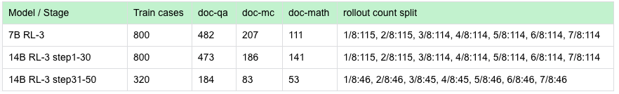||
|10|RL-3评估|**关键代码**<br/>* `eval/scripts/run_eval_pipeline.sh`<br/>* `eval/scripts/merge_lora_to_full_model.py`<br/>* `eval/scripts/vllm_batch_predict.py`<br/>* `eval/scripts/judge_predictions.py`<br/>* `eval/scripts/summarize_eval.py`<br/>* `eval/scripts/common_eval.py`<br/>**评估集**<br/>* ID：`/root/paddlejob/workspace/env_run/xiazhaoyuan/eval/docqa_test_300_seed41_ability_length_balanced.jsonl`<br/>* OOD：`/root/paddlejob/workspace/env_run/xiazhaoyuan/eval/benchmark_eval_300_seed41.jsonl`|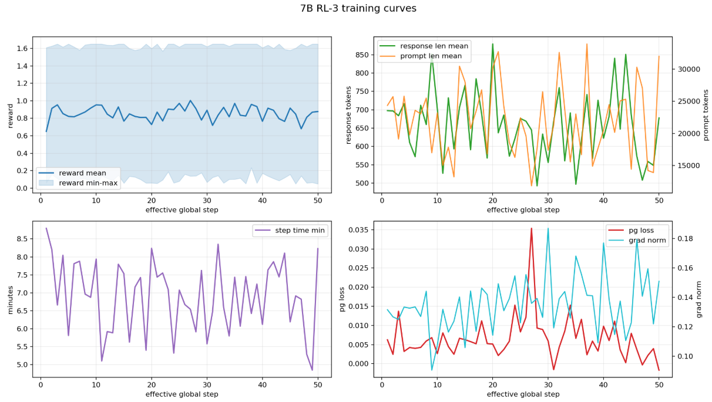||
|11|RL-pro 训练|* 7B：`[train/rl/configs/7b_rl3_grpo_gbs16_rollout8_rewardv5_batchbalanced_70step_20260729T140106Z.yaml]`<br/>* 14B：`[train/rl/configs/14b_rl3_grpo_gbs16_rollout8_rewardv5_batchbalanced_70step_20260729T140106Z.yaml]`|<br/>||
|12|RL-pro 评估||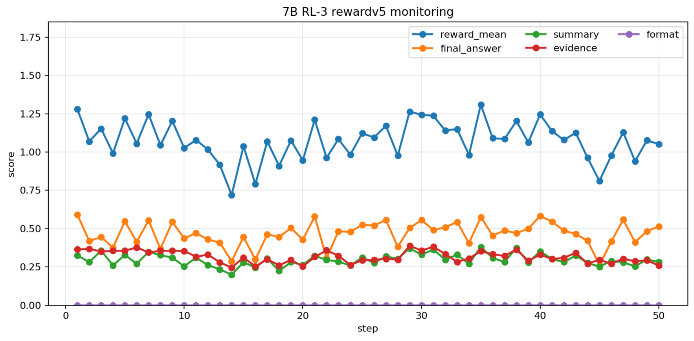||


## 0727汇总
**汇总表格**

**按任务维度（Task Dimension）**


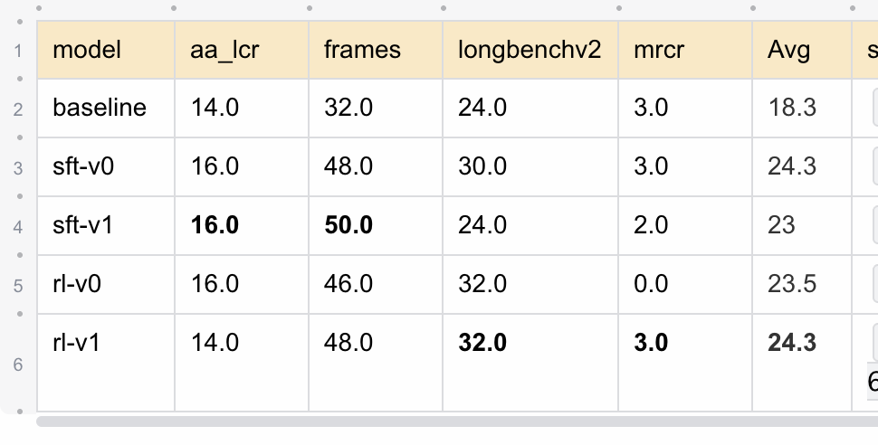

SFT不同数据类型，v1取消了，我觉得重点在RL上，SFT创新点很少，正常SFT，**UUID2summary服务于RL**

|****<br/>**Model**|**In-Domain**|****|**AVG**|**OOD**|****|****|****|** AVG**|
|-|-|-|-|-|-|-|-|-|
|****|**doc-math**|**doc-qa**|****|**helmet-niah**|**helmet-summ**|**longbench-v2**|~~**mrcr**~~|****|
|**7B Base**|**0.2647**|**0.3766**|**0.3207**|**0.4545**|**0.1440**|**0.3788**|~~**0.0000**~~|**0.2443**|
|**7B SFT**|**0.2966**|**0.4527**|**0.3746 +5分**|**0.5200**|**0.1840**|**0.3200**|~~**0.0000**~~|**0.2560**<br/>+1分|
|7B RL-1|0.2800|0.4467|0.3633|0.6200|0.1660|0.3467|~~0.0000~~|**0.2832**|
|7B RL-2|0.3087|0.4667|0.3877|0.5600|0.1680|0.3200|~~0.0000~~|0.2620|
|7B RL-3|0.3267|0.5000|**0.4133**|0.5400|0.2080|0.3267|~~0.0000~~|0.2687|
|7B RL-pro|0.2267|0.3034|**0.2651**|0.4000|0.1360|0.3133|~~0.0000~~|**0.2123**|
||||||||||
|14B Base|0.3538|0.5309|0.4424|0.5417|0.1621|0.4583|~~0.0000~~|0.2905|
|14B SFT|0.3933|0.5733|0.4833<br/>+4分|0.6400|0.3740|0.4467|~~0.0000~~|0.3652<br/>+7分|
|14B RL-1|0.4067|0.6200|**0.5133**|0.6600|0.3220|0.4867|~~0.0000~~|0.3672|
|14B RL-2|0.4133|0.5267|0.4700|0.6800|0.3640|0.4800|~~0.0000~~|**0.3810**|
|14B RL-3|0.3800|0.5733|0.4767|0.6600|0.3460|0.4067|~~0.0000~~|0.3710|
|14B RL-pro|0.3533|0.5000|**0.4267**|0.5800|0.1740|0.5333|0.0000|**0.3218**|

**insight**：**“信号不够尖，更新又太少”**

1. **增加训练量，提高更新量**：RL奖励是稳定的，但对长文任务不够有辨识度，现在是 final_answer=1.0，summary/evidence/format=0.3/0.3/0.05，而且总共 800 个 case、batch=16，total_training_steps=50，基本就是一轮过完，而对 128k 长文来说，一轮很难把 evidence/summary 这种过程能力真正刻出来。
2. **优化信号，拔高过程奖励**：把 summary 和 evidence 变成更强的过程信号，尤其要让中间态真的拉开差距。目前长文做了Rollout难度上的一个分档，缺失按长度把 0-32k、32k-64k、64k-128k 的更新压力分开看。
3. **reward**？v4 **learning_rate**?↑ **bacthsize**?↑ micro? **多epoch训练**？**verl的版本 高优**？新版，加练一版**v1_pro，我明天中午产出一版汇报，明天下午能开始v2阶段**

**按长度维度（Length Dimension）**

**"****收益不稳定****"----》reward是一条直线 强相关**

|**Model**|**In-Domain **|****|****|**AVG**|**OOD**|****|****|** AVG**|
|-|-|-|-|-|-|-|-|-|
|****|**easy 0-32k**|**medium 32k-64k**|**hard 64k-128k**|****|**easy 0-32k**|**medium 32k-64k**|**hard 64k-128k**|****|
|7B Base|0.2476|0.3464|0.1556|0.2499|0.2566|0.3650|0.2929|0.3048|
|7B SFT|0.3853|0.2875|0.2917|**0.3215 +7**|0.2566|0.3622|0.3573|0.3254 **+2.5**|
|7B RL-1|0.3750|0.3922|0.1364|0.3012|0.2623|0.3745|0.3981|**0.3450**|
|7B RL-2|0.3977|0.3922|0.2857|0.3585|0.2452|0.3766|0.3315|0.3178|
|7B RL-3|0.4148|0.4510|0.2273|**0.3643**|0.2367|0.3830|0.3944|0.3380|
|7B RL-pro|0.2727|0.3093|0.0000|**0.1940**|0.2568|0.2489|0.2037|**0.2365**|
|||||****|||||
|14B Base|0.5034|0.3603|0.0000|0.2879|0.3138|0.4170|0.4046|0.3785|
|14B SFT|0.5244|0.3677|0.2589|0.3837 **+10**|0.3723|0.4992|0.5014|0.4576 **+8**|
|14B RL-1|0.5455|0.5196|0.2273|**0.4308**|0.3568|0.5787|0.4426|0.4594|
|14B RL-2|0.5170|0.4412|0.2273|0.3952|0.3422|0.6170|0.5019|**0.4870**|
|14B RL-3|0.5284|0.4608|0.1364|0.3752|0.3090|0.5723|0.4241|0.4352|
|14B RL-pro|0.4489|0.4804|0.0000|**0.3098**|0.3638|0.5234|0.3833|**0.4235**|

## **Timeline**
~~AAAI~~

* 。
* ICLR：去年9月25号 今年还没出

九月初
